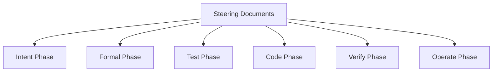

# Steering Documents

Steering documents provide project-wide context and guidelines that all AI agents and developers should follow. These documents ensure consistency across all phases of development.

## Core Steering Documents

### 1. product.md
Contains product vision, target users, core features, and success metrics. This document guides all product-related decisions.

### 2. architecture.md
Defines the technology stack, architecture patterns, system components, and technical requirements. This ensures technical consistency across the project.

### 3. standards.md
Establishes coding standards, naming conventions, documentation requirements, and quality gates. This maintains code quality and consistency.

## Custom Steering Documents

You can add custom steering documents for project-specific guidelines:

- `custom-api.md` - API design standards
- `custom-security.md` - Security implementation guidelines
- `custom-testing.md` - Testing strategies and patterns
- `custom-deployment.md` - Deployment and CI/CD guidelines

## Usage

### For AI Agents
All ae-framework agents automatically load and consider steering documents when generating outputs. The documents provide context for:
- Intent Agent: Understanding product requirements
- Formal Agent: Creating specifications aligned with architecture
- Test Agent: Following testing standards
- Code Agent: Adhering to coding standards
- Verify Agent: Checking against quality gates
- Operate Agent: Following deployment guidelines

### For Developers
1. Review steering documents before starting work
2. Update documents when making architectural decisions
3. Ensure all code follows the established standards
4. Use documents as reference during code reviews

## Maintenance

Steering documents are living documents that should be updated as the project evolves:

1. **Regular Reviews**: Review quarterly or after major milestones
2. **Change Process**: Discuss significant changes with the team
3. **Version Control**: Track changes through git history
4. **Validation**: Ensure documents remain accurate and useful

## Integration with ae-framework

The steering documents system integrates with all ae-framework phases:

Each phase references relevant steering documents to maintain consistency and alignment with project goals.