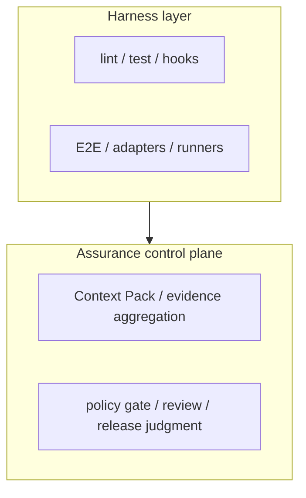

# ae-framework: Agent-Neutral Assurance Control Plane for Agent-Driven SDLC

[](https://github.com/itdojp/ae-framework/actions/workflows/validate-artifacts-ajv.yml)
[](https://github.com/itdojp/ae-framework/actions/workflows/testing-ddd-scripts.yml)
[](https://github.com/itdojp/ae-framework/actions/workflows/coverage-check.yml)
[](https://github.com/itdojp/ae-framework/actions/workflows/pr-ci-status-comment.yml)

> **🌍 Language / 言語**: [English](#english) | [日本語](#japanese) | [Documentation / ドキュメント](#documentation-ドキュメント)

---

## English

ae-framework is an **agent-neutral assurance control plane for agent-driven SDLC**. Coding agents, human maintainers, CI jobs, and formal tools produce changes and raw signals; ae-framework standardises the specifications, verification evidence, policy gates, and release judgments used to decide whether those changes can be trusted.

**Product thesis**: Bring your own agent. Keep your assurance plane. Codex, Claude Code, GitHub Copilot, Gemini-family coding tools, human maintainers, CI jobs, and formal tools are replaceable producers; ae-framework keeps judgment artifacts, policy gates, and release decisions stable across those producer choices.

Preview launch material: `docs/product/LAUNCH-KIT.md`, `docs/product/ONE-PAGE-PITCH.md`, `docs/product/DEMO-SCRIPT.md`, and `docs/product/EVIDENCE-SPRINT-RELEASE-ASSETS-2026-07-01.md`. Start the first-run demo with `pnpm run demo:agent-assurance`; the dedicated one-command path is `docs/getting-started/FIRST-RUN-DEMO.md`.

Current evidence route for first-time product evaluation: run the one-command first-run demo, read the Evidence Sprint dogfood case study, inspect the fixture-backed Web API and event-driven pilots, read the ACP-097 pilot report, then check launch-kit limitations and the controlled-comparison protocol. Internal dogfooding and pilot evidence are separate: the Web API and event-driven pilots are fixture-backed/report-only, the current external pilot report is `dry-run only` with 0 live external PRs collected, and the controlled comparison has not been executed. Public claims should therefore stay limited to review traceability and evidence routing, not review-speed, safety, adoption-impact, live API/event behavior, or agent-vendor superiority.

### Two-layer model



- **Baseline** stabilises the harness layer with `first-run` / `verify:lite`.
- **Structured assurance** connects Context Pack, property/MBT/conformance, and change evidence into the control plane.
- **High-assurance critical core** strengthens the control plane for selected high-risk changes with formal/model/proof lanes.

### What this repository provides
- **Agent-neutral assurance control plane**: Context Pack, formal/conformance summaries, artifact validation, policy gates, and PR/release automation that turn producer outputs into reviewable assurance evidence.
- **Assurance orchestration for agent-driven SDLC**: Ready-to-run GitHub Actions (PR verify / verify-lite, nightly heavy tests, Slack alerts) and CLI scripts that keep requirements, tests, and regression signals aligned without turning ae-framework into a coding-agent runtime.
- **Spec & Verification Kit**: Traceable spec format, mutation/MBT/property verification pipelines, and formal runners for Alloy/TLA/SMT/Apalache/Kani/SPIN/CSP(cspx)/Lean4 with unified summaries.
- **Project scaffolding & policies**: pnpm workspace layout, lint/test/type-coverage gates, label gating (typecov, flake), and TDD-friendly Git hooks.
- **Cacheable heavy test artifacts**: `scripts/pipelines/sync-test-results.mjs` to restore/store/snapshot mutation + MBT results; `heavy-test-trends` artifacts for CI triage.
- **Producer integration guidance**: Playbooks and connectors for Claude Code / Codex plus producer-boundary guidance for Copilot, Gemini-family tools, humans, and CI jobs; JSON-first outputs and AJV validation keep producer artifacts safe before they enter judgment.

### What this is not
- Not a single-model code generator — code generation is one producer, not the system of record.
- Not an agent runtime or IDE plugin — bring your own agent and keep agent choice outside the judgment contracts.
- Not a general-purpose Next.js UI kit or design system starter.
- Not a hosted CI/CD service — workflows are provided for self-hosted GitHub runners or forks.
- Not mandatory formal proof for every change — routine changes stay on the fast lane unless risk or policy selects heavier assurance.

### Adoption profiles
- **Baseline**: `verify:lite`, schema/AJV validation, PR gates for routine application delivery.
- **Structured assurance**: Context Pack, property/MBT/conformance, richer traceability and change evidence.
- **High-assurance critical core**: formal/model/proof lanes plus proof-carrying change packages for selected high-risk components.

### Quick start (local)

The first product-evidence demo is intentionally one command after dependency installation.
It uses repository fixtures only: no live PR, GitHub token, hosted LLM API, or
external agent service is used.

```bash
# Prereqs: Node.js 20.11+ (<23), pnpm 10
corepack enable
corepack prepare pnpm@10.0.0 --activate
pnpm install --frozen-lockfile

# Recommended first command: offline BYO-agent assurance demo
pnpm run demo:agent-assurance
```

| First-run surface | Path / value |
| --- | --- |
| Expected input | Repository fixture data only; no live external service after dependencies are installed. |
| Command | `pnpm run demo:agent-assurance` |
| Main output | `artifacts/` |
| Review surface to open first | `artifacts/review/agent-assurance-demo/assurance-review.md` |
| Evidence proof point | `docs/product/EVIDENCE-SPRINT-DOGFOOD-CASE-STUDY-2026-07-01.md` and `docs/product/evidence-packs/evidence-003-self-dogfood/README.md` |

For the dedicated first-run walkthrough and troubleshooting, use
`docs/getting-started/FIRST-RUN-DEMO.md`. For a real Issue-to-PR assurance path,
continue with `docs/getting-started/REFERENCE-FLOW.md`. Advanced flows such as
formal lanes, domain presets, PR posting helpers, and heavy-test trend snapshots
remain optional and risk/profile-driven.

> `npm install` is intentionally blocked by `preinstall` because this repository uses `pnpm` workspace dependencies (`workspace:*`).
> `pnpm run first-run` remains available for the environment/build/verify baseline (`doctor:env -> build -> verify:lite`) and writes summary JSON/Markdown files under `artifacts/first-run`.
> `pnpm run doctor:env` writes `artifacts/doctor/env.json` and returns `0` (ok) / `2` (warning) / `1` (error) / `3` (invalid arguments).

### Documentation pointers
- First-run demo (one-command local review surface): `docs/getting-started/FIRST-RUN-DEMO.md`
- Reference flow (Issue to PR assurance review): `docs/getting-started/REFERENCE-FLOW.md`
- Overview & nav: `docs/README.md`, `docs/project-organization.md`
- Maintenance operations: `docs/maintenance/branch-cleanup-runbook.md`
- Worktree maintenance operations: `docs/maintenance/worktree-cleanup-runbook.md`
- TODO triage operations: `docs/maintenance/todo-triage-runbook.md`
- Current architecture snapshot: `docs/architecture/CURRENT-SYSTEM-OVERVIEW.md`
- Zero-based ideal redesign blueprint: `docs/architecture/ZERO-BASED-IDEAL-DESIGN.md`
- Product fit (what to input/output, which tools to use): `docs/product/PRODUCT-FIT-INPUT-OUTPUT-TOOL-MAP.md`
- Domain assurance presets (product archetype starter packages): `docs/guides/domain-presets.md`
- Assurance control plane positioning: `docs/product/ASSURANCE-CONTROL-PLANE.md`
- Assurance control plane policy: `docs/product/ASSURANCE-CONTROL-PLANE-POLICY.md`
- Agent-neutral assurance roadmap: `docs/product/AGENT-NEUTRAL-ASSURANCE-ROADMAP.md`
- Public preview launch kit: `docs/product/LAUNCH-KIT.md`, `docs/product/ONE-PAGE-PITCH.md`, `docs/product/DEMO-SCRIPT.md`
- Product evidence and limitations: `docs/product/EFFECTIVENESS-METRICS.md`, `docs/product/REQ2RUN-METRICS.md`, `docs/product/EVIDENCE-SPRINT-RELEASE-ASSETS-2026-07-01.md`, `docs/product/EVIDENCE-SPRINT-DOGFOOD-CASE-STUDY-2026-07-01.md`, `docs/product/evidence-packs/evidence-003-self-dogfood/README.md`, `docs/product/EVIDENCE-SPRINT-WEB-API-PILOT-2026-07-01.md`, `docs/product/EVIDENCE-SPRINT-EVENT-DRIVEN-PILOT-2026-07-01.md`, `docs/product/DOGFOODING-REPORT-2026Q3.md`, `docs/product/PILOT-REPORT-2026Q3-01.md`, `docs/product/CONTROLLED-COMPARISON-PROTOCOL.md`
- Agent PR assurance metrics collector: `docs/ci/agent-pr-assurance-metrics.md`
- BYO-agent assurance onboarding: `docs/guides/byo-agent-assurance-onboarding.md`
- First-run one-command demo: `docs/getting-started/FIRST-RUN-DEMO.md`
- 15-minute BYO-agent assurance quickstart: `docs/guides/byo-agent-assurance-quickstart.md`
- Assurance model (claim / level / lane / evidence): `docs/quality/ASSURANCE-MODEL.md`
- Assurance operations runbook: `docs/quality/assurance-operations-runbook.md`
- Assurance onboarding checklist: `docs/guides/assurance-onboarding-checklist.md`
- PR automation (Copilot -> auto-fix -> auto-merge): `docs/ci/pr-automation.md`
- Release engineering (release verify / post-deploy): `docs/operate/release-engineering.md`
- CI/quality gates: `docs/ci/phase2-ci-hardening-outline.md`, `docs/ci/label-gating.md`, `docs/ci/harness-taxonomy.md`
- Development deep dives: [Enhanced State Manager](docs/development/enhanced-state-manager.md), [Circuit Breaker](docs/development/circuit-breaker.md)
- Docs consistency lint: `pnpm run check:doc-consistency` (`docs/quality/doc-consistency-lint.md`)
- Heavy test observability: `docs/ci/heavy-test-trend-archive.md`, `docs/ci/heavy-test-alerts.md`, `docs/ci/heavy-test-album.md`
- Specification & verification: `docs/quality/`, `docs/quality/formal-csp.md`, `docs/ci-policy.md`, `docs/testing/integration-runtime-helpers.md`
- Context Pack v1 (spec contract): `docs/spec/context-pack.md`
- Context Pack onboarding checklist: `docs/guides/context-pack-onboarding-checklist.md`
- Context Pack Phase5+ cookbook: `docs/guides/context-pack-phase5-cookbook.md`
- Context Pack troubleshooting runbook: `docs/operations/context-pack-troubleshooting.md`
- Contract catalog (input/decision/evidence/operation): `docs/reference/CONTRACT-CATALOG.md`
- Spec & Verification Kit (minimal activation guide): `docs/reference/SPEC-VERIFICATION-KIT-MIN.md`
- Connectors & agent workflows: `docs/integrations/CLAUDE-CODE-TASK-TOOL-INTEGRATION.md`, `docs/integrations/CODEX-INTEGRATION.md`
- License scope and notice management: `LICENSE`, `LICENSE-SCOPE.md`, `TRADEMARKS.md`, `THIRD_PARTY_NOTICES.md`

---

## Japanese

ae-framework は **エージェント協調型SDLCのための、エージェント非依存の assurance control plane** です。coding agent、人間のmaintainer、CI job、formal tool は変更やraw signalを生成する producer であり、ae-framework はその変更を信頼して merge / release できるかを、仕様・検証・証跡・policy gate・release judgment に基づいて判断可能にします。

**Product thesis**: Bring your own agent. Keep your assurance plane. Codex、Claude Code、GitHub Copilot、Gemini系tool、人間のmaintainer、CI job、formal tool は交換可能な producer であり、ae-framework は producer の選択に依存しない judgment artifact、policy gate、release decision を維持します。

Preview launch material: `docs/product/LAUNCH-KIT.md`, `docs/product/ONE-PAGE-PITCH.md`, `docs/product/DEMO-SCRIPT.md`, `docs/product/EVIDENCE-SPRINT-RELEASE-ASSETS-2026-07-01.md`。first-run demo は `pnpm run demo:agent-assurance` から開始します。専用の one-command path は `docs/getting-started/FIRST-RUN-DEMO.md` です。

初見の product evidence 導線は、one-command first-run demo → Evidence Sprint dogfood case study → fixture-backed Web API / event-driven pilots → ACP-097 pilot report → launch kit の limitations → controlled-comparison protocol の順です。内部 dogfooding と pilot evidence は別扱いです。Web API / event-driven pilots は fixture-backed/report-only、現在の external pilot report は `dry-run only` で live external PR の収集数は0件、controlled comparison は未実施です。そのため公開claimは review traceability と evidence routing に限定し、未測定の review-speed、安全性、導入効果、live API/event behavior、agent vendor 優位性は主張しません。

### 二層モデル


- **Baseline** は `first-run` / `verify:lite` で harness layer を安定化させる段階です。
- **Structured assurance** は Context Pack、property/MBT/conformance、change artifact を control plane に接続する段階です。
- **High-assurance critical core** は selected high-risk change に対して control plane を強化する段階です。

### 提供するもの
- **Agent-neutral assurance control plane**: Context Pack、形式検証/Conformance要約、artifact validation、policy gate、PR/release 自動化を束ね、producer output を判断可能な証跡へ変換。
- **AIエージェント協調型SDLCの証跡・検証オーケストレーション**: PR Verify／夜間ヘビーテスト／Slack通知などのGitHub ActionsとCLIスクリプトで、要件・テスト・退行検知を review / release judgment 向けの証跡として整列させる。
- **仕様・検証キット**: トレーサブルな仕様フォーマット、mutation/MBT/Propertyテストのパイプライン、`scripts/pipelines/compare-test-trends.mjs` によるトレンド比較。
- **プロジェクト骨子とポリシー**: pnpmワークスペース、Lint/Test/型カバレッジのゲート、ラベルゲーティング（typecov・flake）、TDDフック。
- **ヘビーテスト成果物のキャッシュ**: `scripts/pipelines/sync-test-results.mjs` による store/restore/snapshot、`heavy-test-trends` アーティファクトでCIトリアージを高速化。
- **Producer統合指針**: Claude Code / Codex 向けプレイブックに加え、Copilot、Gemini系tool、人間、CI job を producer として扱う境界を示し、JSON-first成果物とAJV検証で judgment に入る前の生成物を安全に扱う。

### 提供しないもの
- 単一モデル依存のコード生成専用ツール。codegen は producer の一つであり、SSOT は spec / contract / artifact に置く。
- エージェント実行ランタイムやIDEプラグイン（各自のエージェントを利用し、agent選択を judgment contract から分離）。
- 汎用のNext.js UIスターターやデザインシステム配布物。
- ホスト型CI/CDサービス（GitHub Actionsの定義を提供）。
- すべての変更に formal proof を強制する運用。通常変更は fast lane に留め、risk や policy が必要とする場合だけ heavy lane へ昇格する。

### 導入プロファイル
- **Baseline**: `verify:lite`、schema/AJV、PRゲートで通常の業務アプリを安定化。
- **Structured assurance**: Context Pack、property/MBT/conformance、change evidence を追加し、仕様と検証の対応を明示。
- **High-assurance critical core**: 重要コンポーネントに対して formal/model/proof lane と proof-carrying change package を適用。

### すぐ試す

最初の product evidence demo は、依存関係 install 後の 1 command に絞っています。
Repository fixture のみを使い、live PR、GitHub token、hosted LLM API、external
agent service は不要です。

```bash
# 前提: Node.js 20.11+ (<23), pnpm 10
corepack enable
corepack prepare pnpm@10.0.0 --activate
pnpm install --frozen-lockfile

# 推奨される最初の command: offline BYO-agent assurance demo
pnpm run demo:agent-assurance
```

| First-run surface | Path / value |
| --- | --- |
| Expected input | Repository fixture data のみ。依存関係 install 後は live external service 不要です。 |
| Command | `pnpm run demo:agent-assurance` |
| Main output | `artifacts/` |
| 最初に開く review surface | `artifacts/review/agent-assurance-demo/assurance-review.md` |
| 証跡の根拠 | `docs/product/EVIDENCE-SPRINT-DOGFOOD-CASE-STUDY-2026-07-01.md` と `docs/product/evidence-packs/evidence-003-self-dogfood/README.md` |

専用の first-run walkthrough と troubleshooting は `docs/getting-started/FIRST-RUN-DEMO.md` を参照してください。Real Issue-to-PR assurance path に進む場合は `docs/getting-started/REFERENCE-FLOW.md` を使用します。Formal lane、domain preset、PR posting helper、heavy-test trend snapshot は optional であり、risk/profile に応じて選択します。

> このリポジトリは `workspace:*` を使うため、`npm install` は `preinstall` ガードで意図的に失敗させています。`pnpm install --frozen-lockfile` を使用してください。
> `pnpm run first-run` は environment/build/verify baseline (`doctor:env -> build -> verify:lite`) として引き続き利用でき、`artifacts/first-run` に summary JSON/Markdown を出力します。
> `pnpm run doctor:env` は `artifacts/doctor/env.json` を書き出し、`0` (ok) / `2` (warning) / `1` (error) / `3` (invalid arguments) を返します。

### ドキュメントへの入り口
- First-run demo（one-command local review surface）: `docs/getting-started/FIRST-RUN-DEMO.md`
- 全体概要: `docs/README.md`, `docs/project-organization.md`
- 現行アーキテクチャ全体像: `docs/architecture/CURRENT-SYSTEM-OVERVIEW.md`
- ゼロベース再設計の理想像: `docs/architecture/ZERO-BASED-IDEAL-DESIGN.md`
- 適用対象/入力/出力/ツール適性: `docs/product/PRODUCT-FIT-INPUT-OUTPUT-TOOL-MAP.md`
- Domain assurance presets（product archetype 別 starter package）: `docs/guides/domain-presets.md`
- Assurance control plane の位置付け: `docs/product/ASSURANCE-CONTROL-PLANE.md`
- Assurance control plane policy: `docs/product/ASSURANCE-CONTROL-PLANE-POLICY.md`
- Agent-neutral assurance roadmap: `docs/product/AGENT-NEUTRAL-ASSURANCE-ROADMAP.md`
- Public preview launch kit: `docs/product/LAUNCH-KIT.md`, `docs/product/ONE-PAGE-PITCH.md`, `docs/product/DEMO-SCRIPT.md`
- Product evidence と limitations: `docs/product/EFFECTIVENESS-METRICS.md`, `docs/product/REQ2RUN-METRICS.md`, `docs/product/EVIDENCE-SPRINT-RELEASE-ASSETS-2026-07-01.md`, `docs/product/EVIDENCE-SPRINT-DOGFOOD-CASE-STUDY-2026-07-01.md`, `docs/product/evidence-packs/evidence-003-self-dogfood/README.md`, `docs/product/EVIDENCE-SPRINT-WEB-API-PILOT-2026-07-01.md`, `docs/product/EVIDENCE-SPRINT-EVENT-DRIVEN-PILOT-2026-07-01.md`, `docs/product/DOGFOODING-REPORT-2026Q3.md`, `docs/product/PILOT-REPORT-2026Q3-01.md`, `docs/product/CONTROLLED-COMPARISON-PROTOCOL.md`
- Agent PR assurance metrics collector: `docs/ci/agent-pr-assurance-metrics.md`
- BYO-agent assurance onboarding: `docs/guides/byo-agent-assurance-onboarding.md`
- First-run one-command demo: `docs/getting-started/FIRST-RUN-DEMO.md`
- 15分 BYO-agent assurance quickstart: `docs/guides/byo-agent-assurance-quickstart.md`
- Assurance model（claim / level / lane / evidence）: `docs/quality/ASSURANCE-MODEL.md`
- PR自動化（Copilot→auto-fix→auto-merge）: `docs/ci/pr-automation.md`
- リリース運用（release verify / post-deploy verify）: `docs/operate/release-engineering.md`
- CI/品質ゲート: `docs/ci/phase2-ci-hardening-outline.md`, `docs/ci/label-gating.md`, `docs/ci/harness-taxonomy.md`
- ドキュメント検証ポリシー: `docs/ci/docs-doctest-policy.md`
- 開発向け設計ドキュメント: [Enhanced State Manager](docs/development/enhanced-state-manager.md), [Circuit Breaker](docs/development/circuit-breaker.md)
- ドキュメント整合チェック: `pnpm run check:doc-consistency`（`docs/quality/doc-consistency-lint.md`）
- ヘビーテスト観測: `docs/ci/heavy-test-trend-archive.md`, `docs/ci/heavy-test-alerts.md`, `docs/ci/heavy-test-album.md`
- 仕様と検証: `docs/ci-policy.md`, `docs/testing/integration-runtime-helpers.md`, `docs/quality/`, `docs/quality/formal-csp.md`
- Context Pack v1（仕様入力契約）: `docs/spec/context-pack.md`
- Context Pack 導入チェックリスト: `docs/guides/context-pack-onboarding-checklist.md`
- Context Pack Phase5+ 実践ガイド: `docs/guides/context-pack-phase5-cookbook.md`
- Context Pack 障害対応ランブック: `docs/operations/context-pack-troubleshooting.md`
- 契約カタログ（input/decision/evidence/operation）: `docs/reference/CONTRACT-CATALOG.md`
- Spec & Verification Kit（最小パッケージ・有効化手順）: `docs/reference/SPEC-VERIFICATION-KIT-MIN.md`
- エージェント統合: `docs/integrations/CLAUDE-CODE-TASK-TOOL-INTEGRATION.md`, `docs/integrations/CODEX-INTEGRATION.md`
- ライセンス適用範囲と notice 管理: `LICENSE`, `LICENSE-SCOPE.md`, `TRADEMARKS.md`, `THIRD_PARTY_NOTICES.md`

---

## 🔒 TypeScript Policy / TypeScript ポリシー

### @ts-expect-error Usage Policy

When using `@ts-expect-error` comments, follow this structured format:

```typescript
// @ts-expect-error owner:@username expires:YYYY-MM-DD reason: detailed description
const _example: number = 'type mismatch for policy example';
```

**Core fields:**
- `owner:@username` - GitHub handle responsible for the suppression
- `expires:YYYY-MM-DD` - Date when this suppression should be reviewed/removed
- `reason: description` - Detailed explanation (minimum 12 characters)

Each suppression entry still carries all three fields.

**Examples:**
```typescript
// @ts-expect-error owner:@alice expires:2027-12-31 reason: narrowing todo for complex union
const result = complexUnion as string;

// @ts-expect-error owner:@bob expires:2027-06-15 reason: legacy API compatibility until v2 migration
legacyApi.unsafeMethod(data);
```

**Policy enforcement:**
- ✅ CI validates all `@ts-expect-error` comments
- ⚠️ Local development shows warnings only
- 🔍 Script: `node scripts/ci/check-expect-error.mjs`

---

## Documentation / ドキュメント

- Full navigation: `docs/README.md`
- Quick starts: `docs/getting-started/QUICK-START-GUIDE.md` (baseline -> structured assurance -> high-assurance PR), `docs/getting-started/PHASE-6-GETTING-STARTED.md`
- CLI Reference: `docs/reference/CLI-COMMANDS-REFERENCE.md`, API: `docs/reference/API.md`
- CLI entrypoints in this repo: main CLI `src/cli/index.ts` (`ae` / `ae-framework`), benchmark CLI `src/cli/benchmark-cli.ts` (`ae-benchmark`), legacy compatibility shim `src/cli.ts`

## 🤝 Contributing / 貢献

We welcome contributions! See [CONTRIBUTING.md](CONTRIBUTING.md).
貢献を歓迎します！詳細は[CONTRIBUTING.md](CONTRIBUTING.md)をご覧ください。

## 📄 License / ライセンス

Apache-2.0 - see [LICENSE](LICENSE). Scope, trademark, and third-party notice handling are documented in [LICENSE-SCOPE.md](LICENSE-SCOPE.md), [TRADEMARKS.md](TRADEMARKS.md), and [THIRD_PARTY_NOTICES.md](THIRD_PARTY_NOTICES.md).

## 🙏 Acknowledgments

Built with: MCP SDK, Claude/Codex task tools, pnpm workspace, Vitest, AJV, GitHub Actions.

---

ae-framework — automating agentic specification, verification, and CI quality gates.
