# 🏗️ ae-framework Architecture 2025

> AI-Enhanced Development Framework の完全アーキテクチャドキュメント
> Phase 6 UI/UX & Frontend Delivery実装版

## 🎯 アーキテクチャ概要

ae-frameworkは、**TDD強制機能付き6フェーズ開発手法**を実装するAI駆動開発フレームワークです。Claude Code統合、OpenTelemetryテレメトリ監視、React+Next.js UI自動生成を特徴とします。

### 🎨 全体アーキテクチャ図

```mermaid
graph TB
    subgraph "👤 User Interfaces"
        USER[Developer/PM]
        CC[🤖 Claude Code]
        CLI[💻 CLI Commands]
        WEB[🌐 Web Dashboard]
    end
    
    subgraph "🔄 Integration Layer"
        direction TB
        HYBRID[Hybrid Integration System]
        TASK_TOOL[Claude Code Task Tool]
        MCP[MCP Servers]
        
        HYBRID --> TASK_TOOL
        HYBRID --> MCP
        HYBRID --> CLI
    end
    
    subgraph "📊 Telemetry & Monitoring"
        direction TB
        OTEL[OpenTelemetry]
        METRICS[Phase 6 Metrics]
        ALERTS[Alert Manager]
        PERF[Performance Monitor]
        
        OTEL --> METRICS
        METRICS --> ALERTS
        METRICS --> PERF
    end
    
    subgraph "🎯 Core 6-Phase Engine"
        direction TB
        
        subgraph "Phase 1: Intent Analysis 🎯"
            IA[Intent Agent]
            ITA[Intent Task Adapter]
            HYBRID_I[Hybrid Intent System]
            
            IA --> ITA
            ITA --> HYBRID_I
        end
        
        subgraph "Phase 2: Natural Language Requirements 📝"
            NLA[Natural Language Agent]
            NLTA[Natural Language Task Adapter]
            REQ_EXTRACT[Requirements Extractor]
            
            NLA --> NLTA
            NLTA --> REQ_EXTRACT
        end
        
        subgraph "Phase 3: User Stories Creation 📋"
            USA[User Stories Agent]
            USTA[User Stories Task Adapter]
            STORY_GEN[Story Generator]
            
            USA --> USTA
            USTA --> STORY_GEN
        end
        
        subgraph "Phase 4: Validation 🔍"
            VA[Validation Agent]
            VTA[Validation Task Adapter]
            CROSS_VAL[Cross Validator]
            
            VA --> VTA
            VTA --> CROSS_VAL
        end
        
        subgraph "Phase 5: Domain Modeling 🏗️"
            DMA[Domain Modeling Agent]
            DMTA[Domain Modeling Task Adapter]
            DOMAIN_GEN[Domain Generator]
            
            DMA --> DMTA
            DMTA --> DOMAIN_GEN
        end
        
        subgraph "Phase 6: UI/UX & Frontend Delivery 🎨"
            UIA[UI Generation Agent]
            SCAFFOLD[UI Scaffold Generator]
            DESIGN_SYS[Design System]
            I18N[i18n Manager]
            A11Y[A11y Validator]
            STORYBOOK[Storybook Integration]
            
            UIA --> SCAFFOLD
            SCAFFOLD --> DESIGN_SYS
            SCAFFOLD --> I18N
            SCAFFOLD --> A11Y
            SCAFFOLD --> STORYBOOK
        end
    end
    
    subgraph "⚡ Advanced Features"
        direction TB
        
        subgraph "Sequential Inference Engine"
            SEE[Sequential Engine]
            DECOMP[Problem Decomposer]
            REASON[Reasoning Engine]
            COMPOSE[Solution Composer]
            
            SEE --> DECOMP
            SEE --> REASON  
            SEE --> COMPOSE
        end
        
        subgraph "Intelligent Testing"
            ITS[Intelligent Test Selection]
            E2E_GEN[E2E Generator]
            VRT[Visual Regression]
            PLAYWRIGHT[Playwright Integration]
            
            ITS --> E2E_GEN
            ITS --> VRT
            ITS --> PLAYWRIGHT
        end
        
        subgraph "Optimization System"
            PARALLEL[Parallel Processor]
            RESOURCE[Resource Pool]
            SCHEDULER[Task Scheduler]
            OPTIMIZER[Performance Optimizer]
            
            PARALLEL --> RESOURCE
            PARALLEL --> SCHEDULER
            PARALLEL --> OPTIMIZER
        end
    end
    
    subgraph "🗂️ Generated Artifacts"
        direction TB
        
        subgraph "Frontend Packages"
            TOKENS[Design Tokens]
            UI_LIB[UI Component Library]
            WEB_APP[Next.js Web App]
            STORIES[Storybook Stories]
            
            TOKENS --> UI_LIB
            UI_LIB --> WEB_APP
            UI_LIB --> STORIES
        end
        
        subgraph "Documentation"
            DOCS[Technical Docs]
            API_DOCS[API Documentation]
            USER_GUIDES[User Guides]
            ARCH_DOCS[Architecture Docs]
            
            DOCS --> API_DOCS
            DOCS --> USER_GUIDES
            DOCS --> ARCH_DOCS
        end
        
        subgraph "Quality Artifacts"
            TESTS[Automated Tests]
            E2E_TESTS[E2E Test Suite]
            A11Y_REPORTS[A11y Reports]
            PERF_REPORTS[Performance Reports]
            
            TESTS --> E2E_TESTS
            TESTS --> A11Y_REPORTS
            TESTS --> PERF_REPORTS
        end
    end
    
    %% User Interactions
    USER --> CC
    USER --> CLI
    USER --> WEB
    
    %% Integration Flow
    CC --> HYBRID
    CLI --> HYBRID
    WEB --> HYBRID
    
    %% Phase Flow
    HYBRID --> IA
    IA --> NLA
    NLA --> USA
    USA --> VA
    VA --> DMA
    DMA --> UIA
    
    %% Advanced Features Integration
    SEE -.-> IA
    SEE -.-> NLA
    ITS -.-> USA
    ITS -.-> VA
    PARALLEL -.-> DMA
    PARALLEL -.-> UIA
    
    %% Telemetry Integration
    OTEL -.-> IA
    OTEL -.-> NLA
    OTEL -.-> USA
    OTEL -.-> VA
    OTEL -.-> DMA
    OTEL -.-> UIA
    
    %% Artifact Generation
    UIA --> TOKENS
    UIA --> UI_LIB
    UIA --> WEB_APP
    UIA --> STORIES
    
    VA --> TESTS
    UIA --> E2E_TESTS
    A11Y --> A11Y_REPORTS
    PERF --> PERF_REPORTS
    
    HYBRID --> DOCS
    HYBRID --> API_DOCS
    HYBRID --> USER_GUIDES
    HYBRID --> ARCH_DOCS

    %% Styling
    classDef phaseBox fill:#e1f5fe,stroke:#01579b,stroke-width:2px
    classDef integrationBox fill:#f3e5f5,stroke:#4a148c,stroke-width:2px
    classDef advancedBox fill:#e8f5e8,stroke:#1b5e20,stroke-width:2px
    classDef artifactBox fill:#fff3e0,stroke:#e65100,stroke-width:2px
    classDef telemetryBox fill:#fce4ec,stroke:#880e4f,stroke-width:2px
    
    class IA,NLA,USA,VA,DMA,UIA phaseBox
    class HYBRID,TASK_TOOL,MCP integrationBox
    class SEE,ITS,PARALLEL advancedBox
    class TOKENS,UI_LIB,WEB_APP,STORIES,DOCS,TESTS artifactBox
    class OTEL,METRICS,ALERTS,PERF telemetryBox
```

## 🏗️ レイヤー別詳細アーキテクチャ

### 1. ユーザーインターフェース層

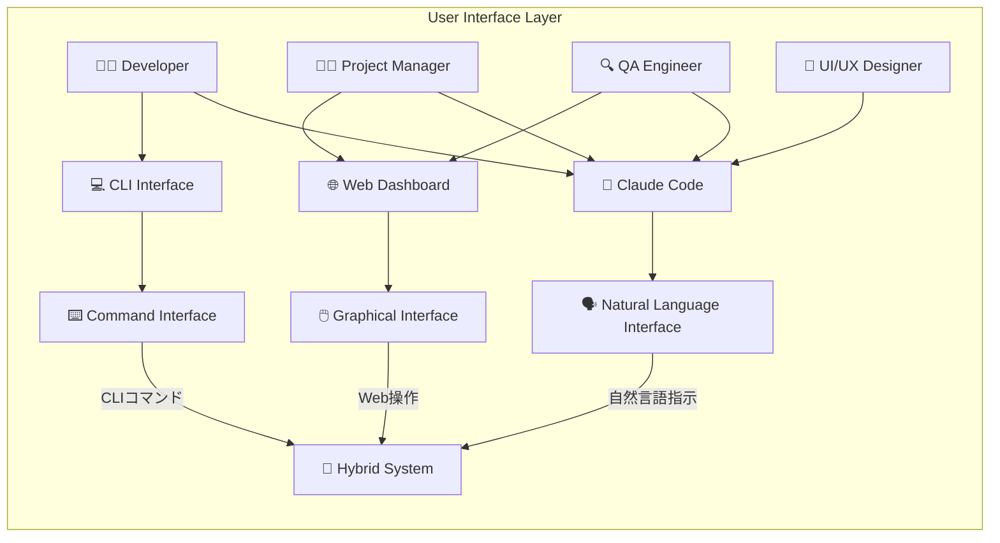

### 2. 統合・オーケストレーション層

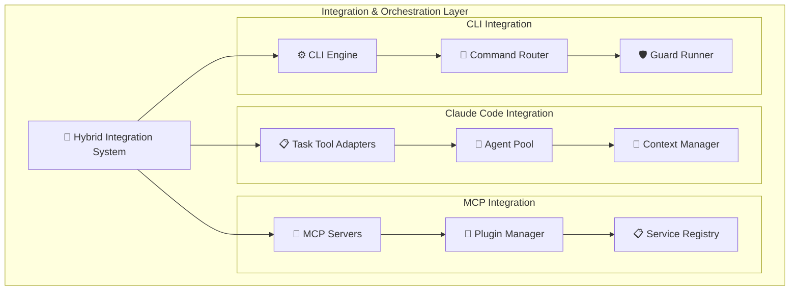

### 3. コア6フェーズエンジン

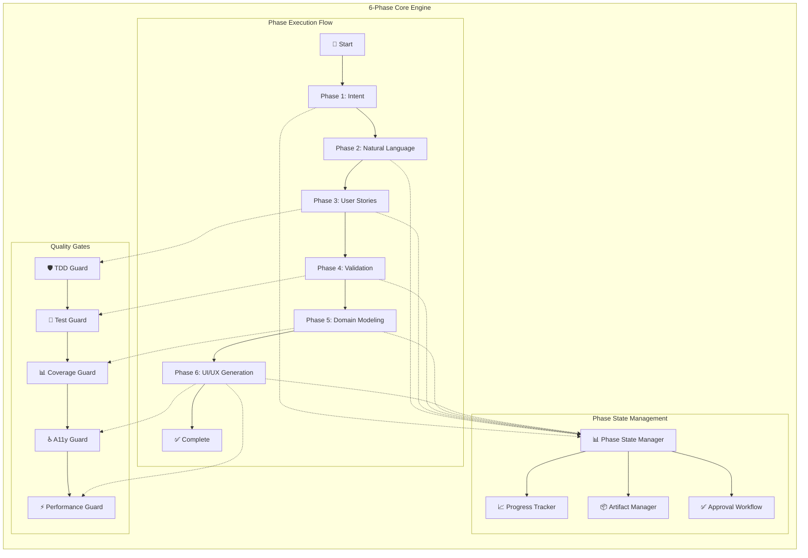

### 4. Phase 6: UI/UX特化アーキテクチャ

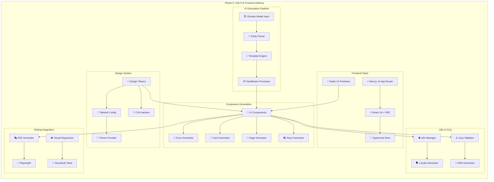

### 5. テレメトリ・監視層

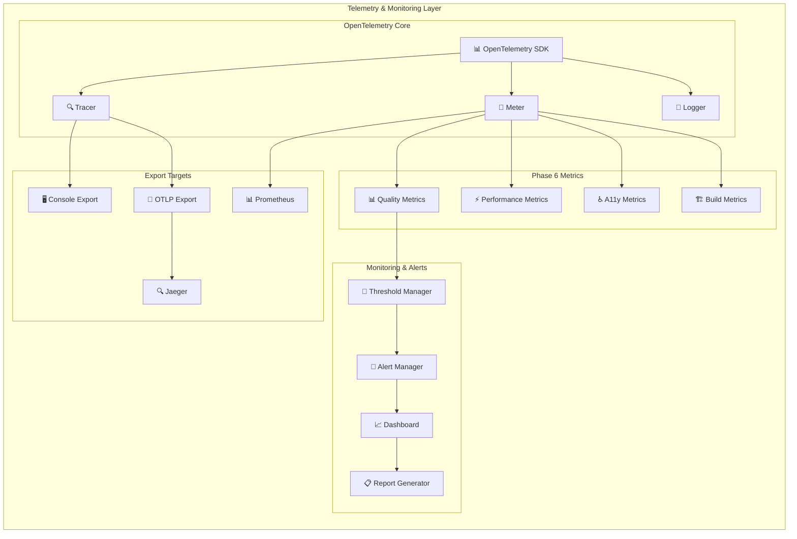

## 🔄 データフロー・プロセスフロー

### 開発プロセスフロー

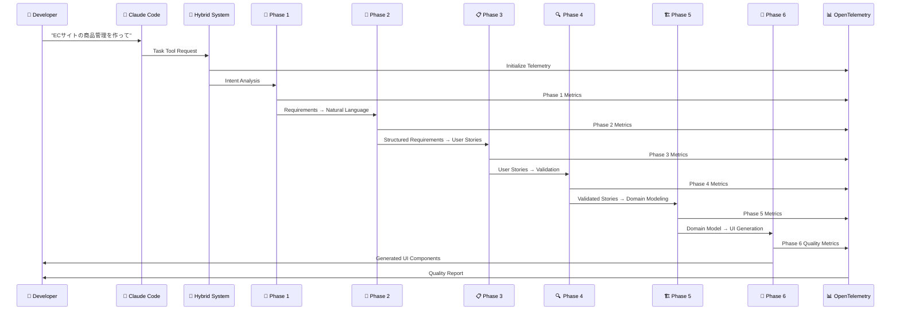

### Phase 6 UIスキャフォールドフロー

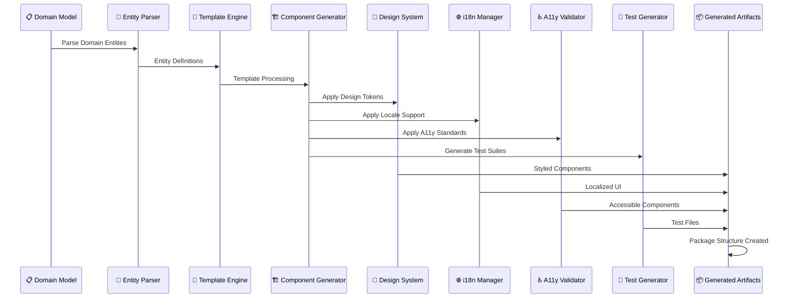

## 📁 ファイル・パッケージ構造

### プロジェクト構造

```
ae-framework/
├── 🏗️ src/                           # Core Implementation
│   ├── agents/                        # Phase Agents
│   │   ├── intent-agent.ts           # Phase 1: Intent Analysis
│   │   ├── natural-language-task-adapter.ts  # Phase 2
│   │   ├── user-stories-task-adapter.ts      # Phase 3
│   │   ├── validation-task-adapter.ts        # Phase 4
│   │   ├── domain-modeling-task-adapter.ts   # Phase 5
│   │   └── tdd-task-adapter.ts               # TDD Integration
│   ├── cli/                          # CLI Interface
│   │   ├── ui-scaffold-cli.ts        # Phase 6 CLI
│   │   ├── ae-ui-alias.ts           # ae-ui Command Alias
│   │   └── guards/                   # Quality Guards
│   ├── generators/                   # Code Generators
│   │   └── ui-scaffold-generator.ts  # Phase 6 UI Generator
│   ├── telemetry/                    # OpenTelemetry
│   │   ├── phase6-metrics.ts        # Phase 6 Metrics
│   │   └── telemetry-setup.ts       # OTEL Configuration
│   ├── integration/                  # Integration Layer
│   │   ├── hybrid-tdd-system.ts     # Hybrid Integration
│   │   └── hybrid-intent-system.ts   # Intent System
│   └── ui/components/generated/       # Generated UI Components
│
├── 📦 packages/                       # Frontend Packages
│   ├── design-tokens/                # Design System Tokens
│   │   ├── src/index.ts             # Token Definitions
│   │   └── src/tailwind.ts          # Tailwind Integration
│   └── ui/                          # UI Component Library
│       ├── src/button.tsx           # Button Component
│       ├── src/input.tsx            # Input Component
│       ├── src/textarea.tsx         # Textarea Component
│       ├── src/select.tsx           # Select Component
│       ├── src/checkbox.tsx         # Checkbox Component
│       └── src/dialog.tsx           # Dialog Component
│
├── 🌐 apps/                          # Generated Applications
│   ├── web/                         # Next.js Web Application
│   │   ├── app/[locale]/            # App Router with i18n
│   │   ├── components/              # App-specific Components
│   │   ├── messages/                # i18n Translation Files
│   │   └── __e2e__/                # E2E Tests
│   └── storybook/                   # Storybook Documentation
│       └── stories/                 # Component Stories
│
├── 🔧 templates/ui/                  # Handlebars Templates
│   ├── component-form.tsx.template  # Form Template
│   ├── component-card.tsx.template  # Card Template
│   └── page-list.tsx.template       # Page Template
│
├── 📚 docs/                          # Documentation
│   ├── getting-started/             # Quick Start Guides
│   ├── guides/                      # Practical Guides
│   ├── phases/                      # Phase Documentation
│   ├── integrations/                # Integration Guides
│   ├── reference/                   # API/CLI Reference
│   ├── architecture/                # Architecture Docs
│   └── legacy/                      # Legacy Documentation
│
└── ⚙️ Configuration Files
    ├── package.json                 # Node.js Dependencies
    ├── tsconfig.json               # TypeScript Configuration
    ├── tailwind.config.js          # Tailwind CSS Configuration
    └── .github/workflows/          # GitHub Actions CI/CD
```

### モノレポパッケージ依存関係

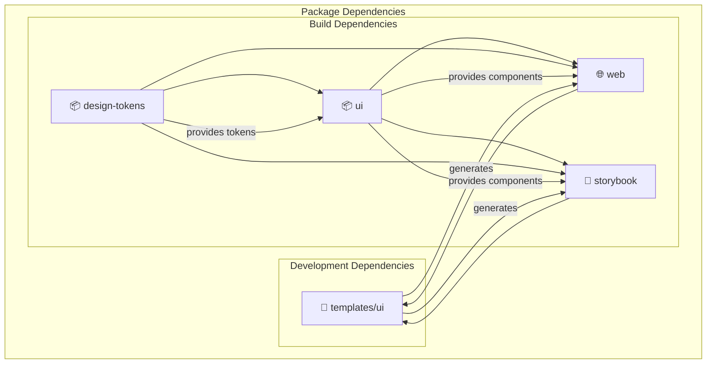

## 🔧 技術スタック詳細

### Phase 6 フロントエンド技術スタック

```mermaid
graph TB
    subgraph "Frontend Technology Stack"
        direction TB
        
        subgraph "Core Framework"
            NEXTJS[Next.js 14]
            REACT[React 18]
            TYPESCRIPT[TypeScript 5]
            TAILWIND[Tailwind CSS 3]
            
            NEXTJS --> REACT
            REACT --> TYPESCRIPT
            TYPESCRIPT --> TAILWIND
        end
        
        subgraph "UI Components"
            RADIX[Radix UI]
            SHADCN[shadcn/ui]
            LUCIDE[Lucide React]
            CVA[Class Variance Authority]
            
            RADIX --> SHADCN
            SHADCN --> LUCIDE
            SHADCN --> CVA
        end
        
        subgraph "State & Forms"
            TANSTACK[TanStack Query 5]
            RHF[React Hook Form 7]
            ZOD[Zod 3]
            
            TANSTACK --> RHF
            RHF --> ZOD
        end
        
        subgraph "Development Tools"
            STORYBOOK_TOOL[Storybook 7]
            ESLINT[ESLint + A11y]
            TYPESCRIPT_DEV[TypeScript]
            POSTCSS[PostCSS]
            
            STORYBOOK_TOOL --> ESLINT
            ESLINT --> TYPESCRIPT_DEV
            TYPESCRIPT_DEV --> POSTCSS
        end
        
        subgraph "Testing & Quality"
            PLAYWRIGHT_TECH[Playwright]
            VITEST[Vitest]
            JEST[Jest]
            A11Y_TESTING[A11y Testing Library]
            
            PLAYWRIGHT_TECH --> VITEST
            VITEST --> JEST
            JEST --> A11Y_TESTING
        end
    end
```

### 統合技術スタック

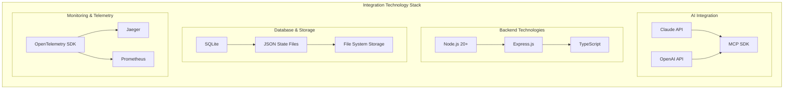

## 📊 品質・監視メトリクス

### Phase 6品質メトリクス

```mermaid
graph TB
    subgraph "Phase 6 Quality Metrics"
        direction TB
        
        subgraph "Code Quality"
            TYPE_ERRORS[TypeScript Errors: 0]
            LINT_ERRORS[ESLint Errors: 0]
            TEST_COV[Test Coverage: ≥80%]
            
            TYPE_ERRORS --> LINT_ERRORS
            LINT_ERRORS --> TEST_COV
        end
        
        subgraph "Performance"
            LCP[LCP: <2.5s]
            FID[FID: <100ms]
            CLS[CLS: <0.1]
            LIGHTHOUSE[Lighthouse: ≥75]
            
            LCP --> FID
            FID --> CLS
            CLS --> LIGHTHOUSE
        end
        
        subgraph "Accessibility"
            WCAG_AA[WCAG 2.1 AA: ≥95%]
            CONTRAST[Color Contrast: 4.5:1]
            KEYBOARD[Keyboard Navigation: 100%]
            ARIA[ARIA Labels: Complete]
            
            WCAG_AA --> CONTRAST
            CONTRAST --> KEYBOARD
            KEYBOARD --> ARIA
        end
        
        subgraph "Development Efficiency"
            SCAFFOLD_TIME[Scaffold Time: <30s]
            BUILD_TIME[Build Time: <2min]
            E2E_TIME[E2E Test Time: <5min]
            COMPONENT_COUNT[Generated Components/min]
            
            SCAFFOLD_TIME --> BUILD_TIME
            BUILD_TIME --> E2E_TIME
            E2E_TIME --> COMPONENT_COUNT
        end
    end
```

## 🔐 セキュリティ・コンプライアンス

### セキュリティアーキテクチャ

```mermaid
graph TB
    subgraph "Security & Compliance Architecture"
        direction TB
        
        subgraph "Input Validation"
            SANITIZE[Input Sanitization]
            VALIDATE[Schema Validation]
            ESCAPE[XSS Prevention]
            
            SANITIZE --> VALIDATE
            VALIDATE --> ESCAPE
        end
        
        subgraph "Authentication & Authorization"
            API_KEYS[API Key Management]
            RATE_LIMIT[Rate Limiting]
            ACCESS_CONTROL[Access Control]
            
            API_KEYS --> RATE_LIMIT
            RATE_LIMIT --> ACCESS_CONTROL
        end
        
        subgraph "Data Protection"
            ENCRYPT[Data Encryption]
            SECRET_MGR[Secret Management]
            ENV_CONFIG[Environment Configuration]
            
            ENCRYPT --> SECRET_MGR
            SECRET_MGR --> ENV_CONFIG
        end
        
        subgraph "Compliance"
            OWASP[OWASP Guidelines]
            WCAG[WCAG 2.1 AA]
            GDPR[GDPR Compliance]
            
            OWASP --> WCAG
            WCAG --> GDPR
        end
    end
```

## 🚀 デプロイメント・運用

### デプロイメントアーキテクチャ

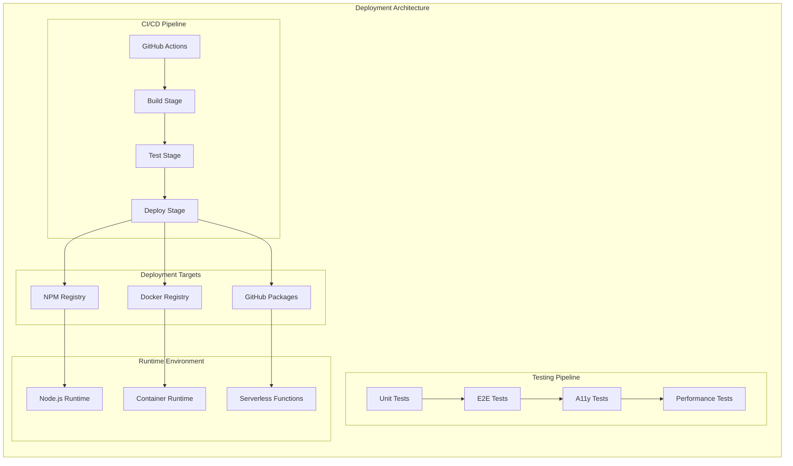

## 🔄 拡張性・将来性

### 拡張アーキテクチャ

```mermaid
graph TB
    subgraph "Extensibility Architecture"
        direction TB
        
        subgraph "Plugin System"
            PLUGIN_API[Plugin API]
            PLUGIN_REGISTRY[Plugin Registry]
            PLUGIN_LOADER[Plugin Loader]
            
            PLUGIN_API --> PLUGIN_REGISTRY
            PLUGIN_REGISTRY --> PLUGIN_LOADER
        end
        
        subgraph "Future Phases"
            PHASE_7[Phase 7: Mobile]
            PHASE_8[Phase 8: Desktop]
            PHASE_9[Phase 9: DevOps]
            
            PHASE_7 --> PHASE_8
            PHASE_8 --> PHASE_9
        end
        
        subgraph "AI Model Integration"
            MULTI_MODEL[Multi-Model Support]
            MODEL_ROUTER[Model Router]
            FALLBACK[Fallback Strategy]
            
            MULTI_MODEL --> MODEL_ROUTER
            MODEL_ROUTER --> FALLBACK
        end
        
        subgraph "Platform Extensions"
            MOBILE_EXT[Mobile Extensions]
            DESKTOP_EXT[Desktop Extensions]
            CLOUD_EXT[Cloud Extensions]
            
            MOBILE_EXT --> DESKTOP_EXT
            DESKTOP_EXT --> CLOUD_EXT
        end
    end
```

---

## 📝 まとめ

ae-framework Architecture 2025は、以下の特徴を持つ最先端のAI駆動開発フレームワークです：

### 🎯 核心価値
1. **TDD強制6フェーズ開発** - 品質保証された開発プロセス
2. **Claude Code完全統合** - 自然言語での開発指示
3. **Phase 6 UI/UX自動生成** - React+Next.js完全自動化
4. **OpenTelemetryテレメトリ** - リアルタイム品質監視
5. **WCAG 2.1 AA準拠** - アクセシビリティファースト

### 🏗️ アーキテクチャの強み
- **ハイブリッド統合** - Claude Code、CLI、MCPの統一
- **モジュラー設計** - 各フェーズ独立、拡張可能
- **品質ゲート** - 自動品質チェック機能
- **テレメトリ駆動** - データに基づく継続改善
- **モノレポ最適化** - 効率的なパッケージ管理

**🚀 ae-frameworkで、AI-Enhanced Developmentの未来を実現しましょう！**