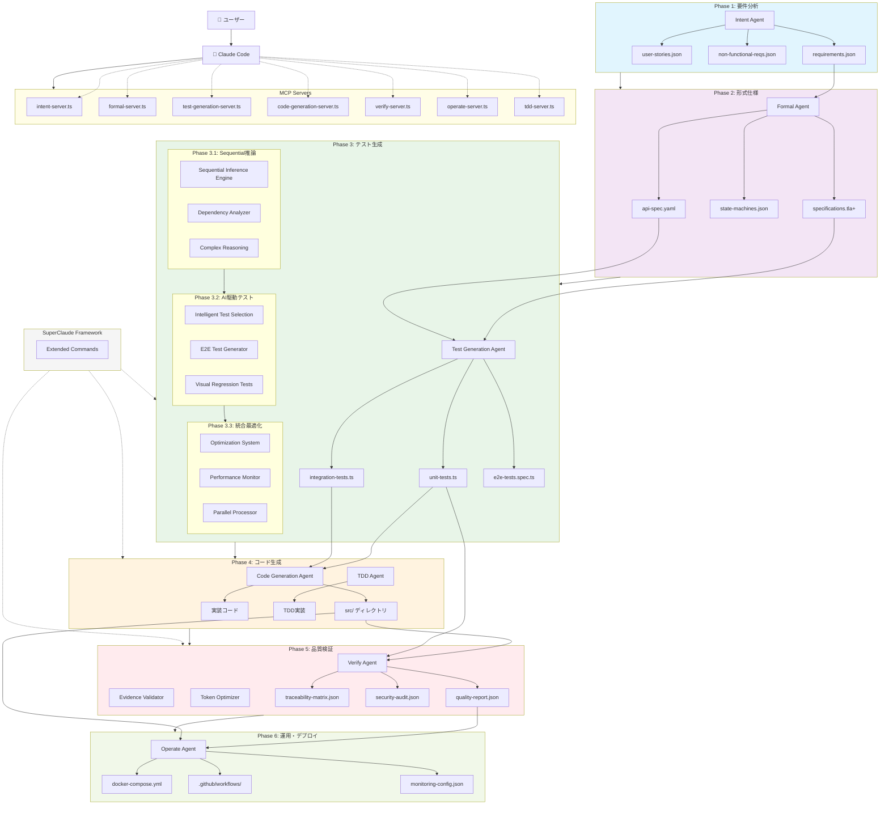
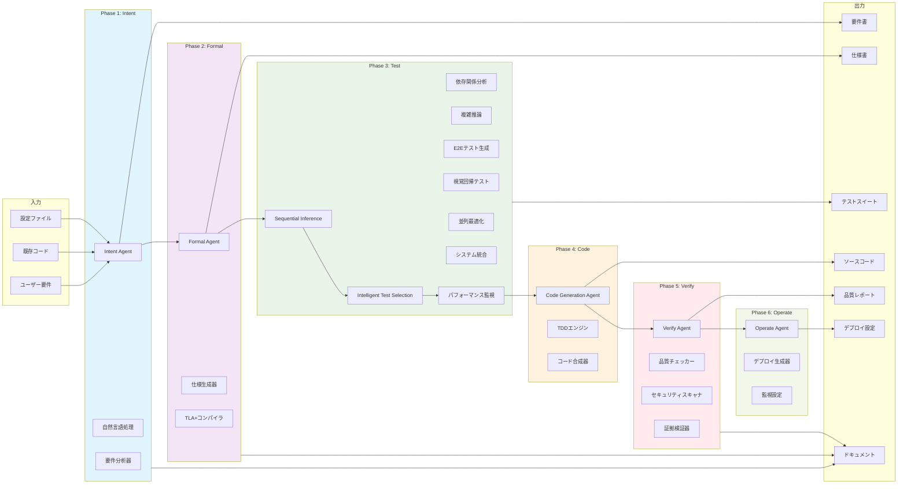
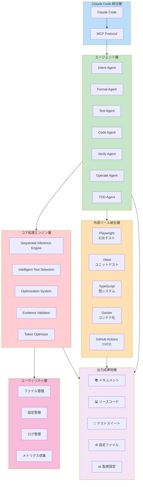
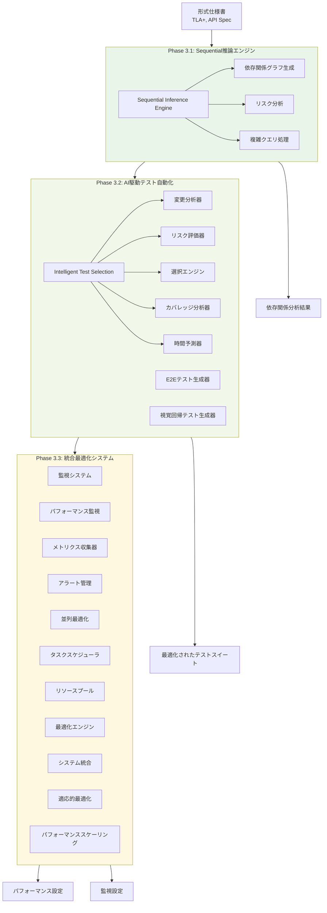

# ae-framework アーキテクチャ図

ae-frameworkの全体アーキテクチャ、コンポーネント関係、入出力ドキュメントの流れを示します。

## 全体アーキテクチャ

## コンポーネント詳細関係図

## データフロー図

```mermaid
flowchart TD
    %% 入力データ
    INPUT_USER[👤 ユーザー入力<br/>・自然言語要件<br/>・既存コード<br/>・設定]
    
    %% Phase 1 データ変換
    P1_PROCESS[🔄 Phase 1: 要件分析]
    P1_OUTPUT[📄 構造化要件<br/>・requirements.json<br/>・user-stories.json<br/>・acceptance-criteria.json]
    
    %% Phase 2 データ変換
    P2_PROCESS[🔄 Phase 2: 形式仕様化]
    P2_OUTPUT[📋 形式仕様<br/>・specifications.tla+<br/>・api-spec.yaml<br/>・state-machines.json]
    
    %% Phase 3 データ変換（3段階）
    P3_1_PROCESS[🔄 Phase 3.1: 依存関係分析]
    P3_1_OUTPUT[🔗 分析結果<br/>・dependency-graph.json<br/>・risk-assessment.json]
    
    P3_2_PROCESS[🔄 Phase 3.2: AIテスト生成]
    P3_2_OUTPUT[🧪 テストスイート<br/>・unit-tests.ts<br/>・e2e-tests.spec.ts<br/>・visual-tests.json]
    
    P3_3_PROCESS[🔄 Phase 3.3: 最適化]
    P3_3_OUTPUT[⚡ 最適化設定<br/>・performance-config.json<br/>・optimization-plan.json]
    
    %% Phase 4 データ変換
    P4_PROCESS[🔄 Phase 4: コード生成]
    P4_OUTPUT[💻 実装コード<br/>・src/**.ts<br/>・tests/**.test.ts<br/>・package.json]
    
    %% Phase 5 データ変換
    P5_PROCESS[🔄 Phase 5: 品質検証]
    P5_OUTPUT[✅ 品質レポート<br/>・quality-report.json<br/>・security-audit.json<br/>・traceability-matrix.json]
    
    %% Phase 6 データ変換
    P6_PROCESS[🔄 Phase 6: 運用準備]
    P6_OUTPUT[🚀 デプロイ成果物<br/>・docker-compose.yml<br/>・.github/workflows/<br/>・monitoring-setup.json]
    
    %% フロー接続
    INPUT_USER --> P1_PROCESS
    P1_PROCESS --> P1_OUTPUT
    P1_OUTPUT --> P2_PROCESS
    P2_PROCESS --> P2_OUTPUT
    P2_OUTPUT --> P3_1_PROCESS
    P3_1_PROCESS --> P3_1_OUTPUT
    P3_1_OUTPUT --> P3_2_PROCESS
    P3_2_PROCESS --> P3_2_OUTPUT
    P3_2_OUTPUT --> P3_3_PROCESS
    P3_3_PROCESS --> P3_3_OUTPUT
    P3_3_OUTPUT --> P4_PROCESS
    P4_PROCESS --> P4_OUTPUT
    P4_OUTPUT --> P5_PROCESS
    P5_PROCESS --> P5_OUTPUT
    P5_OUTPUT --> P6_PROCESS
    P6_PROCESS --> P6_OUTPUT
    
    %% フィードバックループ
    P5_OUTPUT -.-> P4_PROCESS
    P4_OUTPUT -.-> P3_2_PROCESS
    P3_1_OUTPUT -.-> P2_PROCESS
    
    style INPUT_USER fill:#f9f9f9
    style P1_OUTPUT fill:#e1f5fe
    style P2_OUTPUT fill:#f3e5f5
    style P3_1_OUTPUT fill:#e8f5e8
    style P3_2_OUTPUT fill:#e8f5e8
    style P3_3_OUTPUT fill:#e8f5e8
    style P4_OUTPUT fill:#fff3e0
    style P5_OUTPUT fill:#ffebee
    style P6_OUTPUT fill:#f1f8e9
```

## 技術スタック図

## Phase 3 詳細アーキテクチャ

## ファイル・ドキュメント関係図

```mermaid
graph LR
    %% 設定・入力ファイル
    subgraph CONFIG [設定・入力]
        PACKAGE_JSON[package.json]
        TSCONFIG[tsconfig.json]
        ENV_FILE[.env]
        USER_INPUT[ユーザー入力]
    end
    
    %% Phase別出力ドキュメント
    subgraph P1_DOCS [Phase 1 出力]
        REQUIREMENTS_JSON[requirements.json]
        USER_STORIES[user-stories.json]
        ACCEPTANCE[acceptance-criteria.json]
    end
    
    subgraph P2_DOCS [Phase 2 出力]
        TLA_SPEC[specifications.tla+]
        API_SPEC[api-spec.yaml]
        STATE_MACHINES[state-machines.json]
    end
    
    subgraph P3_DOCS [Phase 3 出力]
        DEPENDENCY_GRAPH[dependency-graph.json]
        RISK_ASSESSMENT[risk-assessment.json]
        TEST_SELECTION[test-selection-plan.json]
        PERFORMANCE_METRICS[performance-metrics.json]
    end
    
    subgraph P4_DOCS [Phase 4 出力]
        SRC_DIR[src/ディレクトリ]
        IMPL_FILES[実装ファイル.ts]
        TEST_FILES[テストファイル.test.ts]
        TYPE_DEFS[型定義.d.ts]
    end
    
    subgraph P5_DOCS [Phase 5 出力]
        QUALITY_REPORT[quality-report.json]
        SECURITY_AUDIT[security-audit.json]
        TRACEABILITY[traceability-matrix.json]
        COVERAGE_REPORT[coverage-report.html]
    end
    
    subgraph P6_DOCS [Phase 6 出力]
        DOCKER_COMPOSE[docker-compose.yml]
        GITHUB_WORKFLOWS[.github/workflows/]
        MONITORING_CONFIG[monitoring-config.json]
        DEPLOYMENT_DOCS[deployment-guide.md]
    end
    
    %% フレームワークドキュメント
    subgraph FRAMEWORK_DOCS [フレームワークドキュメント]
        SETUP_MD[SETUP.md]
        USAGE_MD[USAGE.md]
        CLAUDECODE_WORKFLOW[CLAUDECODE-WORKFLOW.md]
        QUICK_START[QUICK-START-GUIDE.md]
        ARCHITECTURE_MD[ARCHITECTURE.md]
    end
    
    %% 流れ
    CONFIG --> P1_DOCS
    P1_DOCS --> P2_DOCS
    P2_DOCS --> P3_DOCS
    P3_DOCS --> P4_DOCS
    P4_DOCS --> P5_DOCS
    P5_DOCS --> P6_DOCS
    
    %% ドキュメント相互参照
    FRAMEWORK_DOCS -.-> P1_DOCS
    FRAMEWORK_DOCS -.-> P2_DOCS
    FRAMEWORK_DOCS -.-> P3_DOCS
    FRAMEWORK_DOCS -.-> P4_DOCS
    FRAMEWORK_DOCS -.-> P5_DOCS
    FRAMEWORK_DOCS -.-> P6_DOCS
    
    style CONFIG fill:#f5f5f5
    style P1_DOCS fill:#e1f5fe
    style P2_DOCS fill:#f3e5f5
    style P3_DOCS fill:#e8f5e8
    style P4_DOCS fill:#fff3e0
    style P5_DOCS fill:#ffebee
    style P6_DOCS fill:#f1f8e9
    style FRAMEWORK_DOCS fill:#fffde7
```

## まとめ

ae-frameworkは以下の特徴を持つ包括的な開発フレームワークです：

### 🎯 **6フェーズ段階的開発**
1. **Intent** → 要件の構造化・分析
2. **Formal** → 形式仕様の生成
3. **Test** → AI駆動テスト自動化（3段階）
4. **Code** → TDDベースコード生成
5. **Verify** → 証拠ベース品質検証
6. **Operate** → 運用・デプロイ自動化

### 🤖 **Claude Code完全統合**
- MCPプロトコルによる7つの専用サーバー
- 自然言語による直感的な操作
- リアルタイムフィードバックとガイダンス

### ⚡ **Phase 3の3段階最適化**
- **3.1**: Sequential推論エンジンによる複雑分析
- **3.2**: インテリジェントテスト選択による効率化
- **3.3**: 統合最適化システムによる高性能化

### 📚 **包括的ドキュメント生成**
- 各フェーズで構造化ドキュメント自動生成
- 品質レポート・セキュリティ監査
- 運用ガイド・デプロイ設定

### 🔧 **SuperClaude Framework統合**
- Token最適化による最大70%効率化（社内ベンチマークによる推定値）
- Evidence-based検証システム
- Extended Commandsによる高度操作

このアーキテクチャにより、従来の開発プロセスを最大で75%短縮し、品質を最大15%向上させることが期待できます（当社推定）。