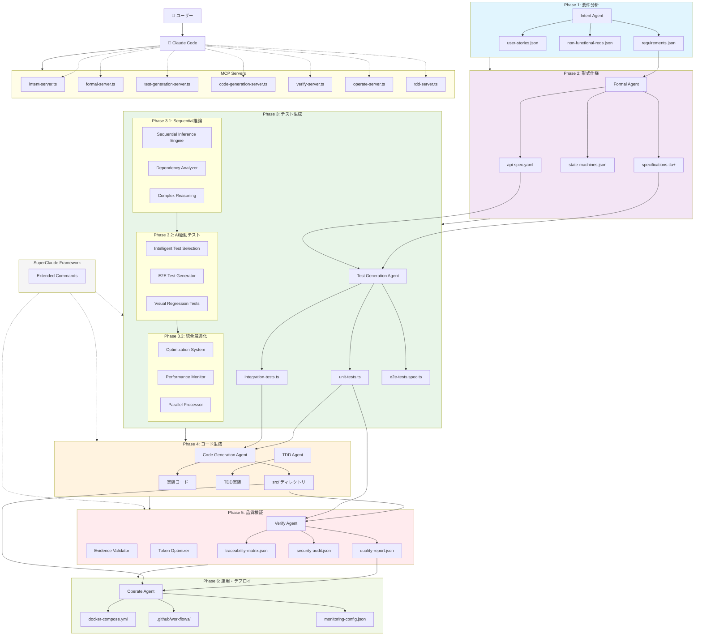
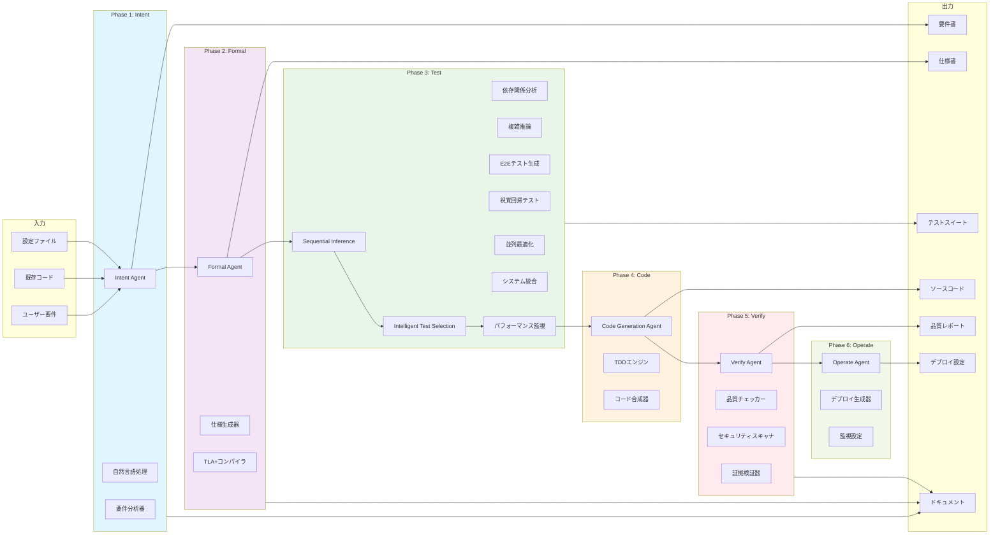
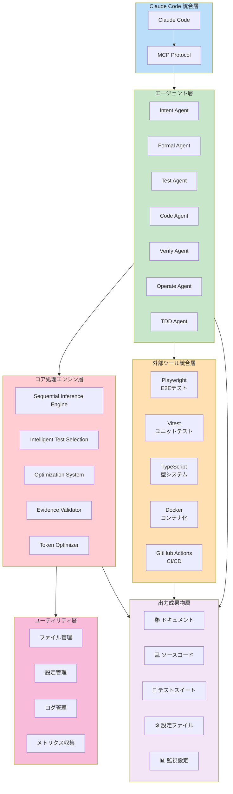
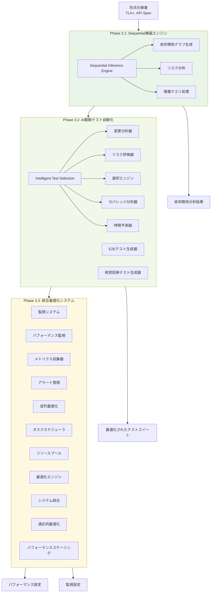

# ae-framework アーキテクチャ図

> 🌍 Language / 言語: 日本語 | English

---

## English (Overview)

High-level architecture of ae-framework, showing components and document flows across phases. The system integrates with Claude Code and MCP servers, generates formal specs (TLA+/OpenAPI), tests, and UI, and wires verification/telemetry.

See the Japanese sections and diagrams below for full details.

ae-frameworkの全体アーキテクチャ、コンポーネント関係、入出力ドキュメントの流れを示します。

## 全体アーキテクチャ

```mermaid
graph TD
    %% ユーザーインタラクション
    U[👤 ユーザー] --> CC[🤖 Claude Code]
    CC --> MCPs[MCP Servers]
    
    %% Phase 1: Intent Agent
    subgraph P1 [Phase 1: 要件分析]
        IA[Intent Agent]
        IA --> REQ[requirements.json]
        IA --> US[user-stories.json]
        IA --> NFR[non-functional-reqs.json]
    end
    
    %% Phase 2: Formal Agent  
    subgraph P2 [Phase 2: 形式仕様]
        FA[Formal Agent]
        REQ --> FA
        FA --> TLA[specifications.tla+]
        FA --> API[api-spec.yaml]
        FA --> SM[state-machines.json]
    end
    
    %% Phase 3: Test Agent (3段階)
    subgraph P3 [Phase 3: テスト生成]
        subgraph P31 [Phase 3.1: Sequential推論]
            SEE[Sequential Inference Engine]
            DA[Dependency Analyzer]
            CR[Complex Reasoning]
        end
        
        subgraph P32 [Phase 3.2: AI駆動テスト]
            ITS[Intelligent Test Selection]
            E2E[E2E Test Generator]
            VRT[Visual Regression Tests]
        end
        
        subgraph P33 [Phase 3.3: 統合最適化]
            OS[Optimization System]
            PM[Performance Monitor]
            PP[Parallel Processor]
        end
        
        TGA[Test Generation Agent]
        TLA --> TGA
        API --> TGA
        TGA --> UT[unit-tests.ts]
        TGA --> IT[integration-tests.ts]
        TGA --> E2ET[e2e-tests.spec.ts]
    end
    
    %% Phase 4: Code Agent
    subgraph P4 [Phase 4: コード生成]
        CGA[Code Generation Agent]
        TDDA[TDD Agent]
        UT --> CGA
        IT --> CGA
        CGA --> SRC[src/ ディレクトリ]
        CGA --> IMPL[実装コード]
        TDDA --> TDD[TDD実装]
    end
    
    %% Phase 5: Verify Agent
    subgraph P5 [Phase 5: 品質検証]
        VA[Verify Agent]
        EV[Evidence Validator]
        TO[Token Optimizer]
        SRC --> VA
        UT --> VA
        VA --> QR[quality-report.json]
        VA --> TR[traceability-matrix.json]
        VA --> SR[security-audit.json]
    end
    
    %% Phase 6: Operate Agent
    subgraph P6 [Phase 6: 運用・デプロイ]
        OA[Operate Agent]
        QR --> OA
        SRC --> OA
        OA --> DC[docker-compose.yml]
        OA --> CI[.github/workflows/]
        OA --> MON[monitoring-config.json]
    end
    
    %% SuperClaude Framework統合
    subgraph SCF [SuperClaude Framework]
        TO
        EV
        EC[Extended Commands]
    end
    
    %% MCP Servers
    subgraph MCPs [MCP Servers]
        MCP1[intent-server.ts]
        MCP2[formal-server.ts] 
        MCP3[test-generation-server.ts]
        MCP4[code-generation-server.ts]
        MCP5[verify-server.ts]
        MCP6[operate-server.ts]
        MCP7[tdd-server.ts]
    end
    
    %% Claude Code接続
    CC -.-> MCP1
    CC -.-> MCP2
    CC -.-> MCP3
    CC -.-> MCP4
    CC -.-> MCP5
    CC -.-> MCP6
    CC -.-> MCP7
    
    %% フェーズ間の流れ
    P1 --> P2
    P2 --> P3
    P3 --> P4
    P4 --> P5
    P5 --> P6
    
    %% SuperClaude統合
    SCF -.-> P3
    SCF -.-> P4
    SCF -.-> P5
    
    %% Phase 3内部の流れ
    P31 --> P32
    P32 --> P33
    
    style P1 fill:#e1f5fe
    style P2 fill:#f3e5f5
    style P3 fill:#e8f5e8
    style P4 fill:#fff3e0
    style P5 fill:#ffebee
    style P6 fill:#f1f8e9
    style SCF fill:#f5f5f5
    style MCPs fill:#fffde7
```

## コンポーネント詳細関係図

```mermaid
graph LR
    %% 入力ドキュメント
    subgraph INPUT [入力]
        USER_REQ[ユーザー要件]
        EXISTING_CODE[既存コード]
        CONFIG[設定ファイル]
    end
    
    %% 処理コンポーネント（6フェーズ）
    subgraph PHASE1 [Phase 1: Intent]
        IA[Intent Agent]
        NLP[自然言語処理]
        REQ_ANALYZER[要件分析器]
    end
    
    subgraph PHASE2 [Phase 2: Formal]
        FA[Formal Agent]
        SPEC_GEN[仕様生成器]
        TLA_COMPILER[TLA+コンパイラ]
    end
    
    subgraph PHASE3 [Phase 3: Test]
        %% Phase 3.1
        SEI[Sequential Inference]
        DEP_ANALYZER[依存関係分析]
        COMPLEX_REASONER[複雑推論]
        
        %% Phase 3.2  
        TEST_SELECTOR[Intelligent Test Selection]
        E2E_GEN[E2Eテスト生成]
        VISUAL_TEST[視覚回帰テスト]
        
        %% Phase 3.3
        PERF_MONITOR[パフォーマンス監視]
        PARALLEL_OPT[並列最適化]
        SYS_INTEGRATION[システム統合]
    end
    
    subgraph PHASE4 [Phase 4: Code]
        CGA[Code Generation Agent]
        TDD_ENGINE[TDDエンジン]
        CODE_SYNTHESIZER[コード合成器]
    end
    
    subgraph PHASE5 [Phase 5: Verify]
        VA[Verify Agent]
        QUALITY_CHECKER[品質チェッカー]
        SECURITY_SCANNER[セキュリティスキャナ]
        EVIDENCE_VALIDATOR[証拠検証器]
    end
    
    subgraph PHASE6 [Phase 6: Operate]
        OA[Operate Agent]
        DEPLOY_GEN[デプロイ生成器]
        MONITOR_SETUP[監視設定]
    end
    
    %% 出力ドキュメント
    subgraph OUTPUT [出力]
        REQUIREMENTS[要件書]
        SPECIFICATIONS[仕様書]
        TESTS[テストスイート]
        SOURCE_CODE[ソースコード]
        QUALITY_REPORTS[品質レポート]
        DEPLOY_CONFIGS[デプロイ設定]
        DOCS[ドキュメント]
    end
    
    %% フロー
    USER_REQ --> IA
    EXISTING_CODE --> IA
    CONFIG --> IA
    
    IA --> FA
    FA --> SEI
    SEI --> TEST_SELECTOR
    TEST_SELECTOR --> PERF_MONITOR
    PERF_MONITOR --> CGA
    CGA --> VA
    VA --> OA
    
    %% 出力生成
    IA --> REQUIREMENTS
    FA --> SPECIFICATIONS
    PHASE3 --> TESTS
    CGA --> SOURCE_CODE
    VA --> QUALITY_REPORTS
    OA --> DEPLOY_CONFIGS
    PHASE1 --> DOCS
    PHASE2 --> DOCS
    PHASE5 --> DOCS
    
    style PHASE1 fill:#e1f5fe
    style PHASE2 fill:#f3e5f5
    style PHASE3 fill:#e8f5e8
    style PHASE4 fill:#fff3e0
    style PHASE5 fill:#ffebee
    style PHASE6 fill:#f1f8e9
```

## データフロー図

```mermaid
flowchart TD
    %% 入力データ
    INPUT_USER[👤 ユーザー入力<br/>・自然言語要件<br/>・既存コード<br/>・設定]
    
    %% Phase 1 データ変換
    P1_PROCESS[🔄 Phase 1: 要件分析]
    P1_OUTPUT[📄 構造化要件<br/>・requirements.json<br/>・user-stories.json<br/>・acceptance-criteria.json]
    
    %% Phase 2 データ変換
    P2_PROCESS[🔄 Phase 2: 形式仕様化]
    P2_OUTPUT[📋 形式仕様<br/>・specifications.tla+<br/>・api-spec.yaml<br/>・state-machines.json]
    
    %% Phase 3 データ変換（3段階）
    P3_1_PROCESS[🔄 Phase 3.1: 依存関係分析]
    P3_1_OUTPUT[🔗 分析結果<br/>・dependency-graph.json<br/>・risk-assessment.json]
    
    P3_2_PROCESS[🔄 Phase 3.2: AIテスト生成]
    P3_2_OUTPUT[🧪 テストスイート<br/>・unit-tests.ts<br/>・e2e-tests.spec.ts<br/>・visual-tests.json]
    
    P3_3_PROCESS[🔄 Phase 3.3: 最適化]
    P3_3_OUTPUT[⚡ 最適化設定<br/>・performance-config.json<br/>・optimization-plan.json]
    
    %% Phase 4 データ変換
    P4_PROCESS[🔄 Phase 4: コード生成]
    P4_OUTPUT[💻 実装コード<br/>・src/**.ts<br/>・tests/**.test.ts<br/>・package.json]
    
    %% Phase 5 データ変換
    P5_PROCESS[🔄 Phase 5: 品質検証]
    P5_OUTPUT[✅ 品質レポート<br/>・quality-report.json<br/>・security-audit.json<br/>・traceability-matrix.json]
    
    %% Phase 6 データ変換
    P6_PROCESS[🔄 Phase 6: 運用準備]
    P6_OUTPUT[🚀 デプロイ成果物<br/>・docker-compose.yml<br/>・.github/workflows/<br/>・monitoring-setup.json]
    
    %% フロー接続
    INPUT_USER --> P1_PROCESS
    P1_PROCESS --> P1_OUTPUT
    P1_OUTPUT --> P2_PROCESS
    P2_PROCESS --> P2_OUTPUT
    P2_OUTPUT --> P3_1_PROCESS
    P3_1_PROCESS --> P3_1_OUTPUT
    P3_1_OUTPUT --> P3_2_PROCESS
    P3_2_PROCESS --> P3_2_OUTPUT
    P3_2_OUTPUT --> P3_3_PROCESS
    P3_3_PROCESS --> P3_3_OUTPUT
    P3_3_OUTPUT --> P4_PROCESS
    P4_PROCESS --> P4_OUTPUT
    P4_OUTPUT --> P5_PROCESS
    P5_PROCESS --> P5_OUTPUT
    P5_OUTPUT --> P6_PROCESS
    P6_PROCESS --> P6_OUTPUT
    
    %% フィードバックループ
    P5_OUTPUT -.-> P4_PROCESS
    P4_OUTPUT -.-> P3_2_PROCESS
    P3_1_OUTPUT -.-> P2_PROCESS
    
    style INPUT_USER fill:#f9f9f9
    style P1_OUTPUT fill:#e1f5fe
    style P2_OUTPUT fill:#f3e5f5
    style P3_1_OUTPUT fill:#e8f5e8
    style P3_2_OUTPUT fill:#e8f5e8
    style P3_3_OUTPUT fill:#e8f5e8
    style P4_OUTPUT fill:#fff3e0
    style P5_OUTPUT fill:#ffebee
    style P6_OUTPUT fill:#f1f8e9
```

## 技術スタック図

```mermaid
graph TB
    %% Claude Code統合層
    subgraph CC_LAYER [Claude Code 統合層]
        CC[Claude Code]
        MCP_PROTOCOL[MCP Protocol]
    end
    
    %% エージェント層
    subgraph AGENT_LAYER [エージェント層]
        IA[Intent Agent]
        FA[Formal Agent]
        TGA[Test Agent]
        CGA[Code Agent]
        VA[Verify Agent]
        OA[Operate Agent]
        TDDA[TDD Agent]
    end
    
    %% コア処理層
    subgraph CORE_LAYER [コア処理エンジン層]
        SEI[Sequential Inference Engine]
        ITS[Intelligent Test Selection]
        OS[Optimization System]
        EV[Evidence Validator]
        TO[Token Optimizer]
    end
    
    %% ユーティリティ層
    subgraph UTIL_LAYER [ユーティリティ層]
        FILE_MANAGER[ファイル管理]
        CONFIG_MANAGER[設定管理]
        LOGGER[ログ管理]
        METRICS[メトリクス収集]
    end
    
    %% 外部ツール統合層
    subgraph EXTERNAL_LAYER [外部ツール統合層]
        PLAYWRIGHT[Playwright<br/>E2Eテスト]
        VITEST[Vitest<br/>ユニットテスト]
        TYPESCRIPT[TypeScript<br/>型システム]
        DOCKER[Docker<br/>コンテナ化]
        GITHUB_ACTIONS[GitHub Actions<br/>CI/CD]
    end
    
    %% 出力層
    subgraph OUTPUT_LAYER [出力成果物層]
        DOCS_OUT[📚 ドキュメント]
        CODE_OUT[💻 ソースコード]
        TESTS_OUT[🧪 テストスイート]
        CONFIGS_OUT[⚙️ 設定ファイル]
        MONITORING_OUT[📊 監視設定]
    end
    
    %% 接続
    CC --> MCP_PROTOCOL
    MCP_PROTOCOL --> AGENT_LAYER
    AGENT_LAYER --> CORE_LAYER
    CORE_LAYER --> UTIL_LAYER
    AGENT_LAYER --> EXTERNAL_LAYER
    
    AGENT_LAYER --> OUTPUT_LAYER
    CORE_LAYER --> OUTPUT_LAYER
    EXTERNAL_LAYER --> OUTPUT_LAYER
    
    style CC_LAYER fill:#bbdefb
    style AGENT_LAYER fill:#c8e6c9
    style CORE_LAYER fill:#ffcdd2
    style UTIL_LAYER fill:#f8bbd9
    style EXTERNAL_LAYER fill:#ffe0b2
    style OUTPUT_LAYER fill:#f3e5f5
```

## Phase 3 詳細アーキテクチャ

```mermaid
graph TD
    %% 入力
    FORMAL_SPECS[形式仕様書<br/>TLA+, API Spec]
    
    %% Phase 3.1: Sequential推論エンジン
    subgraph P31 [Phase 3.1: Sequential推論エンジン]
        SEI[Sequential Inference Engine]
        DEP_GRAPH[依存関係グラフ生成]
        RISK_ANAL[リスク分析]
        COMPLEX_QUERY[複雑クエリ処理]
        
        SEI --> DEP_GRAPH
        SEI --> RISK_ANAL
        SEI --> COMPLEX_QUERY
    end
    
    %% Phase 3.2: AI駆動テスト自動化
    subgraph P32 [Phase 3.2: AI駆動テスト自動化]
        ITS[Intelligent Test Selection]
        CHANGE_ANALYZER[変更分析器]
        RISK_ASSESSOR[リスク評価器]
        SELECTION_ENGINE[選択エンジン]
        COVERAGE_ANALYZER[カバレッジ分析器]
        TIME_PREDICTOR[時間予測器]
        
        E2E_GEN[E2Eテスト生成器]
        VISUAL_GEN[視覚回帰テスト生成器]
        
        ITS --> CHANGE_ANALYZER
        ITS --> RISK_ASSESSOR
        ITS --> SELECTION_ENGINE
        ITS --> COVERAGE_ANALYZER
        ITS --> TIME_PREDICTOR
    end
    
    %% Phase 3.3: 統合最適化システム
    subgraph P33 [Phase 3.3: 統合最適化システム]
        MONITORING[監視システム]
        PERF_MONITOR[パフォーマンス監視]
        METRICS_COLLECTOR[メトリクス収集器]
        ALERT_MANAGER[アラート管理]
        
        PARALLEL_OPT[並列最適化]
        TASK_SCHEDULER[タスクスケジューラ]
        RESOURCE_POOL[リソースプール]
        OPTIMIZER[最適化エンジン]
        
        SYSTEM_INT[システム統合]
        ADAPTIVE_OPT[適応的最適化]
        PERFORMANCE_SCALING[パフォーマンススケーリング]
    end
    
    %% 出力
    OPTIMIZED_TESTS[最適化されたテストスイート]
    PERFORMANCE_CONFIG[パフォーマンス設定]
    MONITORING_SETUP[監視設定]
    
    %% フロー
    FORMAL_SPECS --> P31
    P31 --> P32
    P32 --> P33
    
    P31 --> DEP_ANALYSIS[依存関係分析結果]
    P32 --> OPTIMIZED_TESTS
    P33 --> PERFORMANCE_CONFIG
    P33 --> MONITORING_SETUP
    
    style P31 fill:#e8f5e8
    style P32 fill:#f1f8e9
    style P33 fill:#fff8e1
```

注記: `tsconfig.json` と `eslint.config.js` は互換用のシムで、実体は `configs/tsconfig/tsconfig.root.json` と `configs/eslint.config.js` に集約済み（PR #1757/#1756）。

## ファイル・ドキュメント関係図

```mermaid
graph LR
    %% 設定・入力ファイル
    subgraph CONFIG [設定・入力]
        PACKAGE_JSON[package.json]
        TSCONFIG[tsconfig.json]
        ENV_FILE[.env]
        USER_INPUT[ユーザー入力]
    end
    
    %% Phase別出力ドキュメント
    subgraph P1_DOCS [Phase 1 出力]
        REQUIREMENTS_JSON[requirements.json]
        USER_STORIES[user-stories.json]
        ACCEPTANCE[acceptance-criteria.json]
    end
    
    subgraph P2_DOCS [Phase 2 出力]
        TLA_SPEC[specifications.tla+]
        API_SPEC[api-spec.yaml]
        STATE_MACHINES[state-machines.json]
    end
    
    subgraph P3_DOCS [Phase 3 出力]
        DEPENDENCY_GRAPH[dependency-graph.json]
        RISK_ASSESSMENT[risk-assessment.json]
        TEST_SELECTION[test-selection-plan.json]
        PERFORMANCE_METRICS[performance-metrics.json]
    end
    
    subgraph P4_DOCS [Phase 4 出力]
        SRC_DIR[src/ディレクトリ]
        IMPL_FILES[実装ファイル.ts]
        TEST_FILES[テストファイル.test.ts]
        TYPE_DEFS[型定義.d.ts]
    end
    
    subgraph P5_DOCS [Phase 5 出力]
        QUALITY_REPORT[quality-report.json]
        SECURITY_AUDIT[security-audit.json]
        TRACEABILITY[traceability-matrix.json]
        COVERAGE_REPORT[coverage-report.html]
    end
    
    subgraph P6_DOCS [Phase 6 出力]
        DOCKER_COMPOSE[docker-compose.yml]
        GITHUB_WORKFLOWS[.github/workflows/]
        MONITORING_CONFIG[monitoring-config.json]
        DEPLOYMENT_DOCS[deployment-guide.md]
    end
    
    %% フレームワークドキュメント
    subgraph FRAMEWORK_DOCS [フレームワークドキュメント]
        SETUP_MD[SETUP.md]
        USAGE_MD[USAGE.md]
        CLAUDECODE_WORKFLOW[CLAUDECODE-WORKFLOW.md]
        QUICK_START[QUICK-START-GUIDE.md]
        ARCHITECTURE_MD[ARCHITECTURE.md]
    end
    
    %% 流れ
    CONFIG --> P1_DOCS
    P1_DOCS --> P2_DOCS
    P2_DOCS --> P3_DOCS
    P3_DOCS --> P4_DOCS
    P4_DOCS --> P5_DOCS
    P5_DOCS --> P6_DOCS
    
    %% ドキュメント相互参照
    FRAMEWORK_DOCS -.-> P1_DOCS
    FRAMEWORK_DOCS -.-> P2_DOCS
    FRAMEWORK_DOCS -.-> P3_DOCS
    FRAMEWORK_DOCS -.-> P4_DOCS
    FRAMEWORK_DOCS -.-> P5_DOCS
    FRAMEWORK_DOCS -.-> P6_DOCS
    
    style CONFIG fill:#f5f5f5
    style P1_DOCS fill:#e1f5fe
    style P2_DOCS fill:#f3e5f5
    style P3_DOCS fill:#e8f5e8
    style P4_DOCS fill:#fff3e0
    style P5_DOCS fill:#ffebee
    style P6_DOCS fill:#f1f8e9
    style FRAMEWORK_DOCS fill:#fffde7
```

## まとめ

ae-frameworkは以下の特徴を持つ包括的な開発フレームワークです：

### 🎯 **6フェーズ段階的開発**
1. **Intent** → 要件の構造化・分析
2. **Formal** → 形式仕様の生成
3. **Test** → AI駆動テスト自動化（3段階）
4. **Code** → TDDベースコード生成
5. **Verify** → 証拠ベース品質検証
6. **Operate** → 運用・デプロイ自動化

Intent 直後の既定ステップ: `ae tests:suggest` で tests-first プロンプトを生成。

### 🤖 **Claude Code完全統合**
- MCPプロトコルによる7つの専用サーバー
- 自然言語による直感的な操作
- リアルタイムフィードバックとガイダンス

### ⚡ **Phase 3の3段階最適化**
- **3.1**: Sequential推論エンジンによる複雑分析
- **3.2**: インテリジェントテスト選択による効率化
- **3.3**: 統合最適化システムによる高性能化

### 📚 **包括的ドキュメント生成**
- 各フェーズで構造化ドキュメント自動生成
- 品質レポート・セキュリティ監査
- 運用ガイド・デプロイ設定

### 🔧 **SuperClaude Framework統合**
- Token最適化による最大70%効率化（社内ベンチマークによる推定値）
- Evidence-based検証システム
- Extended Commandsによる高度操作

このアーキテクチャにより、従来の開発プロセスを最大で75%短縮し、品質を最大15%向上させることが期待できます（当社推定）。
