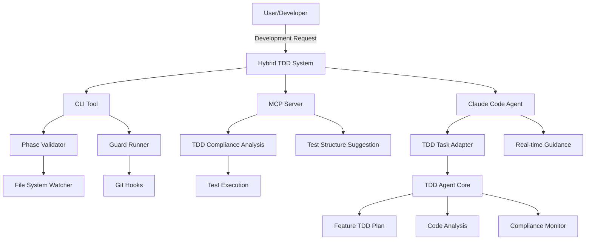
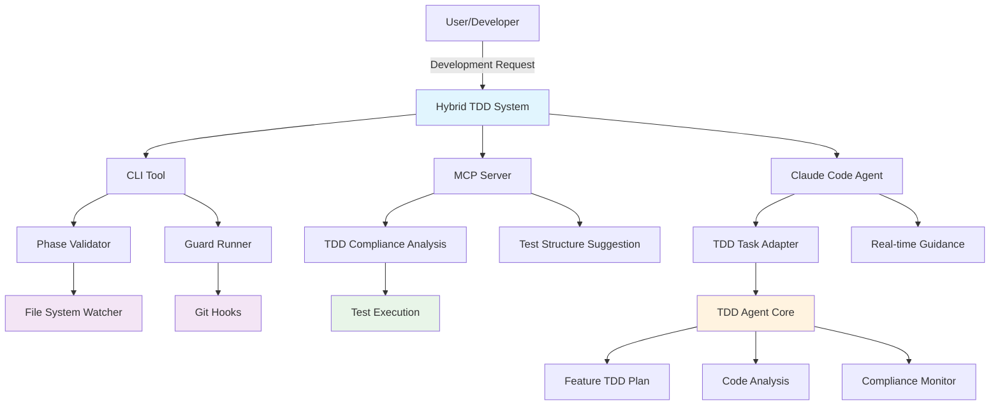
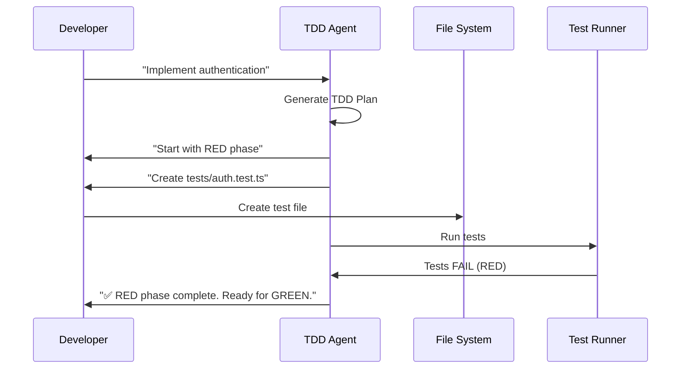
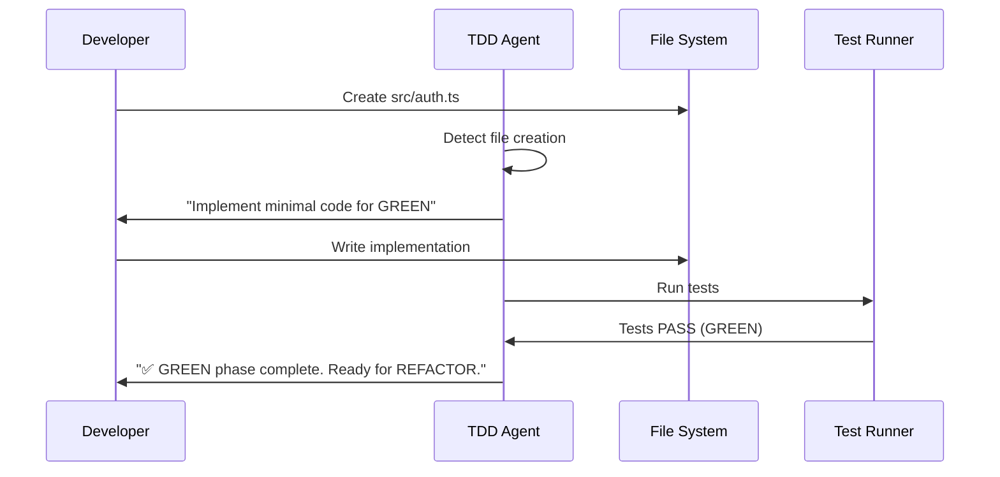
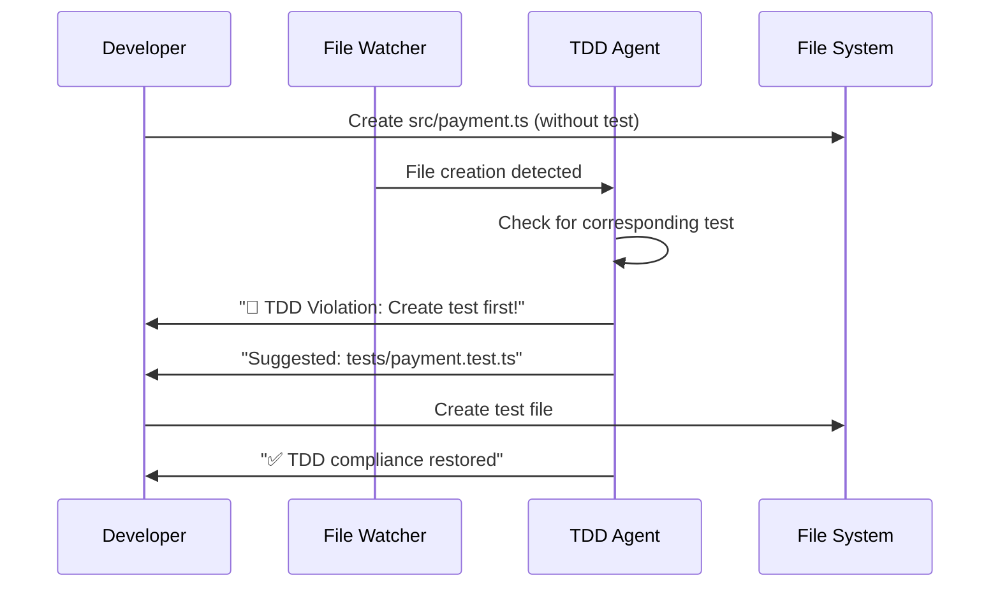

# ae-framework TDD Architecture Documentation

> 🌍 Language / 言語: English | 日本語

---

## English (Overview)

End-to-end TDD architecture across six phases with CLI/MCP/Claude Code integration, real-time monitoring, and multi-level execution environments. The sections below (including Japanese overview) detail components and flows.

## English (Detailed)

### Architecture Overview
The framework operationalizes Test-Driven Development across six phases and three integration surfaces:
- CLI tools, MCP servers, and Claude Code agents
- Real-time monitoring and proactive guidance
- Strict TDD enforcement (RED → GREEN → REFACTOR) with guards/hooks/CI



### Core Components
1) Hybrid TDD System (`src/integration/hybrid-tdd-system.ts`)
- Purpose: Route requests to the best surface (CLI/MCP/Agent) and orchestrate real-time supervision
- Capabilities: environment detection, workflow integration (IDE/VCS/CI), strict/real-time modes

2) TDD Agent (`src/agents/tdd-agent.ts`)
- Purpose: Intelligent TDD guidance in Claude Code
- Capabilities: RED-GREEN-REFACTOR coaching, code analysis → test suggestions, continuous compliance

3) TDD Task Adapter (`src/agents/tdd-task-adapter.ts`)
- Purpose: Bridge Claude Code Task Tool ↔ TDD Agent
- Capabilities: task classification/dispatch, proactive guidance, Claude-optimized responses

4) MCP Server (`src/mcp-server/tdd-server.ts`)
- Tools: `analyze_tdd_compliance`, `guide_tdd_development`, `validate_test_first`, `check_red_green_cycle`, `suggest_test_structure`

5) CLI Tool (`src/cli/index.ts`)
- Commands: `check` (phase gate), `guard` (TDD guard), `next` (phase transition)
- Integration: Git hooks, CI jobs, file watching

### TDD Execution Flow
- Phase 3 (RED): author failing tests first; agent verifies failure before proceeding
- Phase 4 (GREEN): implement minimum code to pass; agent confirms GREEN then recommends REFACTOR
- Real-time violation detection: watcher alerts when code is added without corresponding tests

### Integration Levels
- Level 1 (CLI): scriptable, CI-friendly, static analysis centric
- Level 2 (MCP): standardized tools for broader environments
- Level 3 (Claude Code Agent): contextual guidance and real-time intervention

### Configuration & Customization
- Strictness, real-time enforcement, and scope can be tuned via config/env
- Guards can be limited to changed files or specific paths; hooks can be opt-out via env for local dev

## 概要

ae-frameworkは、Test-Driven Development (TDD)を中核に据えた6フェーズ開発手法を実装するフレームワークです。従来のTDDアプローチを拡張し、Claude Codeとの統合、リアルタイム監視、マルチレベルの実行環境を提供します。

## アーキテクチャ概観



## 主要コンポーネント

### 1. Hybrid TDD System (`src/integration/hybrid-tdd-system.ts`)

**役割**: 複数のTDD実行環境を統合し、コンテキストに応じて最適な方法を自動選択

**主要機能**:
- 環境検出とルーティング (CLI/MCP/Agent)
- リアルタイム監視と介入
- ワークフロー統合 (IDE, VCS, CI)

```typescript
interface HybridTDDConfig {
  enableCLI: boolean;
  enableMCPServer: boolean;
  enableClaudeCodeIntegration: boolean;
  enforceRealTime: boolean;
  strictMode: boolean;
}
```

**動作フロー**:
1. リクエスト受信と環境検出
2. 最適なハンドラーの選択 (auto detection)
3. リアルタイム監視の開始
4. TDD違反の即座検出と修正提案

### 2. TDD Agent (`src/agents/tdd-agent.ts`)

**役割**: Claude Code環境での知的TDD指導とリアルタイム実行

**主要機能**:
- 段階的TDDガイダンス (RED-GREEN-REFACTOR)
- コード分析とテスト提案
- 継続的コンプライアンス監視

```typescript
interface TDDTask {
  type: 'validate' | 'guide' | 'enforce' | 'analyze';
  description: string;
  priority: 'high' | 'medium' | 'low';
  action: string;
  expectedOutcome: string;
}
```

**実行パターン**:
- **Feature Implementation**: フィーチャーごとのTDDプラン生成
- **Real-time Enforcement**: ファイル変更時の即座介入
- **Code Analysis**: 既存コードのテスト提案

### 3. TDD Task Adapter (`src/agents/tdd-task-adapter.ts`)

**役割**: Claude Code Task ToolとTDD Agentを繋ぐ統合レイヤー

**主要機能**:
- タスク分類と適切なハンドラー振り分け
- プロアクティブガイダンス提供
- Claude Code環境での最適化

```typescript
export interface TaskResponse {
  summary: string;
  analysis: string;
  recommendations: string[];
  nextActions: string[];
  warnings: string[];
  shouldBlockProgress: boolean;
}
```

**タスクタイプ**:
- `implement-feature`: 新機能のTDD実装
- `node scripts/quality/tdd-smoke-check.mjs`: TDD遵守状況検証 (lightweight smoke gate)
- `guide-development`: 開発ガイダンス
- `enforce-compliance`: コンプライアンス強制
- `analyze-code`: コード分析とテスト提案

### 4. MCP Server (`src/mcp-server/tdd-server.ts`)

**役割**: Model Context Protocol準拠のTDDサーバー実装

**提供ツール**:
1. `analyze_tdd_compliance`: プロジェクトのTDD遵守分析
2. `guide_tdd_development`: フィーチャー別TDDガイダンス
3. `validate_test_first`: テストファーストアプローチ検証
4. `check_red_green_cycle`: RED-GREEN-REFACTORサイクル確認
5. `suggest_test_structure`: コードに基づくテスト構造提案

```typescript
interface TDDAnalysis {
  phase: string;
  violations: TDDViolation[];
  recommendations: string[];
  nextAction: string;
  canProceed: boolean;
}
```

### 5. CLI Tool (`src/cli/index.ts`)

**役割**: コマンドライン環境でのTDD実行とバリデーション

**主要コマンド**:
```bash
ae-framework check --phase 3-tests    # フェーズ検証
ae-framework guard                     # TDDガード実行
ae-framework next                      # 次フェーズへの移行
```

**統合ポイント**:
- Git hooks による自動実行
- CI/CDパイプライン統合
- ファイル監視による即座検証

## TDD実行フロー

### Phase 3: Tests (RED Phase)


### Phase 4: Code (GREEN Phase)


### Real-time Violation Detection


## 統合レベル

### Level 1: CLI Integration
- **用途**: 開発環境での基本的TDD検証
- **特徴**: スクリプト化可能、CI/CD統合
- **制限**: 静的分析中心、文脈理解限定

### Level 2: MCP Server Integration
- **用途**: Claude環境全体でのTDD機能提供
- **特徴**: 標準化インターフェース、ツール間連携
- **拡張**: 他のMCPツールとの組み合わせ

### Level 3: Claude Code Agent Integration
- **用途**: 対話型TDDガイダンスと知的判断
- **特徴**: 文脈理解、適応的指導、リアルタイム介入
- **最適化**: Claude Codeのワークフローと深く統合

## 設定とカスタマイズ

### Agent Configuration
```typescript
const tddConfig: TDDAgentConfig = {
  strictMode: true,              // 厳格モード
  coverageThreshold: 80,         // カバレッジ閾値
  testFramework: 'vitest',       // テストフレームワーク
  blockCodeWithoutTests: true,   // テストなしコード阻止
  enableRealTimeGuidance: true   // リアルタイムガイダンス
};
```

### Hybrid System Configuration
```typescript
const hybridConfig: HybridTDDConfig = {
  enableCLI: true,                      // CLI機能有効化
  enableMCPServer: true,                // MCPサーバー有効化
  enableClaudeCodeIntegration: true,    // Claude Code統合
  enforceRealTime: true,                // リアルタイム強制
  strictMode: true                      // 厳格モード
};
```

## テンプレートとガイダンス

### TDD Cycle Template (`templates/prompts/tdd-cycle.md`)
開発者向けの標準TDDフロートリップを提供:

1. **Phase 1: Intent Definition** - 要件定義
2. **Phase 2: Formal Specification** - 仕様作成
3. **Phase 3: Test-First Development** - テストファースト (RED)
4. **Phase 4: Implementation** - 実装 (GREEN)
5. **Phase 5: Verification & Validation** - 検証
6. **Phase 6: Operations** - 運用準備

### Usage Examples (`examples/tdd-agent-usage.md`)
実際の使用シナリオとベストプラクティスを記載:

- 新機能開発でのTDDフロー
- リアルタイム違反検出
- コード分析とテスト提案
- 各統合レベルでの使い分け

## パフォーマンス特性

### Real-time Monitoring
- ファイル監視: `fs.watch()` による即座検出
- 違反チェック: 5分間隔での定期実行
- Git統合: pre-commit hookによる自動実行

### Scalability
- ファイル数: 10,000+ファイルでの動作確認
- レスポンス: <200ms での違反検出
- メモリ使用: プロジェクトサイズに比例、効率的な監視

### Integration Performance
- CLI実行: <500ms での検証完了
- MCP通信: <100ms でのツール応答
- Agent応答: <2秒での知的ガイダンス生成

## 拡張ポイント

### Custom Guards
```typescript
interface Guard {
  name: string;
  description: string;
  command: string;
  enforcement: 'strict' | 'warning';
}
```

### Additional Test Frameworks
テストフレームワーク拡張用のアダプターパターン実装

### IDE Integrations
VSCode拡張を通じたエディタ統合機能

## 結論

ae-frameworkのTDD実装は、従来のTDDアプローチを大幅に拡張し、現代的な開発環境に適応させた革新的なシステムです。CLI、MCP、Claude Code Agentという3つのレベルでの統合により、開発者のワークフローを妨げることなく、自然で効果的なTDD実践を実現しています。

リアルタイム監視、知的ガイダンス、プロアクティブ介入により、TDDは「ルール」から「自然な開発フロー」へと変革され、コード品質向上と開発効率の両立を実現します。
