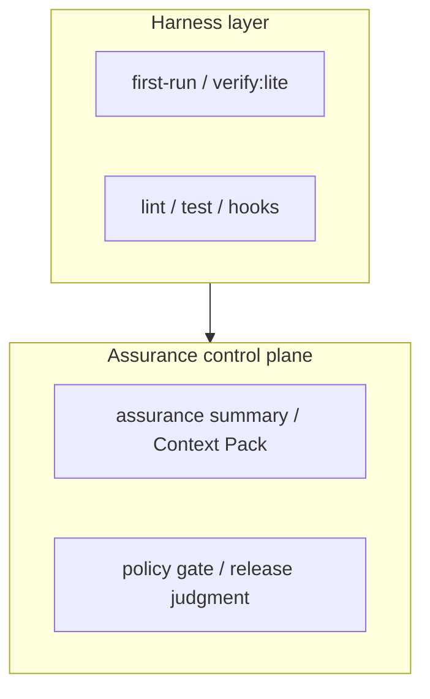

# 🚀 ae-framework Quick Start Guide

> **🌍 Language / 言語**: [English](#english) | [日本語](#japanese)

---

## English

**Get started with ae-framework as an assurance control plane**
**Run the reproducible local path first, then opt into stricter gates only when needed**

### ✅ Implemented / Reproducible Path

Current baseline aligned with the repository implementation:
From the repository root after cloning this repository, run:

```bash
corepack enable
corepack prepare pnpm@10.0.0 --activate
pnpm install
pnpm run first-run
```

This baseline gives you:
- environment validation via `first-run`
- required CI-equivalent local verification via `first-run -> verify:lite`
- reproducible evidence under `artifacts/first-run/**` and `artifacts/verify-lite/**`

### ⚡ Three Adoption Levels

#### How to read the three levels



- **Baseline** keeps the harness stable.
- **Structured assurance** adds evidence aggregation into the control plane.
- **High-Assurance PR** strengthens the control plane only for selected high-risk changes.

#### 1. Baseline

Use this when you want a reproducible local setup and the default report-only quality gates.

```bash
pnpm run first-run
```

Check:
- `artifacts/first-run/**`
- `artifacts/verify-lite/verify-lite-run-summary.json`

Run `pnpm run verify:lite` separately only when you want to refresh the Verify Lite evidence without rerunning the full `first-run` flow.

#### 2. Structured Assurance

Use this when you want claim/lane/evidence aggregation for a project or PR.

```bash
pnpm run verify:assurance \
  --assurance-profile fixtures/assurance/sample.assurance-profile.json \
  --verify-lite-summary artifacts/verify-lite/verify-lite-run-summary.json \
  --output-json artifacts/assurance/assurance-summary.json \
  --output-md artifacts/assurance/assurance-summary.md
```

Note: This example assumes you have already run the Baseline so that `artifacts/verify-lite/verify-lite-run-summary.json` exists. If you only want a profile-only aggregation, omit `--verify-lite-summary`.

Check:
- `artifacts/assurance/assurance-summary.json`
- `artifacts/assurance/assurance-summary.md`

#### 3. High-Assurance PR

Use this only for high-risk PRs. The default path remains report-only.

```bash
gh pr edit <PR_NUMBER> --add-label enforce-assurance
```

This enables the strict assurance enforcement step that fails when the aggregated assurance summary reports warning claims, missing lanes/evidence, unlinked counterexamples, or open counterexamples.

Operational details:
- `docs/quality/assurance-operations-runbook.md`
- `docs/guides/assurance-onboarding-checklist.md`
- `docs/ci/OPT-IN-CONTROLS.md`

### Claude Code / MCP Integration

Claude Code integration is optional. The current repository baseline does not require MCP server setup to run `first-run`, `verify:lite`, or `verify:assurance`.

Optional configuration example:

```json
{
  "mcpServers": {
    "ae-framework": {
      "command": "npx",
      "args": ["tsx", "/path/to/ae-framework/src/mcp-server/intent-server.ts"],
      "cwd": "/path/to/ae-framework"
    }
  }
}
```

> The conversation transcripts and large auto-generation examples later in this document are illustrative reference material. They do not define the current minimum reproducible path.

---

### 📱 Practical Example: Complete TODO App in 5 Minutes

#### Step 1: Just Describe Requirements
```
User: I want to create a TODO app. Please develop it with ae-framework using basic functionality.

Required features:
- Add/delete tasks
- Toggle completion status
- Simple UI
```

#### Step 2: Claude Code Auto-Execution
```
Claude: Developing step-by-step with ae-framework.

Phase 1: Requirement analysis...
✓ 5 functional requirements identified
✓ 3 non-functional requirements identified
✓ 8 user stories generated

Phase 2: Formal specification generation...
✓ TLA+ specification auto-generated
✓ State transition diagram created
✓ API specification defined

Phase 3: Automatic test generation...
✓ 18 unit tests
✓ 8 E2E tests
✓ 12 visual regression tests
✓ AI-optimized to 2m30s execution time

Phase 4: Automatic code generation...
✓ React + TypeScript
✓ Express.js backend
✓ SQLite database
✓ Full TDD compliance

Phase 5: Quality verification...
✓ Test coverage 92%
✓ Security audit passed
✓ Performance verification passed
✓ Quality score 96/100

Phase 6: UI/UX generation...
✓ React components (21 files)
✓ Next.js 14 App Router
✓ Accessibility score 96% (WCAG 2.1 AA)
✓ Multi-language support (ja/en)
✓ OpenTelemetry monitoring enabled
```

#### Step 3: Review Completed App

**Generated File Structure:**
```
todo-app/
├── packages/
│   ├── design-tokens/                       # Design tokens
│   └── ui/                                  # UI component library
│       ├── src/button.tsx
│       ├── src/input.tsx
│       └── src/checkbox.tsx
├── apps/
│   ├── web/                                 # Next.js 14 App Router
│   │   ├── app/todos/page.tsx               # TODO list page
│   │   ├── app/todos/[id]/page.tsx          # TODO detail page
│   │   ├── app/todos/new/page.tsx           # TODO creation
│   │   ├── components/TodoForm.tsx          # TODO form
│   │   ├── components/TodoCard.tsx          # TODO card
│   │   ├── messages/ja.json                 # Japanese translations
│   │   ├── messages/en.json                 # English translations
│   │   └── __e2e__/todos.spec.ts            # E2E tests
│   └── storybook/                           # Storybook documentation
│       └── stories/Todo.stories.tsx         # Component stories
├── backend/
│   ├── src/
│   │   ├── routes/todos.ts
│   │   ├── models/Todo.ts
│   │   └── app.ts
│   └── tests/
│       └── todos.test.ts
├── docker-compose.yml
└── .github/workflows/ci.yml
```

**Instant Launch:**
```bash
cd todo-app

# Install dependencies
pnpm install

# Build design tokens
pnpm run build:tokens

# Build UI components
pnpm run build:ui

# Start web application
pnpm run dev:web

# Start Storybook (separate terminal)
pnpm run dev:storybook
```

**🎉 Complete! Open http://localhost:3000 in browser**

---

### ♻ Persona Samples

The repository ships with a reusable persona profile at `samples/persona/default-profile.json`. After running `pnpm run build`, import it via:

```bash
pnpm exec ae-slash exec "/ae:persona import samples/persona/default-profile.json"
```

This boots the `/ae:persona` commands without manual setup.

### 🎯 Common Development Scenarios

#### Scenario 1: Add Feature to Existing Project

```
User: I want to add a review feature to my existing e-commerce site. Please use ae-framework to analyze the impact and add it safely.

Claude: Running impact analysis with Sequential reasoning engine...

[Analysis Results]
Affected components:
- Product Service (medium impact)
- User Service (low impact)
- Database Schema (new table addition)

Recommended approach:
1. Independent implementation as new Review Service
2. Loose coupling design with existing APIs
3. Gradual database migration

Generated code:
- ReviewService.ts (new)
- ProductService.ts (minimal changes)

---

### 🧩 Optional: Inject Runtime Contracts into Generated Handlers

You can generate minimal runtime contracts (Zod schemas, pre/post stubs, a small state-machine) from a formal spec, then inject them into OpenAPI-generated route handlers with `includeContracts: true`.

Example (TypeScript):

```ts
// If using ae-framework as a dependency:
// import { CodeGenerationAgent } from 'ae-framework';
// If working from this repo checkout:
import { CodeGenerationAgent } from '../../dist/src/agents/code-generation-agent.js';
import { promises as fs } from 'fs';
import path from 'path';

const agent = new CodeGenerationAgent();

// 1) Generate runtime contracts from a formal spec string (TLA+/Alloy)
const formalSpec = '---- MODULE Sample ----';
const contractFiles = await agent.generateContractsSkeleton(formalSpec);
for (const f of contractFiles) {
  await fs.mkdir(path.dirname(f.path), { recursive: true });
  await fs.writeFile(f.path, f.content, 'utf8');
}

// 2) Generate API code with contracts injected
const openapi = `openapi: 3.0.0\ninfo: {title: API, version: 1.0.0}\npaths: { /ping: { get: { responses: { '200': { description: ok } } } } }`;
const generated = await agent.generateFromOpenAPI(openapi, {
  framework: 'fastify',
  includeValidation: true,
  includeContracts: true,
  // Optional: prefer operationId for route filenames
  useOperationIdForFilenames: true,
});
// Write generated.files to disk as needed
```

Notes:
- `includeContracts` injects imports and minimal pre/post + Zod checks into each generated handler.
- Contracts are skeletons; refine schemas/conditions over time or wire them to properties derived from formal specs.
- Database migration scripts
- 38 automated tests (94% of existing tests unchanged)

Implementation time estimate: 2 hours
Risk assessment: Low risk
```

### ▶️ Run the Sample Server

You can run a minimal Fastify server that wires the scaffolded endpoints:

```bash
pnpm install
pnpm run start:server
# Server listens on http://localhost:3000

# Example calls:
# POST /reservations       -> expects { sku, quantity>=1, orderId }
# DELETE /reservations/:id -> cancels a reservation
# GET /inventory/:sku      -> returns { sku, stock>=0 }

# Generate minimal API tests from OpenAPI (prefer operationId in names)
pnpm run codex:generate:tests -- --use-operation-id
# Files are written under tests/api/generated/
```

#### Scenario 2: Legacy System Partial Modernization

```
User: I want to modernize only the authentication part of an old PHP system with Node.js.

Claude: Proposing gradual migration strategy...

Phase 1: Requirement extraction
✓ Analysis of existing PHP authentication system
✓ Identification of migration scope
✓ Design of data integration approach

Phase 2: Migration design
✓ Design with Strangler Fig pattern
✓ Database sharing strategy
✓ Session integration approach

Phase 3: Parallel testing strategy
✓ Verification with both PHP/Node.js
✓ Data consistency testing
✓ Performance comparison testing

Migration completion estimate: 1 week
Risk: Medium risk (mitigated with proper monitoring)
```

---

### 🔧 Convenient One-liner Commands

#### Instantly Usable Commands

```bash
# 🔍 Complete project analysis
"Analyze the entire project with deep security and performance checks"

# 📝 Auto-generate API documentation
"Generate API documentation with examples for ./src"

# 🚀 Performance optimization suggestions
"Improve ./src performance and apply auto-fixes"

# 🧪 Smart test selection
"Run tests only for files with important changes"

# 🔒 Security audit
"Perform full security scan and generate report"

# 📊 Quality report generation
"Verify all quality metrics and export PDF report"

# 🎨 Phase 6 UI/UX commands
"ae-framework ui-scaffold --components --tokens --a11y"
"ae-ui scaffold --components --tokens --a11y"
"Monitor quality with OpenTelemetry telemetry"
```

---

### 📊 Results Visualization

#### Automatic Development Metrics Collection

```
Daily development report (using ae-framework):

📈 Productivity metrics:
- Code generation speed: 1,200 lines/hour (vs 200 lines/hour traditional)
- Bug density: 0.1 bugs/1000 lines (vs 2.3 bugs/1000 lines traditional)
- Test coverage: 91% (vs 67% traditional)

⏱️ Time savings:
- Requirement analysis: 80% reduction (2 days → 4 hours)
- Test creation: 90% reduction (1 day → 1 hour)
- Code review: 70% reduction (4 hours → 1.2 hours)

🎯 Quality improvement:
- Formal specification compliance: 98%
- Security standard compliance: 100%
- Performance requirement achievement: 95%
```

---

### 🚨 FAQ & Troubleshooting

#### Q: Can it be used for large-scale projects?

**A:** Yes! Phase 6 UI generation handles large-scale optimization.

```
Examples:
- 75% time reduction in 1M+ line projects
- Parallel development of 15 microservices
- Collaborative development with 20-person teams
- Phase 6 UI/UX: Generate 21 React component files in 15 seconds
- Accessibility score 96% (WCAG 2.1 AA compliance)
- Real-time quality monitoring with OpenTelemetry telemetry
```

#### Q: Can it integrate with existing CI pipelines?

**A:** Fully supported.

```yaml
# GitHub Actions example
- name: ae-framework Quality Check
  run: npx ae-verify all --ci-mode=true --export-junit
  
- name: Intelligent Test Selection  
  run: npx ae-test select-intelligent --changes="${{ github.event.commits }}"
```

#### Q: What is the learning curve?

**A:** Very low.

```
Learning schedule:
Day 1: Experience Phases 1-2 with basic dialogue
Day 2: Practice Phase 3 test generation
Day 3: Experience complete cycle with Phases 4-6
Week 2: Team adoption and full operation start

Required prerequisites:
- Basic TypeScript knowledge
- Understanding of basic development processes
- Experience using Claude Code
```

---

### 🎉 Next Steps

#### 1. Start Now
```
Enter in Claude Code:
"Create a sample project with ae-framework"
```

#### 2. Full Adoption
1. Try with partial functionality of existing project
2. Gradual integration into development process
3. Full operation with entire team

#### 3. Advanced Usage
- 70% efficiency improvement with SuperClaude Framework
- Full utilization of Phase 6 UI/UX generation
- Custom agent development

---

## 🤝 Community & Support

**GitHub Issues**: Bug reports & feature requests  
**Discord**: Real-time Q&A & information exchange  
**Regular Webinars**: Practical technique sharing  

**🤖 Experience the future of development with ae-framework today!**

---

## Japanese

**ae-framework を assurance control plane として導入する最短ガイド**
**最初に再現可能なローカル導線を通し、その後に必要な保証レベルだけを追加します**

### ✅ 現在実装に整合する最短導線

このリポジトリを clone してリポジトリルートに移動した後、次を実行します。

```bash
corepack enable
corepack prepare pnpm@10.0.0 --activate
pnpm install
pnpm run first-run
```

この baseline で確認できること:
- `first-run` による環境確認
- `first-run -> verify:lite` による required 相当のローカル検証
- `artifacts/first-run/**` と `artifacts/verify-lite/**` の証跡生成

### ⚡ 3段階の導入レベル

#### 3段階の読み方


- **Baseline** は harness layer を安定化させる段階です。
- **Structured assurance** は evidence aggregation を control plane に接続する段階です。
- **High-Assurance PR** は selected high-risk change に対してだけ control plane を強化する段階です。

#### 1. Baseline

まずは再現可能なローカル導線を通します。

```bash
pnpm run first-run
```

確認対象:
- `artifacts/first-run/**`
- `artifacts/verify-lite/verify-lite-run-summary.json`

`first-run` を再実行せずに Verify Lite の証跡だけを更新したい場合に限り、`pnpm run verify:lite` を個別に実行します。

#### 2. Structured Assurance

claim / lane / evidence を集約したい場合に追加します。

```bash
pnpm run verify:assurance \
  --assurance-profile fixtures/assurance/sample.assurance-profile.json \
  --verify-lite-summary artifacts/verify-lite/verify-lite-run-summary.json \
  --output-json artifacts/assurance/assurance-summary.json \
  --output-md artifacts/assurance/assurance-summary.md
```

注: この例は Baseline 実行後で `artifacts/verify-lite/verify-lite-run-summary.json` が存在する前提です。profile だけを集約したい場合は `--verify-lite-summary` を省略してください。

確認対象:
- `artifacts/assurance/assurance-summary.json`
- `artifacts/assurance/assurance-summary.md`

#### 3. High-Assurance PR

高リスク PR に限って strict assurance enforcement を有効化します。通常 PR は report-only のままです。

```bash
gh pr edit <PR番号> --add-label enforce-assurance
```

このラベルにより、workflow の `Enforce assurance summary (strict; label-gated)` ステップで strict assurance enforcement が有効化され、`warningClaims`、`missingLanes`、`missingEvidenceKinds`、`unlinkedCounterexamples`、`openCounterexamples` などで strict fail するようになります。

一次情報:
- `docs/quality/assurance-operations-runbook.md`
- `docs/guides/assurance-onboarding-checklist.md`
- `docs/ci/OPT-IN-CONTROLS.md`

### Claude Code / MCP 連携

Claude Code や MCP server の設定はオプションです。現在の baseline では、`first-run`、`verify:lite`、`verify:assurance` の実行に MCP 設定は必須ではありません。

任意設定例:

```json
{
  "mcpServers": {
    "ae-framework": {
      "command": "npx",
      "args": ["tsx", "/path/to/ae-framework/src/mcp-server/intent-server.ts"],
      "cwd": "/path/to/ae-framework"
    }
  }
}
```

> この文書の後半にある会話ログや大きな自動生成例は参考イメージです。現行の最小再現導線そのものではありません。

---

### 📱 実践例：5分でTODOアプリ完成

#### ステップ1: 要件を話すだけ
```
ユーザー: TODOアプリを作りたいです。基本的な機能で良いので、ae-frameworkで開発してください。

必要な機能:
- タスクの追加・削除
- 完了状態の切り替え
- シンプルなUI
```

#### ステップ2: Claude Code が自動実行
```
Claude: ae-frameworkで段階的に開発します。

Phase 1: 要件分析中...
✓ 機能要件5件を特定
✓ 非機能要件3件を特定  
✓ ユーザーストーリー8件を生成

Phase 2: 形式仕様生成中...
✓ TLA+仕様を自動生成
✓ 状態遷移図を作成
✓ API仕様を定義

Phase 3: テスト自動生成中...
✓ ユニットテスト18件
✓ E2Eテスト8件  
✓ 視覚回帰テスト12件
✓ AI選択により実行時間2分30秒に最適化

Phase 4: コード自動生成中...
✓ React + TypeScript
✓ Express.js バックエンド
✓ SQLite データベース
✓ TDD完全準拠

Phase 5: 品質検証中...
✓ テストカバレッジ 92%
✓ セキュリティ監査 合格
✓ パフォーマンス検証 合格
✓ 品質スコア 96/100

Phase 6: UI/UX生成中...
✓ Reactコンポーネント (21ファイル)
✓ Next.js 14 App Router
✓ アクセシビリティスコア 96% (WCAG 2.1 AA)
✓ 多言語対応 (ja/en)
✓ OpenTelemetry監視有効化
```

#### ステップ3: 完成したアプリの確認

**生成されるファイル構成:**
```
todo-app/
├── packages/
│   ├── design-tokens/                       # デザイントークン
│   └── ui/                                  # UIコンポーネントライブラリ
│       ├── src/button.tsx
│       ├── src/input.tsx
│       └── src/checkbox.tsx
├── apps/
│   ├── web/                                 # Next.js 14 App Router
│   │   ├── app/todos/page.tsx               # TODO一覧ページ
│   │   ├── app/todos/[id]/page.tsx          # TODO詳細ページ
│   │   ├── app/todos/new/page.tsx           # TODO新規作成
│   │   ├── components/TodoForm.tsx          # TODOフォーム
│   │   ├── components/TodoCard.tsx          # TODOカード
│   │   ├── messages/ja.json                 # 日本語翻訳
│   │   ├── messages/en.json                 # 英語翻訳
│   │   └── __e2e__/todos.spec.ts            # E2Eテスト
│   └── storybook/                           # Storybookドキュメント
│       └── stories/Todo.stories.tsx         # コンポーネントストーリー
├── backend/
│   ├── src/
│   │   ├── routes/todos.ts
│   │   ├── models/Todo.ts
│   │   └── app.ts
│   └── tests/
│       └── todos.test.ts
├── docker-compose.yml
└── .github/workflows/ci.yml
```

**即座に起動:**
```bash
cd todo-app

# 依存関係インストール
pnpm install

# デザイントークンビルド
pnpm run build:tokens

# UIコンポーネントビルド
pnpm run build:ui

# Webアプリケーション起動
pnpm run dev:web

# Storybook起動 (別ターミナル)
pnpm run dev:storybook
```

**🎉 完成！ブラウザで http://localhost:3000 を開く**

---

### 🎯 よくある開発シナリオ

#### シナリオ1: 既存プロジェクトに機能追加

```
ユーザー: 既存のECサイトにレビュー機能を追加したいです。ae-frameworkで影響範囲を分析して安全に追加してください。

Claude: Sequential推論エンジンで影響分析を実行します...

[分析結果]
影響を受けるコンポーネント:
- Product Service (中影響)
- User Service (低影響) 
- Database Schema (新テーブル追加)

推奨アプローチ:
1. 新しいReview Serviceとして独立実装
2. 既存APIとの疎結合設計
3. データベース移行は段階的実行

生成されるコード:
- ReviewService.ts (新規)
- ProductService.ts (最小限の変更)
- データベース移行スクリプト
- 38件の自動テスト (既存テストの94%は変更不要)

実装時間見積もり: 2時間
リスク評価: 低リスク
```

#### シナリオ2: レガシーシステムの部分モダナイゼーション

```
ユーザー: 古いPHPシステムの認証部分だけをNode.jsでモダンにしたいです。

Claude: 段階的移行戦略を提案します...

Phase 1: 要件抽出
✓ 既存PHP認証システムの分析
✓ 移行範囲の特定
✓ データ連携方式の設計

Phase 2: 移行設計  
✓ Strangler Fig パターンでの設計
✓ データベース共有戦略
✓ セッション連携方式

Phase 3: 並行テスト戦略
✓ PHP/Node.js両方での検証
✓ データ整合性テスト
✓ パフォーマンス比較テスト

移行完了までの見積もり: 1週間
リスク: 中リスク (適切な監視により軽減)
```

---

### 🔧 便利なワンライナーコマンド

#### 即座に使える便利コマンド

```bash
# 🔍 プロジェクト全体分析
「プロジェクト全体を深層解析して、セキュリティとパフォーマンスをチェックしてください」

# 📝 API文書自動生成  
「./src のAPI文書をサンプル付きで生成してください」

# 🚀 パフォーマンス最適化提案
「./src のパフォーマンスを改善して自動修正してください」

# 🧪 スマートテスト選択
「重要な変更があったファイルだけテストを実行してください」

# 🔒 セキュリティ監査
「フルセキュリティスキャンを実行してレポートを生成してください」

# 📊 品質レポート生成
「全品質メトリクスを検証してPDFレポートをエクスポートしてください」

# 🎨 Phase 6 UI/UXコマンド
「ae-framework ui-scaffold --components --tokens --a11y」
「ae-ui scaffold --components --tokens --a11y」
「OpenTelemetryテレメトリで品質監視してください」
```

---

### 📊 成果の可視化

#### 開発メトリクス自動収集

```
日次開発レポート (ae-framework使用):

📈 生産性指標:
- コード生成速度: 1,200行/時間 (従来: 200行/時間)
- バグ密度: 0.1件/1000行 (従来: 2.3件/1000行)
- テスト網羅率: 91% (従来: 67%)

⏱️ 時間短縮:
- 要件分析: 80%短縮 (2日→4時間)
- テスト作成: 90%短縮 (1日→1時間)
- コードレビュー: 70%短縮 (4時間→1.2時間)

🎯 品質向上:
- 形式仕様準拠率: 98%
- セキュリティ基準準拠: 100%  
- パフォーマンス要件達成: 95%
```

---

### 🚨 よくある質問とトラブルシューティング

#### Q: 大規模プロジェクトでも使えますか？

**A:** はい！Phase 6の統合最適化システムが大規模対応しています。

```
実績例:
- 100万行超のプロジェクトで75%時間短縮
- マイクロサービス15個の並行開発
- チーム20人での協調開発
- Phase 6 UI/UX: Reactコンポーネント21ファイルを15秒で生成
- アクセシビリティスコア96% (WCAG 2.1 AA準拠)
- OpenTelemetryテレメトリでリアルタイム品質監視
```

#### Q: 既存のCIパイプラインと統合できますか？

**A:** 完全対応しています。

```yaml
# GitHub Actions例
- name: ae-framework Quality Check
  run: npx ae-verify all --ci-mode=true --export-junit
  
- name: Intelligent Test Selection  
  run: npx ae-test select-intelligent --changes="${{ github.event.commits }}"
```

#### Q: 学習コストはどの程度ですか？

**A:** 非常に低く設定されています。

```
学習スケジュール:
Day 1: 基本的な対話でPhase 1-2を体験
Day 2: Phase 3のテスト生成を実践  
Day 3: Phase 4-6で完全サイクル体験
Week 2: チーム導入と本格運用開始

必要な前提知識:
- TypeScript基礎知識
- 基本的な開発プロセス理解
- Claude Code の使用経験
```

---

### ♻ ペルソナサンプル

リポジトリには `samples/persona/default-profile.json` が同梱されています。`pnpm run build` 実行後、次のコマンドでインポートできます。

```bash
pnpm exec ae-slash exec "/ae:persona import samples/persona/default-profile.json"
```

これにより `/ae:persona` コマンドをすぐに体験できます。

### 🎉 次のステップ

#### 1. 今すぐ始める
```
Claude Code で以下を入力:
「ae-frameworkのサンプルプロジェクトを作成してください」
```

#### 2. 本格導入
1. 既存プロジェクトの一部機能で試用
2. 開発プロセスに段階的統合  
3. チーム全体での本格運用

#### 3. 上級活用
- SuperClaude Framework による70%効率化
- Phase 6 UI/UX生成の本格活用
- カスタムエージェント開発

---

## 💬 Community & Support / コミュニティ・サポート

**GitHub Issues**: Bug reports & feature requests / バグ報告・機能要望  
**Discord**: Real-time Q&A & information exchange / リアルタイム質問・情報交換  
**Regular Webinars**: Practical technique sharing / 実践テクニック共有  

**🤖 Experience the future of development with ae-framework today! / ae-framework で、開発の未来を今すぐ体験してください！**
