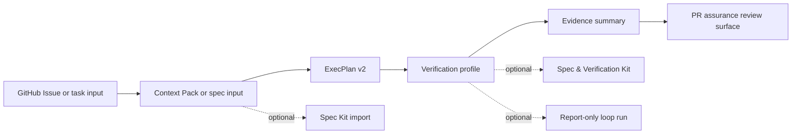

# Reference Flow: Issue to PR Assurance Review

> Language / 言語: English | 日本語

---

## English

This is the default paved path for new ae-framework users. Use it before choosing
among the deeper Context Pack, Spec Kit, Spec & Verification Kit, loop
engineering, or assurance-lane documents.

The flow is intentionally narrow:



### Decision rule

- **Baseline** is the default for ordinary PRs: Issue, Context Pack/spec input,
  ExecPlan v2, Verify Lite, assurance summary, PR review surface.
- **Structured assurance** is optional and selected when the PR needs explicit
  claim/evidence/lane aggregation, Spec Kit import, or the minimum Spec &
  Verification Kit profile.
- **High-assurance** is selected only by risk/profile boundaries such as
  `risk:high`, `enforce-assurance`, selected critical claims, or a documented
  critical-core scope.
- **Loop engineering** is optional and report-only. It is for controlled repair or
  investigation loops, not for normal PR approval.

### Running example

The commands below use repository fixtures so the route can be exercised without
calling hosted LLM APIs or creating a live PR. Replace the Issue number, feature
fixture, and PR number when applying the flow to a real change.

| Step | Input | Command | Output artifact | Review surface |
| --- | --- | --- | --- | --- |
| 1. Capture Issue input | GitHub Issue or local task | `node scripts/codex/export-issue-task.mjs --repo itdojp/ae-framework --issue 3554 --work . --print-commands` | `.codex-local/tasks/issue-3554.md` (local, ignored) | The Issue URL and task file become traceable operator input. |
| 2. Validate Context Pack/spec input | `spec/context-pack/minimal-example.yaml` | `pnpm -s run context-pack:validate --sources spec/context-pack/minimal-example.yaml` | `artifacts/context-pack/context-pack-validate-report.json` / `.md` | Confirms the supplied Context Pack source is schema-valid. This alone is not conflict evidence. |
| 3. Run boundary-map preflight | `spec/context-pack/boundary-map.json` + Issue target files | `pnpm -s run context-pack:verify-boundary-map` | `artifacts/context-pack/context-pack-boundary-map-report.json`, `artifacts/context-pack/boundary-map-summary.json` | Record `Context Pack conflict: none` only after validating the relevant boundary slices and target-file ownership. |
| 4. Render ExecPlan v2 | `fixtures/exec-plan/baseline.exec-plan.v2.json` | `pnpm run exec-plan:v2:validate -- --file fixtures/exec-plan/baseline.exec-plan.v2.json --output-json artifacts/plan/exec-plan-v2-validation.json --output-md artifacts/plan/exec-plan.v2.md` | `artifacts/plan/exec-plan-v2-validation.json`, `artifacts/plan/exec-plan.v2.md` | Paste or link the rendered plan when reviewers need task/evidence context. |
| 5. Run baseline verification | repository source and tests | `pnpm run verify:lite` | `artifacts/verify-lite/verify-lite-run-summary.json` | Required PR signal: pass/fail evidence for the fast lane. |
| 6. Aggregate evidence | `fixtures/assurance/sample.assurance-profile.json` + Verify Lite summary | `pnpm run verify:assurance -- --assurance-profile fixtures/assurance/sample.assurance-profile.json --verify-lite-summary artifacts/verify-lite/verify-lite-run-summary.json --output-json artifacts/assurance/assurance-summary.json --output-md artifacts/assurance/assurance-summary.md` | `artifacts/assurance/assurance-summary.json`, `artifacts/assurance/assurance-summary.md` | Claim/lane/evidence status for reviewers. |
| 7. Render PR assurance review surface | assurance + verification artifacts | `pnpm run assurance:review-surface -- --assurance-summary artifacts/assurance/assurance-summary.json --verify-lite-summary artifacts/verify-lite/verify-lite-run-summary.json --output-md artifacts/review/assurance-review.md` | `artifacts/review/assurance-review.md` | Reviewer-first Markdown surface; not approval authority. |

To preview a PR comment without posting it:

```bash no-doctest
pnpm run assurance:post-review-surface -- \
  --repo itdojp/ae-framework \
  --pr 123 \
  --body-file artifacts/review/assurance-review.md \
  --marker '<!-- ae-assurance-review-surface -->'
```

Switch to `--mode comment` only after confirming maintainer approval and
`gh auth status`. The helper posts a comment only; it does not approve, review,
merge, or rewrite the source Markdown.

### Branches by adoption profile

| Profile | When to choose it | Additional command | Expected artifacts | Deeper guide |
| --- | --- | --- | --- | --- |
| Baseline | Ordinary PR quality gate and first adoption. | `pnpm run verify:lite` | `artifacts/verify-lite/verify-lite-run-summary.json` | `docs/getting-started/QUICK-START-GUIDE.md` |
| Structured assurance | You need explicit claim/evidence/lane aggregation. | `pnpm run verify:assurance -- --assurance-profile fixtures/assurance/sample.assurance-profile.json --verify-lite-summary artifacts/verify-lite/verify-lite-run-summary.json` | `artifacts/assurance/assurance-summary.json` / `.md` | `docs/quality/assurance-operations-runbook.md` |
| Spec Kit import | A feature is already authored in a Spec Kit-style directory. | `pnpm run spec-kit:import-feature -- --feature-dir fixtures/spec-kit/greenfield/specs/001-reservation-approval --output-dir artifacts/spec-kit --generated-at 2026-06-30T00:00:00.000Z` | `artifacts/spec-kit/spec-kit-bridge-report.json`, `artifacts/spec-kit/context-pack.import.json`, `artifacts/spec-kit/exec-plan.v2.json` | `docs/integrations/SPEC-KIT-BRIDGE.md` |
| Spec & Verification Kit | You need one-command BDD/property activation evidence. | `pnpm run spec-kit-min:verify -- --profile-root examples/spec-verification-kit-min --run-custom-suites --skip lint --skip types --skip fast --skip property-smoke` | `artifacts/spec-kit-min/activation-summary.json` / `.md` | `docs/reference/SPEC-VERIFICATION-KIT-MIN.md` |
| High-assurance selected claims | A risk/profile boundary selects stricter review. | `pnpm run exec-plan:v2:validate -- --file fixtures/exec-plan/high-risk-selected-claims.exec-plan.v2.json --output-md artifacts/plan/exec-plan.v2.md` | high-risk ExecPlan rendering plus assurance/policy evidence | `docs/quality/assurance-operations-runbook.md` |
| Report-only loop engineering | You need a bounded repair/investigation loop with stop rules. | `pnpm -s run loop:run-report-only -- --input examples/loop-engineering/safety/loop-input.json --policy fixtures/loop/strict-safety.loop-policy.json --generated-at 2026-07-01T00:00:00.000Z --output-json artifacts/loop/safety-budget.loop-run-summary.json --output-md artifacts/loop/safety-budget.loop-run-summary.md` | `artifacts/loop/safety-budget.loop-run-summary.json` / `.md` | `docs/automation/LOOP-ENGINEERING-SAFETY.md` |

### PR body checklist

Use this checklist for a PR created from the reference flow:

- `Closes #<issue>` is present.
- `Context Pack conflict: none` or `Context Pack conflict: found` is recorded.
- ExecPlan v2 path or rendered Markdown is linked when task/evidence context is
  non-trivial.
- Verification section names the commands run and the artifacts generated.
- Assurance section links `artifacts/assurance/assurance-summary.md` or explains
  why structured assurance was not selected.
- Review surface section links or pastes `artifacts/review/assurance-review.md`.
- Rollback section states how to revert the code/docs change and artifact update.
- No loop summary, producer output, or review-surface Markdown is treated as
  human approval or merge authority.

### Troubleshooting

| Symptom | Likely cause | Action |
| --- | --- | --- |
| Missing evidence in the review surface | Verify Lite, assurance summary, policy summary, or producer summary was not generated or not passed to the renderer. | Re-run the missing producer command, or keep the `missing` row visible and explain it in the PR. Do not hide missing evidence. |
| Context Pack conflict | The requested change crosses a design SSOT or boundary-map constraint. | Stop implementation, record `Context Pack conflict: found`, and update the Issue/plan before editing code. |
| Variance finding | Same logical input produced drift in judgment artifacts or volatile fields were not normalized. | Use `docs/quality/VARIANCE-REDUCTION-POLICY.md` and keep the finding report-only unless a later policy promotes it. |
| High-risk escalation | Risk label, assurance profile, or critical claim selected stricter review. | Use the high-assurance ExecPlan/profile and require human approval evidence; do not downgrade silently. |
| Loop run stops as `blocked` / `human-required` / `unsafe-action` | Policy budget, missing evidence, high-risk approval, denied command/path, or unsafe action triggered a stop rule. | Treat the loop summary as evidence only. Fix the plan/evidence or ask for human decision before continuing. |

### Non-goals and authority boundary

- This flow does not make Spec Kit, formal tools, or loop engineering mandatory
  for routine PRs.
- It does not replace branch protection, required checks, human review, or
  repository policy.
- It does not make any coding agent the system of record. Agents, CI jobs, and
  humans are producers; contracts and artifacts are the judgment surface.

---

## 日本語

この文書は、ae-framework を初めて使う場合の既定導線です。Context Pack、Spec Kit、
Spec & Verification Kit、loop engineering、assurance lane の深い文書を選ぶ前に、
まずこの導線を使います。

### 判断ルール

- **Baseline** は通常 PR の既定です。Issue、Context Pack/spec input、ExecPlan v2、
  Verify Lite、assurance summary、PR review surface をつなぎます。
- **Structured assurance** は、claim / evidence / lane の集約、Spec Kit import、
  Spec & Verification Kit の minimum profile が必要な場合だけ選択します。
- **High-assurance** は `risk:high`、`enforce-assurance`、selected critical claim、
  critical-core scope などの境界でのみ選択します。
- **Loop engineering** は optional かつ report-only です。通常 PR の承認や merge
  の代替ではありません。

### 既定フロー

| Step | Input | Command | Output artifact | Review surface |
| --- | --- | --- | --- | --- |
| 1. Issue input を固定 | GitHub Issue または task | `node scripts/codex/export-issue-task.mjs --repo itdojp/ae-framework --issue 3554 --work . --print-commands` | `.codex-local/tasks/issue-3554.md`（local/ignored） | Issue URL と task file を traceable な operator input として扱う。 |
| 2. Context Pack/spec input を検証 | `spec/context-pack/minimal-example.yaml` | `pnpm -s run context-pack:validate --sources spec/context-pack/minimal-example.yaml` | `artifacts/context-pack/context-pack-validate-report.json` / `.md` | supplied Context Pack source の schema validity を確認する。この結果だけを conflict evidence としない。 |
| 3. boundary-map preflight | `spec/context-pack/boundary-map.json` + Issue target files | `pnpm -s run context-pack:verify-boundary-map` | `artifacts/context-pack/context-pack-boundary-map-report.json`, `artifacts/context-pack/boundary-map-summary.json` | 関連 boundary slice と target-file ownership を確認してから `Context Pack conflict: none` を記録する。 |
| 4. ExecPlan v2 を render | `fixtures/exec-plan/baseline.exec-plan.v2.json` | `pnpm run exec-plan:v2:validate -- --file fixtures/exec-plan/baseline.exec-plan.v2.json --output-json artifacts/plan/exec-plan-v2-validation.json --output-md artifacts/plan/exec-plan.v2.md` | `artifacts/plan/exec-plan-v2-validation.json`, `artifacts/plan/exec-plan.v2.md` | task / evidence context が必要な reviewer に plan を提示する。 |
| 5. baseline verification | repository source / tests | `pnpm run verify:lite` | `artifacts/verify-lite/verify-lite-run-summary.json` | fast lane の必須 PR signal。 |
| 6. evidence summary | assurance profile + Verify Lite summary | `pnpm run verify:assurance -- --assurance-profile fixtures/assurance/sample.assurance-profile.json --verify-lite-summary artifacts/verify-lite/verify-lite-run-summary.json --output-json artifacts/assurance/assurance-summary.json --output-md artifacts/assurance/assurance-summary.md` | `artifacts/assurance/assurance-summary.json`, `artifacts/assurance/assurance-summary.md` | claim / lane / evidence status を reviewer に提示する。 |
| 7. PR assurance review surface | assurance + verification artifacts | `pnpm run assurance:review-surface -- --assurance-summary artifacts/assurance/assurance-summary.json --verify-lite-summary artifacts/verify-lite/verify-lite-run-summary.json --output-md artifacts/review/assurance-review.md` | `artifacts/review/assurance-review.md` | reviewer-first Markdown。承認権限ではない。 |

PR comment を投稿せず preview する場合:

```bash no-doctest
pnpm run assurance:post-review-surface -- \
  --repo itdojp/ae-framework \
  --pr 123 \
  --body-file artifacts/review/assurance-review.md \
  --marker '<!-- ae-assurance-review-surface -->'
```

`--mode comment` は maintainer approval と `gh auth status` を確認した後だけ使います。
この helper は comment 投稿のみを行い、approve / review / merge / source Markdown の
書き換えは行いません。

### profile 別の分岐

| Profile | 選択条件 | 追加 command | Artifact | 詳細 |
| --- | --- | --- | --- | --- |
| Baseline | 通常 PR と初回導入 | `pnpm run verify:lite` | `artifacts/verify-lite/verify-lite-run-summary.json` | `docs/getting-started/QUICK-START-GUIDE.md` |
| Structured assurance | claim / evidence / lane 集約が必要 | `pnpm run verify:assurance -- --assurance-profile fixtures/assurance/sample.assurance-profile.json --verify-lite-summary artifacts/verify-lite/verify-lite-run-summary.json` | `artifacts/assurance/assurance-summary.json` / `.md` | `docs/quality/assurance-operations-runbook.md` |
| Spec Kit import | Spec Kit 形式の feature がある | `pnpm run spec-kit:import-feature -- --feature-dir fixtures/spec-kit/greenfield/specs/001-reservation-approval --output-dir artifacts/spec-kit --generated-at 2026-06-30T00:00:00.000Z` | `artifacts/spec-kit/spec-kit-bridge-report.json`, `artifacts/spec-kit/context-pack.import.json`, `artifacts/spec-kit/exec-plan.v2.json` | `docs/integrations/SPEC-KIT-BRIDGE.md` |
| Spec & Verification Kit | BDD/property activation evidence が必要 | `pnpm run spec-kit-min:verify -- --profile-root examples/spec-verification-kit-min --run-custom-suites --skip lint --skip types --skip fast --skip property-smoke` | `artifacts/spec-kit-min/activation-summary.json` / `.md` | `docs/reference/SPEC-VERIFICATION-KIT-MIN.md` |
| High-assurance selected claims | risk/profile boundary が strict review を選択 | `pnpm run exec-plan:v2:validate -- --file fixtures/exec-plan/high-risk-selected-claims.exec-plan.v2.json --output-md artifacts/plan/exec-plan.v2.md` | high-risk ExecPlan + assurance/policy evidence | `docs/quality/assurance-operations-runbook.md` |
| Report-only loop engineering | bounded repair / investigation loop が必要 | `pnpm -s run loop:run-report-only -- --input examples/loop-engineering/safety/loop-input.json --policy fixtures/loop/strict-safety.loop-policy.json --generated-at 2026-07-01T00:00:00.000Z --output-json artifacts/loop/safety-budget.loop-run-summary.json --output-md artifacts/loop/safety-budget.loop-run-summary.md` | `artifacts/loop/safety-budget.loop-run-summary.json` / `.md` | `docs/automation/LOOP-ENGINEERING-SAFETY.md` |

### PR body checklist

- `Closes #<issue>` がある。
- `Context Pack conflict: none` または `Context Pack conflict: found` がある。
- task / evidence context が非自明な場合は ExecPlan v2 path または rendered Markdown を示す。
- Verification に実行 command と生成 artifact を記載する。
- Structured assurance を選択した場合は `artifacts/assurance/assurance-summary.md` を示す。
- `artifacts/review/assurance-review.md` を review surface として示す。
- Rollback には code/docs change と artifact update の戻し方を書く。
- loop summary、producer output、review-surface Markdown を human approval / merge authority として扱わない。

### Troubleshooting

| Symptom | 原因 | 対応 |
| --- | --- | --- |
| review surface に missing evidence が出る | Verify Lite、assurance summary、policy summary、producer summary の未生成または renderer 引数不足 | 欠けた producer command を再実行する。欠落が事実なら `missing` を隠さず PR で説明する。 |
| Context Pack conflict | design SSOT または boundary-map constraint と衝突 | 実装を止め、`Context Pack conflict: found` として Issue / plan を更新する。 |
| variance finding | 同じ論理入力で judgment artifact が drift した、または volatile field が正規化されていない | `docs/quality/VARIANCE-REDUCTION-POLICY.md` を参照し、将来 policy で昇格されるまでは report-only として扱う。 |
| high-risk escalation | risk label、assurance profile、critical claim が strict review を選択 | high-assurance ExecPlan/profile を使い、人間の approval evidence を要求する。黙って downgrade しない。 |
| loop run が `blocked` / `human-required` / `unsafe-action` で止まる | policy budget、missing evidence、approval、denied command/path、unsafe action が stop rule を発火 | loop summary は evidence として扱う。plan/evidence を修正するか human decision を得る。 |
