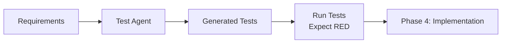

# Test Generation Agent User Guide

> 🌍 Language / 言語: English | 日本語

---

## 日本語（概要）

Test Generation Agent は Phase 3（テスト）を自動化し、要件/コード/仕様から包括的なテストを生成します。要件ベース、コード逆生成、プロパティテスト、BDD シナリオ生成などをサポートします。

以下の英語セクションに MCP ツール呼び出し例と出力形式を記載しています。

## Overview

Test Generation Agentは、ae-frameworkの Phase 3 (Tests) を自動化するAIエージェントです。要件、コード、仕様から包括的なテストを自動生成し、テスト戦略の立案を支援します。

## Features

### 1. Requirements-Based Test Generation
要件から自動的にテストケースを生成します。

**使用例：**
```javascript
// MCP Tool Call
{
  "tool": "generate_tests_from_requirements",
  "args": {
    "feature": "Payment Processing",
    "requirements": [
      "Process credit card payments",
      "Validate card numbers",
      "Handle insufficient funds",
      "Support refunds"
    ],
    "testFramework": "vitest"
  }
}
```

**生成されるテスト：**
- Happy path tests
- Error handling tests
- Edge case tests
- Security tests
- Performance considerations

### 2. Reverse TDD (Code to Test)
既存コードを分析してテストを逆生成します。レガシーコードのテスト追加に最適。

**使用例：**
```javascript
{
  "tool": "generate_tests_from_code",
  "args": {
    "codeFile": "src/services/paymentService.ts"
  }
}
```

### 3. Property-Based Testing
関数の契約から数学的性質を満たすプロパティテストを生成。

**使用例：**
```javascript
{
  "tool": "generate_property_tests",
  "args": {
    "functionName": "calculateDiscount",
    "inputs": [
      {
        "name": "price",
        "type": "number",
        "constraints": ["positive", "max:1000000"]
      },
      {
        "name": "discountRate",
        "type": "number",
        "constraints": ["min:0", "max:1"]
      }
    ],
    "invariants": [
      "result should be less than or equal to original price",
      "result should be non-negative",
      "0% discount returns original price",
      "100% discount returns 0"
    ]
  }
}
```

### 4. BDD Scenario Generation
ユーザーストーリーからGherkinシナリオを自動生成。

**使用例：**
```javascript
{
  "tool": "generate_bdd_scenarios",
  "args": {
    "title": "User Login",
    "asA": "registered user",
    "iWant": "to login to my account",
    "soThat": "I can access my personal dashboard",
    "acceptanceCriteria": [
      "Valid credentials allow login",
      "Invalid credentials show error",
      "Account locks after 5 failed attempts",
      "Remember me option keeps session for 30 days"
    ]
  }
}
```

**生成される Gherkin：**
```gherkin
Feature: User Login
  As a registered user
  I want to login to my account
  So that I can access my personal dashboard

  Scenario: Successful login with valid credentials
    Given I am on the login page
    When I enter valid email "user@example.com"
    And I enter valid password
    And I click the login button
    Then I should be redirected to dashboard
    And I should see welcome message

  Scenario: Failed login with invalid credentials
    Given I am on the login page
    When I enter invalid credentials
    Then I should see error message "Invalid email or password"
    And I should remain on login page
```

### 5. Integration Test Planning
マイクロサービスアーキテクチャの統合テスト戦略を立案。

**使用例：**
```javascript
{
  "tool": "plan_integration_tests",
  "args": {
    "services": [
      {
        "name": "AuthService",
        "dependencies": ["UserDB", "TokenService"]
      },
      {
        "name": "PaymentService",
        "dependencies": ["PaymentGateway", "OrderService"]
      },
      {
        "name": "NotificationService",
        "dependencies": ["EmailProvider", "SMSProvider"]
      }
    ],
    "dataFlow": [
      {
        "from": "AuthService",
        "to": "PaymentService",
        "data": "authToken"
      }
    ]
  }
}
```

### 6. Security Test Generation
OWASP Top 10に基づくセキュリティテストを生成。

**使用例：**
```javascript
{
  "tool": "generate_security_tests",
  "args": {
    "endpoint": {
      "path": "/api/users/profile",
      "method": "POST",
      "authentication": true,
      "authorization": ["user", "admin"],
      "inputs": [
        { "name": "email", "type": "string" },
        { "name": "name", "type": "string" }
      ]
    }
  }
}
```

**生成されるテスト：**
- SQL Injection tests
- XSS prevention tests
- CSRF protection tests
- Authentication bypass attempts
- Authorization boundary tests
- Input validation tests

### 7. Performance Test Design
SLA要件からパフォーマンステストスイートを設計。

**使用例：**
```javascript
{
  "tool": "design_performance_tests",
  "args": {
    "sla": {
      "responseTime": 200,      // ms
      "throughput": 1000,        // requests/second
      "concurrentUsers": 5000,
      "availability": 99.9       // percentage
    }
  }
}
```

**生成されるテストスイート：**
- Load tests (通常負荷)
- Stress tests (限界探索)
- Spike tests (急激な負荷変化)
- Soak tests (長時間負荷)

## Integration with ae-framework Workflow

### Phase 3: Test-First Development



### Workflow Example

1. **Start with requirements**
   ```bash
   # Generate tests from user story
   pnpm run mcp:test-gen
   ```

2. **Review generated tests**
   - Ensure coverage is comprehensive
   - Add domain-specific tests if needed

3. **Run tests (RED phase)**
   ```bash
   pnpm test
   # All tests should fail initially
   ```

4. **Implement code (GREEN phase)**
   - Write minimal code to pass tests
   - Follow TDD principles

5. **Refactor**
   - Improve code quality
   - Maintain test coverage

## Best Practices

### 1. Start with High-Level Tests
Begin with integration and acceptance tests, then drill down to unit tests.

### 2. Use Property-Based Testing for Critical Functions
Especially for mathematical operations, data transformations, and algorithms.

### 3. Security Tests for All External Interfaces
Always generate security tests for APIs, forms, and data inputs.

### 4. Performance Tests Early
Design performance tests during development, not after deployment.

### 5. Maintain Test Documentation
Keep generated test documentation synchronized with code changes.

## Configuration

### MCP Server Setup

Add to your Claude Desktop configuration:

```json
{
  "mcpServers": {
    "test-generation": {
      "command": "node",
      "args": ["/path/to/ae-framework/dist/mcp-server/test-generation-server.js"]
    }
  }
}
```

### Environment Variables

```bash
# Test framework preference
export AE_TEST_FRAMEWORK=vitest

# Coverage threshold
export AE_COVERAGE_THRESHOLD=80

# Test output directory
export AE_TEST_OUTPUT_DIR=tests/
```

## Troubleshooting

### Issue: Generated tests don't match coding style
**Solution**: Configure test templates in `ae-framework.yml`

### Issue: Too many edge case tests generated
**Solution**: Use priority filtering to focus on critical tests first

### Issue: Integration tests are too complex
**Solution**: Use the mock strategy recommendations from the agent

## Future Enhancements

- [ ] Visual test generation from UI mockups
- [ ] Contract test generation from OpenAPI specs
- [ ] Mutation test optimization
- [ ] AI-powered test maintenance
- [ ] Test impact analysis

## Related Documentation

- [TDD Enforcement Guide](./tdd-enforcement.md)
- [ae-framework Phases](./phases.md)
- [Agent Architecture](./agent-architecture-proposal.md)

---

*Test Generation Agent is part of the ae-framework AI-powered development suite.*
