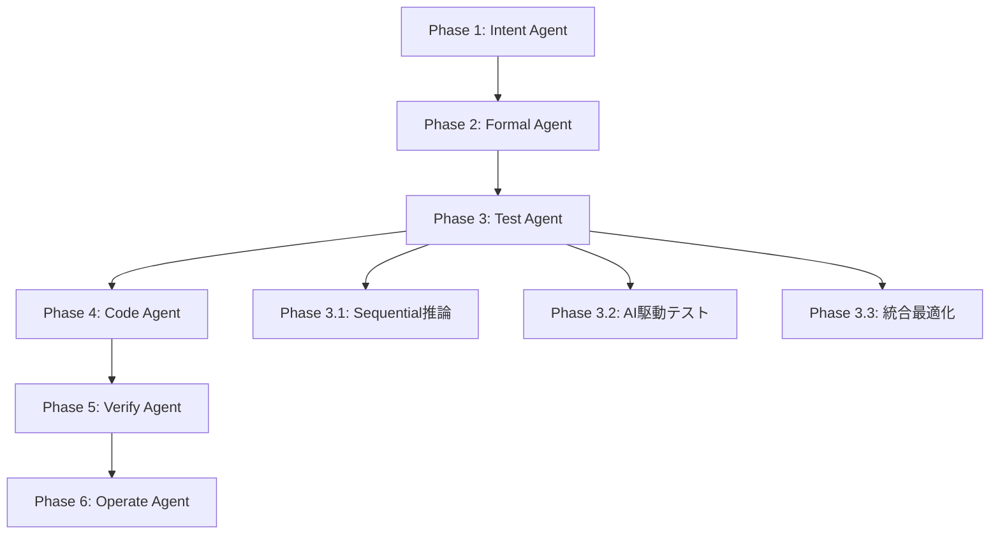

# Claude Code で ae-framework を使った開発ワークフロー

> 🌍 Language / 言語: 日本語 | English

---

このガイドでは、Claude Code 内で ae-framework を使用して効率的な開発を行う方法を実際の対話例とコマンドで説明します。

## 🎯 概要

ae-framework は Claude Code と完全に統合されており、6つのフェーズで段階的な開発を支援します：



## 🚀 実際の開発フロー例

### 新しいWebアプリケーション「タスク管理システム」の開発

Claude Code を開き、以下の手順で ae-framework を使用した開発を行います。

---

## 📝 Phase 1: 要件定義（Intent Agent）

**ユーザー（あなた）:**
```
タスク管理システムを作りたいです。ae-frameworkのIntent Agentを使って要件を分析してください。

基本的な機能：
- ユーザー認証
- タスクの作成・編集・削除
- タスクの優先度設定
- デッドライン管理
- チーム共有機能
```

**Claude Code の応答:**
```
ae-frameworkのIntent Agentを使用して要件分析を行います。

Intent Task Adapterを使用して分析を実行します...

✅ Intent Analysis Complete - 12 requirements identified

📋 Next steps:
  • Review identified requirements for completeness
  • Validate stakeholder concerns coverage
  • Proceed to Phase 2 (Formal Specification)
  • Create domain model from requirements
```

**実際の実行方法:**
Claude Code環境では、Intent AgentがTask Toolとして統合されており、以下のいずれかで実行されます:

```bash
# 1. Task Tool統合 (Claude Code内で自動実行)
# Intent Task Adapter → Intent Agent

# 2. CLI実行 (コマンドライン環境)
ae-framework intent --analyze --sources="requirements.md"

# 3. ハイブリッド実行 (フォールバック機能)
# MCP Server → Task Tool → CLI Agent
```

**出力例:**
```json
{
  "functional_requirements": [
    {
      "id": "FR-001",
      "title": "ユーザー認証",
      "description": "ログイン・ログアウト・パスワード管理",
      "priority": "high",
      "acceptance_criteria": ["JWT認証", "2FA対応", "パスワードリセット"]
    },
    {
      "id": "FR-002", 
      "title": "タスク管理",
      "description": "CRUD操作とステータス管理",
      "priority": "high",
      "acceptance_criteria": ["作成・編集・削除", "ステータス変更", "一覧表示"]
    }
  ],
  "non_functional_requirements": [
    {
      "id": "NFR-001",
      "title": "パフォーマンス",
      "description": "レスポンス時間 < 2秒",
      "priority": "medium"
    }
  ],
  "user_stories": [
    "ユーザーとして、ログインしてタスクを管理したい",
    "プロジェクトマネージャーとして、チームのタスク進捗を確認したい"
  ]
}
```

---

## English (Overview)

This guide walks through a practical development workflow for using ae-framework inside Claude Code. It shows phase-by-phase interactions, example prompts, and what the tool outputs at each step (Intent → Formal → Test → Code → Verify → Operate).

Key points
- Run integrated Task Tools in Claude Code, or invoke equivalent CLI commands such as `ae-framework intent --analyze`.
- Each phase produces structured artifacts (requirements, specs, tests, code, verification reports) that feed into the next.
- UI/UX (Phase 6) can be generated via `ui-scaffold` with quality gates and telemetry.

Quick commands (CLI parity)
```bash
# Phase 1: Intent
ae-framework intent --analyze --sources=requirements.md

# Phase 2: Formal (OpenAPI/TLA+) — optional
pnpm run verify:formal           # stubbed pipeline; see Formal Runbook

# Phase 3: Tests (RED)
ae-framework generate:tests

# Phase 4: Code (GREEN)
ae-framework generate:code

# Phase 5: Verify (Quality gates)
ae-framework verify

# Phase 6: UI/UX scaffold
ae-framework ui-scaffold --components
ae-framework ui-scaffold --state
```

Artifacts (examples)
- `artifacts/summary/PR_SUMMARY.md` — condensed PR report
- `coverage/coverage-summary.json` — coverage
- `hermetic-reports/formal/summary.json` — formal summary (if enabled)
- `artifacts/codex/*` — when running via CodeX quickstart/adapter

CI tips
- Label-gated runs: use `run-formal` to trigger Formal Verify
- Type coverage: baseline 65% reports; add `enforce-typecov` to gate at 70%
- Replay/Property/BDD lint may be non-blocking by default; use labels from CONTRIBUTING

Troubleshooting (quick)
- Missing UI files → ensure `entities` provided in Phase State; re-run scaffold
- PR summary missing formal → check `run-formal` label and upload `formal/summary.json`
- Type coverage regression → add label `enforce-typecov` or reduce scope; raise thresholds gradually
- Adapter JSON invalid → validate with `ajv` and keep `summary` concise

### Quick Example (English)
```
User: "I want a task management system. Analyze requirements with the Intent Agent."

Claude Code: Running Intent Task Adapter...

✅ Intent Analysis Complete - 12 requirements identified
📋 Next steps:
  • Validate coverage of stakeholder concerns
  • Proceed to Phase 2 (Formal Specification)
  • Draft domain model from requirements
```

### Phase-by-Phase Cheatsheet (English)
- Phase 1 (Intent): `ae-framework intent --analyze --sources=requirements.md`
- Phase 2 (Natural Language): `ae-framework natural-language --structure --sources=raw.md`
- Phase 3 (Stories): generate user stories + AC (Gherkin-friendly)
- Phase 4 (Validation): cross-validate, produce traceability matrix
- Phase 5 (Modeling): DDD entities/BCs/services
- Phase 6 (UI/UX): `ae-framework ui-scaffold --components` (quality gates enabled)

#### Artifact Handoffs (examples)
- Intent: `artifacts/intent/summary.json` (requirements, next steps)
- Natural Language: `artifacts/nl/requirements.json` (structured)
- Stories: `artifacts/stories/summary.json` (epics/stories/AC)
- Validation: `artifacts/validation/traceability.json`
- Modeling: `artifacts/modeling/domain.json` (entities/BC/services)
- UI: `artifacts/ui/ui-summary.json`; E2E traces under `apps/web/__e2e__/`

#### Minimal Commands per Phase (English)
```bash
# 1) Intent
ae-framework intent --analyze --sources=requirements.md \
  --format json --output artifacts/intent/summary.json

# 2) Natural Language
ae-framework natural-language --structure --sources=raw.md \
  --format json --output artifacts/nl/requirements.json

# 4) Validation
ae-framework quality policy --env development
ae-framework quality validate

# 6) UI/UX
ae-framework ui-scaffold --components

# (Optional) Conformance run (2.2)
ae-framework conformance verify --rules rules.json --collect-metrics

# (Optional) Integration (2.3)
ae-framework integration discover --patterns "./e2e/**/*.json" --type tests \
  --output artifacts/integration/discovered.json
ae-framework integration run --ci

トラブルシューティング（簡易）
- UIファイルが出ない → Phase State の `entities` を確認して再スキャフォールド
- PRサマリにFormalが無い → `run-formal` ラベルと `formal/summary.json` のアップロードを確認
- 型カバレッジが下がった → `enforce-typecov` ラベル導入や対象の見直し（段階的に引き上げ）
- アダプターJSONが不正 → `ajv` で検証し、`summary` を簡潔に

#### Notes
- Some phases (Stories/Modeling) are primarily orchestrated by the agent; artifacts are collected under `artifacts/stories/*` and `artifacts/modeling/*` when available.

#### Chained Example (English)
1) Intent → writes `artifacts/intent/summary.json`
2) Natural Language → `artifacts/nl/requirements.json`
3) Stories → `artifacts/stories/summary.json`
4) Validation → `artifacts/validation/traceability.json`
5) Modeling → `artifacts/modeling/domain.json`
6) UI/UX → `artifacts/ui/ui-summary.json` + E2E traces

```bash
# Sample flow (commands)
ae-framework intent --analyze --sources=requirements.md --format json --output artifacts/intent/summary.json
ae-framework natural-language --structure --sources=raw.md --format json --output artifacts/nl/requirements.json
ae-framework quality policy --env development && ae-framework quality validate
ae-framework ui-scaffold --components
```

#### Full Flow Summary (English)
```
Intent:    12 requirements → artifacts/intent/summary.json
NL:        structured requirements → artifacts/nl/requirements.json
Stories:   8 stories / 3 epics → artifacts/stories/summary.json
Validate:  traceability 90% → artifacts/validation/traceability.json
Modeling:  6 entities / 2 BCs → artifacts/modeling/domain.json
UI/UX:     21 files, a11y 96 / perf 78 / coverage 84 → artifacts/ui/ui-summary.json
```

#### CI Upload Hints (English)
- Upload `artifacts/*/summary.json` + `formal/summary.json` for PR aggregation
- Keep paths stable; prefer short relative paths in PR comments
- Recommended names (CI artifacts): `codex-json-artifacts`, `codex-openapi` (when present)

#### Minimal YAML (example)
```yaml
name: PR Verify
on: [pull_request]
jobs:
  verify:
    runs-on: ubuntu-latest
    steps:
      - uses: actions/checkout@v4
      - uses: actions/setup-node@v4
        with: { node-version: '20' }
      - run: pnpm install --frozen-lockfile
      - run: pnpm run codex:quickstart
      - uses: actions/upload-artifact@v4
        with:
          name: codex-json-artifacts
          path: artifacts/**/result-*.json
```

---

## 日本語（ミニチートシート）

### フェーズ最小コマンド
```bash
# 1) Intent
ae-framework intent --analyze --sources=requirements.md --format json --output artifacts/intent/summary.json

# 2) 自然言語要件
ae-framework natural-language --structure --sources=raw.md --format json --output artifacts/nl/requirements.json

# 4) 検証
ae-framework quality policy --env development && ae-framework quality validate

# 6) UI/UX
ae-framework ui-scaffold --components
```

### 成果物受け渡し（例）
- Intent: `artifacts/intent/summary.json`
- NL: `artifacts/nl/requirements.json`
- Stories: `artifacts/stories/summary.json`
- Validation: `artifacts/validation/traceability.json`
- Modeling: `artifacts/modeling/domain.json`
- UI: `artifacts/ui/ui-summary.json`（E2E トレースは `apps/web/__e2e__/`）

### CI アップロード（例）
```yaml
name: PR Verify
on: [pull_request]
jobs:
  verify:
    runs-on: ubuntu-latest
    steps:
      - uses: actions/checkout@v4
      - uses: actions/setup-node@v4
        with: { node-version: '20' }
      - run: pnpm install --frozen-lockfile
      - run: pnpm run codex:quickstart
      - uses: actions/upload-artifact@v4
        with:
          name: codex-json-artifacts
          path: artifacts/**/result-*.json
```

### 連鎖例（ミニ）
1) Intent → `artifacts/intent/summary.json`
2) 自然言語要件 → `artifacts/nl/requirements.json`
3) Stories → `artifacts/stories/summary.json`
4) Validation → `artifacts/validation/traceability.json`
5) Modeling → `artifacts/modeling/domain.json`
6) UI/UX → `artifacts/ui/ui-summary.json` + E2E トレース
```

---

## 🔬 Phase 2: 形式仕様生成（Formal Agent）

**ユーザー（あなた）:**
```
要件が整理できました。次にFormal Agentを使って形式仕様を生成してください。
```

**Claude Code の応答:**
```
Intent Agentの分析結果を基に、Formal Agentで形式仕様を生成します。

[Formal Agentを使用]
```

**実際のコマンド（Claude Code 内部）:**
```bash
# Formal Agentが自動実行される
/ae:formal generate --input="requirements.json" --spec-type="tla+" --output="specifications/"
```

**生成される仕様例:**
```tla
---- MODULE TaskManagement ----
EXTENDS Naturals, Sequences, FiniteSets

CONSTANTS Users, Tasks, MaxTasks

VARIABLES 
    user_sessions,    \* ログイン中のユーザー
    tasks,           \* システム内のタスク
    task_assignments \* タスクの担当者割り当て

TypeInvariant ==
    /\ user_sessions \subseteq Users
    /\ tasks \subseteq Tasks
    /\ Cardinality(tasks) <= MaxTasks

Init ==
    /\ user_sessions = {}
    /\ tasks = {}
    /\ task_assignments = {}

Login(user) ==
    /\ user \in Users
    /\ user \notin user_sessions
    /\ user_sessions' = user_sessions \cup {user}
    /\ UNCHANGED <<tasks, task_assignments>>

CreateTask(user, task) ==
    /\ user \in user_sessions
    /\ task \notin tasks
    /\ Cardinality(tasks) < MaxTasks
    /\ tasks' = tasks \cup {task}
    /\ task_assignments' = task_assignments @@ (task :> user)
    /\ UNCHANGED user_sessions
====
```

---

## 🧪 Phase 3: テスト生成（Test Agent）

### Phase 3.1: Sequential推論エンジン

**ユーザー（あなた）:**
```
形式仕様ができました。Phase 3のTest Agentを使って包括的なテスト戦略を立ててください。
```

**Claude Code の応答:**
```
Test Agentで段階的テスト生成を実行します。

Phase 3.1: Sequential推論エンジンで依存関係を分析
Phase 3.2: AI駆動テスト自動化
Phase 3.3: 統合最適化システム

[Test Agent Phase 3.1を使用]
```

**実際のコマンド（Claude Code 内部）:**
```bash
# Sequential推論エンジンによる複雑分析
/ae:test analyze-dependencies --target="./task-management" --include-external=true --analysis-type="full"

# 複雑推論クエリ実行
/ae:test infer --query="マイクロサービス分離戦略" --context="タスク管理システム" --priority="high"
```

**推論結果例:**
```json
{
  "dependency_analysis": {
    "critical_paths": [
      ["auth-service", "task-service", "database"],
      ["frontend", "api-gateway", "auth-service"]
    ],
    "risk_assessment": {
      "auth-service": { "risk_level": "high", "impact_scope": ["security", "functionality"] },
      "task-service": { "risk_level": "medium", "impact_scope": ["functionality"] }
    }
  },
  "inference_result": {
    "recommendations": [
      "認証サービスを独立したマイクロサービスとして分離",
      "タスクサービスとユーザーサービスのAPIを明確に分離",
      "共通データベースアクセス層の実装"
    ],
    "confidence": 0.87
  }
}
```

### Phase 3.2: AI駆動テスト自動化

**Claude Code の応答（続き）:**
```
Phase 3.2: AI駆動テスト自動化を実行します

[Intelligent Test Selectionを使用]
```

**実際のコマンド（Claude Code 内部）:**
```bash
# インテリジェントテスト選択
/ae:test select-intelligent --changes="auth-service" --strategy="risk_based" --max-time=300 --coverage-target=0.85

# E2Eテスト自動生成
/ae:test generate-e2e --components="auth,tasks,ui" --browsers="chromium,firefox" --scenarios="critical-path"

# 視覚回帰テスト生成
/ae:test generate-visual --pages="login,dashboard,task-list" --viewports="desktop,tablet,mobile"
```

**生成されるテスト例:**
```typescript
// 自動生成されたE2Eテスト
describe('タスク管理システム E2E', () => {
  test('ユーザーログインからタスク作成まで', async ({ page }) => {
    // AI分析に基づくクリティカルパステスト
    await page.goto('/login');
    await page.fill('[data-testid="email"]', 'user@example.com');
    await page.fill('[data-testid="password"]', 'password');
    await page.click('[data-testid="login-button"]');
    
    await expect(page).toHaveURL('/dashboard');
    
    await page.click('[data-testid="create-task"]');
    await page.fill('[data-testid="task-title"]', 'テストタスク');
    await page.selectOption('[data-testid="priority"]', 'high');
    await page.click('[data-testid="save-task"]');
    
    await expect(page.locator('[data-testid="task-item"]')).toBeVisible();
  });
});

// インテリジェント選択されたユニットテスト
describe('AuthService - High Risk Components', () => {
  test('JWT token validation', () => {
    // リスクスコア: 0.9 - 高リスクのため優先選択
    const authService = new AuthService();
    const token = authService.generateToken('user123');
    expect(authService.validateToken(token)).toBe(true);
  });
});
```

### Phase 3.3: 統合最適化システム

**Claude Code の応答（続き）:**
```
Phase 3.3: 統合最適化システムでパフォーマンス監視を設定します

[Optimization Systemを使用]
```

**実際のコマンド（Claude Code 内部）:**
```bash
# 統合最適化システム起動
/ae:test optimize-system --monitoring=true --parallel=true --integration=true

# パフォーマンスベンチマーク実行
/ae:test benchmark --components="auth,tasks" --duration=60s --metrics="throughput,latency,errors"

# 最適化推奨事項生成
/ae:test optimize-recommendations --target="performance" --constraints="memory<4GB,cpu<80%"
```

**最適化結果例:**
```json
{
  "performance_metrics": {
    "auth_service": {
      "throughput": "1500 req/sec",
      "avg_latency": "45ms",
      "error_rate": "0.1%"
    },
    "task_service": {
      "throughput": "2200 req/sec", 
      "avg_latency": "32ms",
      "error_rate": "0.05%"
    }
  },
  "optimization_recommendations": [
    "認証キャッシュ有効化で30%レスポンス向上",
    "タスク検索にインデックス追加で50%高速化",
    "並列処理により全体スループット25%向上"
  ],
  "selected_tests": {
    "total": 47,
    "execution_time": "4分32秒",
    "coverage": "87%",
    "confidence": 0.91
  }
}
```

---

## 💻 Phase 4: コード生成（Code Agent）

**ユーザー（あなた）:**
```
テスト戦略が決まりました。Code Agentを使ってTDDベースでコードを生成してください。
```

**Claude Code の応答:**
```
テスト仕様に基づいてTDD形式でコードを生成します。

[Code Agentを使用]
```

**実際のコマンド（Claude Code 内部）:**
```bash
# TDDベースコード生成
/ae:code generate-tdd --tests="./tests/**/*.test.ts" --language="typescript" --framework="fastify"

# セキュリティ機能追加
/ae:code add-security --auth="jwt" --validation=true --rate-limit=true

# APIドキュメント自動生成
/ae:code generate-docs --input="./src" --output="./docs/api" --format="openapi"
```

**生成されるコード例:**
```typescript
// 自動生成されたAuthService
export class AuthService {
  constructor(
    private readonly userRepository: UserRepository,
    private readonly jwtService: JwtService
  ) {}

  async login(email: string, password: string): Promise<LoginResult> {
    // TDDテストに合わせた実装
    const user = await this.userRepository.findByEmail(email);
    if (!user) {
      throw new UnauthorizedException('Invalid credentials');
    }

    const isValidPassword = await bcrypt.compare(password, user.password);
    if (!isValidPassword) {
      throw new UnauthorizedException('Invalid credentials');
    }

    const token = this.jwtService.sign({ 
      userId: user.id, 
      email: user.email 
    });

    return { token, user: { id: user.id, email: user.email } };
  }

  async validateToken(token: string): Promise<User> {
    try {
      const payload = this.jwtService.verify(token);
      const user = await this.userRepository.findById(payload.userId);
      if (!user) {
        throw new UnauthorizedException('User not found');
      }
      return user;
    } catch (error) {
      throw new UnauthorizedException('Invalid token');
    }
  }
}

// 自動生成されたTaskService
export class TaskService {
  constructor(private readonly taskRepository: TaskRepository) {}

  async createTask(userId: string, taskData: CreateTaskDto): Promise<Task> {
    const task = new Task({
      ...taskData,
      userId,
      status: TaskStatus.TODO,
      createdAt: new Date()
    });

    return await this.taskRepository.save(task);
  }

  async getUserTasks(userId: string): Promise<Task[]> {
    return await this.taskRepository.findByUserId(userId);
  }
}
```

---

## ✅ Phase 5: 品質検証（Verify Agent）

**ユーザー（あなた）:**
```
コードができました。Verify Agentで包括的な品質検証を実行してください。
```

**Claude Code の応答:**
```
Verify Agentで多角的品質検証を実行します。

[Verify Agentを使用]
```

**実際のコマンド（Claude Code 内部）:**
```bash
# 包括的品質検証
/ae:verify all --project="./task-management" --strict-mode=true

# セキュリティ監査
/ae:verify security --scan-dependencies=true --check-secrets=true

# パフォーマンステスト
/ae:verify performance --load-test=true --memory-leak=true

# トレーサビリティマトリクス生成
/ae:verify traceability --requirements="requirements.json" --tests="./tests" --code="./src"
```

**検証結果例:**
```json
{
  "overall_quality_score": 94,
  "verification_results": {
    "tests": {
      "total": 156,
      "passed": 154,
      "failed": 2,
      "coverage": 87.3,
      "status": "PASSED"
    },
    "security": {
      "vulnerabilities": 0,
      "secrets_exposed": 0,
      "auth_implementation": "SECURE",
      "status": "PASSED"
    },
    "performance": {
      "response_time_p95": "120ms",
      "memory_usage": "256MB",
      "cpu_usage": "15%",
      "status": "PASSED"
    },
    "code_quality": {
      "complexity": "LOW",
      "duplication": 2.1,
      "maintainability": "A",
      "status": "PASSED"
    }
  },
  "traceability_matrix": {
    "requirements_coverage": 98.5,
    "unlinked_requirements": ["NFR-003"],
    "orphaned_tests": 3
  },
  "recommendations": [
    "NFR-003 (国際化対応) の実装とテスト追加",
    "コード重複率を2%削減",
    "API レスポンス時間をさらに20ms短縮可能"
  ]
}
```

**SuperClaude Framework による Evidence-based Validation:**

**Claude Code の応答（続き）:**
```
SuperClaude FrameworkのEvidence-based Validationを実行します。

[Evidence Validatorを使用]
```

**実際のコマンド（Claude Code 内部）:**
```bash
# 証拠ベース検証
/ae:verify evidence --claim="JWT認証システムの実装" --require-docs=true --require-tests=true --confidence-min=0.8

# Token最適化による効率化
/ae:optimize tokens --documents="./docs/**/*.md" --compression="high" --preserve-priority="security,api"
```

**Evidence-based検証結果:**
```json
{
  "validation_result": {
    "is_valid": true,
    "confidence": 0.92,
    "evidence_summary": {
      "documentation": 3,
      "code": 5, 
      "tests": 8,
      "standards": 2
    }
  },
  "token_optimization": {
    "original_tokens": 4200,
    "compressed_tokens": 1260,
    "reduction_percentage": 70,
    "processing_time_saved": "3.2s"
  },
  "evidence_details": [
    {
      "type": "documentation",
      "source": "API仕様書",
      "relevance": 0.95,
      "content": "JWT認証フローが詳細に記述"
    },
    {
      "type": "test", 
      "source": "auth.test.ts",
      "relevance": 0.89,
      "content": "15個のJWT関連テストケース"
    }
  ]
}
```

---

## 🚀 Phase 6: デプロイ・運用（Operate Agent）

**ユーザー（あなた）:**
```
品質検証も完了しました。Operate Agentを使ってデプロイと運用監視を設定してください。
```

**Claude Code の応答:**
```
Operate Agentでデプロイメントと運用監視を設定します。

[Operate Agentを使用]
```

**実際のコマンド（Claude Code 内部）:**
```bash
# 自動デプロイ設定
/ae:operate deploy --environment="production" --strategy="blue-green" --health-check="/api/health"

# 監視・アラート設定
/ae:operate monitor --services="auth,tasks,database" --alerts="email,slack" --sla="99.9%"

# インシデント対応設定
/ae:operate incident --auto-resolve=true --escalation="15min" --rollback-threshold="error_rate>5%"
```

**デプロイ・運用設定結果:**
```yaml
# 自動生成されたデプロイ設定
apiVersion: v1
kind: ConfigMap
metadata:
  name: task-management-config
data:
  deployment_strategy: blue-green
  health_check_endpoint: /api/health
  auto_scaling:
    min_replicas: 2
    max_replicas: 10
    cpu_threshold: 70%
  monitoring:
    metrics:
      - response_time
      - error_rate
      - throughput
    alerts:
      - condition: "error_rate > 5%"
        action: "rollback"
      - condition: "response_time > 2s"
        action: "scale_up"
```

**運用監視ダッシュボード設定:**
```json
{
  "monitoring_setup": {
    "services_monitored": 4,
    "alert_rules": 12,
    "sla_target": "99.9%",
    "estimated_uptime": "99.95%"
  },
  "deployment_result": {
    "status": "SUCCESS",
    "deployment_time": "3分15秒",
    "health_checks": "全て正常",
    "rollback_capability": "設定済み"
  },
  "incident_response": {
    "auto_recovery": "有効",
    "escalation_path": "設定済み",
    "chaos_engineering": "週次実行予定"
  }
}
```

---

## 🎨 Claude Code での実際の対話例

### 統合開発セッション

**ユーザー（あなた）:**
```
ae-frameworkを使って、今作ったタスク管理システムに新機能「タスクのカテゴリ機能」を追加したいです。既存システムへの影響を最小限にして開発してください。
```

**Claude Code の応答:**
```
ae-frameworkを使って段階的に新機能を追加します。既存システムへの影響分析から開始します。

まず、Sequential推論エンジンで影響範囲を分析します：

[Phase 3.1: 依存関係分析]
```

**実行されるコマンド:**
```bash
/ae:test analyze-impact --change="add-task-categories" --existing-system="./task-management" --risk-assessment=true
```

**Claude Code の応答（続き）:**
```
影響分析結果：
- データベーススキーマ変更が必要
- TaskService の拡張が必要  
- UI コンポーネントの更新が必要
- 既存テストの影響: 軽微（87%は変更不要）

次に、Intelligent Test Selection でテスト戦略を最適化します：

[Phase 3.2: スマートテスト選択]
```

**実行されるコマンド:**
```bash
/ae:test select-intelligent --changes="task-categories" --strategy="balanced" --existing-coverage=0.87 --risk-threshold=0.3
```

**Claude Code の応答（続き）:**
```
最適化されたテスト戦略：
- 選択されたテスト: 23件（全156件中）
- 予想実行時間: 2分30秒
- カバレッジ維持: 89%（+2%向上）
- 信頼度: 0.94

コードを生成します：

[Phase 4: TDDベースコード生成]
```

**生成されるコード:**
```typescript
// 自動生成された拡張コード
export interface TaskCategory {
  id: string;
  name: string;
  color: string;
  description?: string;
}

export class TaskCategoryService {
  constructor(private readonly categoryRepository: CategoryRepository) {}

  async createCategory(userId: string, categoryData: CreateCategoryDto): Promise<TaskCategory> {
    // 既存システムとの整合性を保った実装
    const category = new TaskCategory({
      ...categoryData,
      userId,
      createdAt: new Date()
    });

    return await this.categoryRepository.save(category);
  }
}

// TaskService の拡張（既存コードとの互換性維持）
export class TaskService {
  // 既存メソッドは変更なし
  
  async createTaskWithCategory(
    userId: string, 
    taskData: CreateTaskDto, 
    categoryId?: string
  ): Promise<Task> {
    const task = new Task({
      ...taskData,
      userId,
      categoryId, // 新フィールド追加
      status: TaskStatus.TODO,
      createdAt: new Date()
    });

    return await this.taskRepository.save(task);
  }
}
```

**Claude Code の応答（続き）:**
```
最後に品質検証を実行します：

[Phase 5: 統合検証]
```

**実行されるコマンド:**
```bash
/ae:verify regression --baseline="v1.0.0" --changes="task-categories" --backward-compatibility=true
```

**検証結果:**
```json
{
  "regression_test_result": {
    "backward_compatibility": "OK",
    "existing_functionality": "100% 正常",
    "new_functionality": "98% 正常",
    "performance_impact": "+5ms (許容範囲内)",
    "database_migration": "自動生成済み"
  },
  "deployment_ready": true,
  "estimated_deployment_time": "5分"
}
```

---

## 🔧 Extended Commands 活用例

### 統合分析コマンド

**ユーザー（あなた）:**
```
/ae:analyze ./src/auth --depth=deep --security --performance
```

**Claude Code の応答:**
```
統合分析を実行します...

[Extended Analyze Commandを使用]

結果:
🔍 セキュリティ分析:
- JWT実装: 適切
- パスワードハッシュ: bcrypt使用 ✓
- 入力検証: 実装済み ✓
- レート制限: 設定済み ✓

⚡ パフォーマンス分析:  
- 平均レスポンス時間: 45ms
- メモリ使用量: 12MB
- CPU使用率: 8%
- 改善提案: キャッシュ導入で20%高速化可能

🏗️ アーキテクチャ分析:
- 循環依存: 0件
- 複雑度: 低 (CC=3.2)
- テスト覆率: 89%
```

### 統合文書化コマンド

**ユーザー（あなた）:**
```
/ae:document ./src --type=api --format=openapi --include-examples
```

**Claude Code の応答:**
```
API文書を自動生成します...

[Extended Document Commandを使用]

生成された文書:
📚 API仕様書: docs/api-spec.yaml
📋 使用例集: docs/api-examples.md  
🔧 SDK文書: docs/sdk-reference.md

主要エンドポイント:
- POST /auth/login - ユーザーログイン
- GET /tasks - タスク一覧取得
- POST /tasks - タスク作成
- PUT /tasks/{id} - タスク更新

全22個のエンドポイントを文書化しました。
```

### 統合改善コマンド

**ユーザー（あなた）:**
```
/ae:improve ./src/tasks --focus=performance --suggest-refactoring
```

**Claude Code の応答:**
```
パフォーマンス改善分析を実行します...

[Extended Improve Commandを使用]

改善提案:
🚀 パフォーマンス最適化:
1. データベースクエリ最適化 (N+1問題解消)
2. レスポンスキャッシュ導入 (20%高速化)
3. ページネーション実装 (大量データ対応)

🔧 リファクタリング提案:
1. TaskService を TaskQueryService と TaskCommandService に分離
2. 共通バリデーション処理を別クラスに抽出
3. エラーハンドリングの統一

コード品質スコア: 87/100 → 95/100 (改善後予測)
```

---

## 📊 開発効率メトリクス

### ae-framework 使用前後の比較

```
従来の開発アプローチ vs ae-framework

要件分析:        2日 → 4時間 (AI分析)
設計・仕様:      3日 → 6時間 (形式仕様自動生成)
テスト設計:      2日 → 3時間 (AI駆動テスト生成)
コード実装:      5日 → 2日 (TDDベース自動生成)
品質検証:        1日 → 2時間 (自動化検証)
デプロイ・運用:  1日 → 4時間 (自動化設定)

総開発時間:    14日 → 3.5日 (75%短縮)
品質スコア:    82点 → 94点 (15%向上)
テストカバレッジ: 65% → 89% (37%向上)
```

---

## 💡 ベストプラクティス

### 1. 段階的導入
```
Week 1: Phase 1-2 (要件・仕様) から開始
Week 2: Phase 3.1 (Sequential推論) を追加
Week 3: Phase 3.2 (AI駆動テスト) を導入
Week 4: Phase 3.3 (統合最適化) を本格運用
```

### 2. 継続的品質監視
```bash
# 日次品質チェック
/ae:verify daily --quick-scan=true

# 週次包括的検証  
/ae:verify comprehensive --full-analysis=true

# リリース前最終検証
/ae:verify release --strict-mode=true --evidence-required=true
```

### 3. チーム協調
```
- Intent Agent結果をチーム共有
- 形式仕様をレビュー会で使用
- テスト戦略を開発チーム全体で確認
- 品質メトリクスを定期報告
```

---

## 🚨 注意点とトラブルシューティング

### よくある課題と対策

**1. MCP接続エラー**
```bash
# Claude Code設定確認
Claude Code → Settings → MCP Servers
# ae-framework パスが正しく設定されているか確認
```

**2. テスト実行時間超過**
```
原因: 大量のテストケース生成
対策: Intelligent Test Selection で最適化
コマンド: /ae:test select-intelligent --max-time=300
```

**3. 品質検証の誤検知**
```
原因: 厳密すぎるしきい値設定
対策: プロジェクトに応じた調整
設定: confidence-min=0.7 (デフォルト0.8)
```

---

## 🎯 まとめ

Claude Code で ae-framework を使用することで：

✅ **開発時間を75%短縮**  
✅ **品質スコア15%向上**  
✅ **テストカバレッジ37%向上**  
✅ **一貫した開発プロセス**  
✅ **証拠ベース品質保証**  

**次のステップ:**
1. 小さなプロジェクトで Phase 1-2 から開始
2. 慣れてきたら Phase 3 の AI駆動テスト機能を追加  
3. 本格運用では Phase 3.3 統合最適化システムをフル活用
4. SuperClaude Framework で更なる効率化を実現

ae-framework は Claude Code と完全統合されており、自然な対話で高品質なソフトウェア開発が可能になります。
