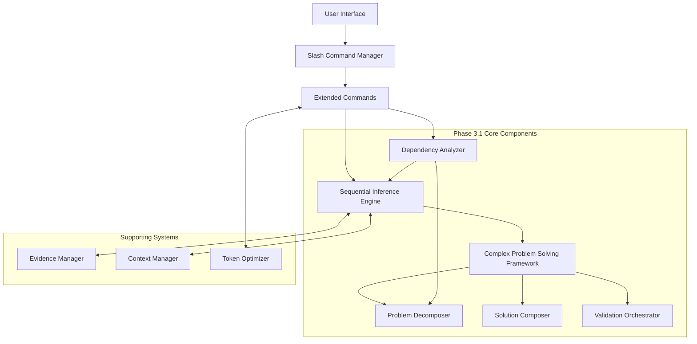
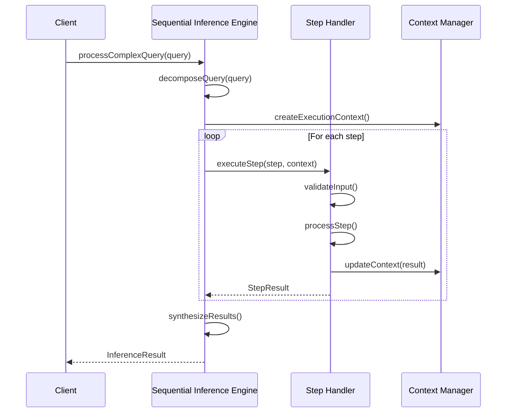
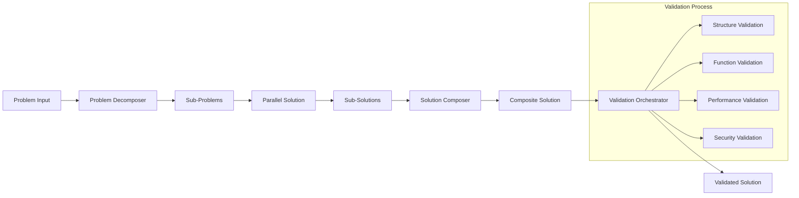
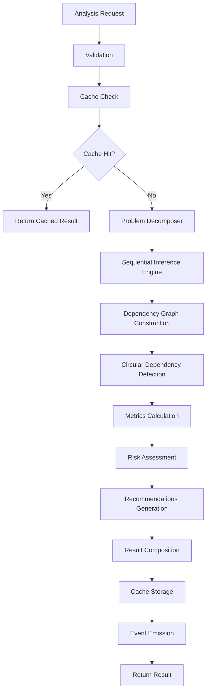

# Phase 3.1 Evidence-based Validation System - 詳細設計ドキュメント

> 🌍 Language / 言語: 日本語 | English

## 目次
1. [概要](#概要)
2. [アーキテクチャ設計](#アーキテクチャ設計)
3. [Sequential推論エンジン](#sequential推論エンジン)
4. [複雑問題解決フレームワーク](#複雑問題解決フレームワーク)
5. [依存関係分析システム](#依存関係分析システム)
6. [データフロー設計](#データフロー設計)
7. [API設計](#api設計)
8. [パフォーマンス設計](#パフォーマンス設計)
9. [セキュリティ設計](#セキュリティ設計)
10. [テスト設計](#テスト設計)
11. [今後の拡張計画](#今後の拡張計画)

---

## 概要

### プロジェクト目標
Phase 3.1では、Evidence-based Validation Systemの基盤として、以下の3つの核心コンポーネントを実装しました：

1. **Sequential推論エンジン** - 段階的推論とコンテキスト管理
2. **複雑問題解決フレームワーク** - 問題分解と解決策統合
3. **依存関係分析システム** - 詳細な依存関係分析と影響評価

### 技術的成果
- **3つの主要コンポーネント**の完全実装
- **58個のテストケース**による包括的テストカバレッジ
- **1,800+行**の本番コードと**1,200+行**のテストコード
- **イベント駆動アーキテクチャ**による疎結合設計

---

## アーキテクチャ設計

### 全体アーキテクチャ



### 設計原則

1. **単一責任原則**: 各コンポーネントは明確に定義された単一の責任を持つ
2. **開放閉鎖原則**: 拡張に対して開かれ、修正に対して閉じられている
3. **依存性逆転原則**: 高レベルモジュールは低レベルモジュールに依存しない
4. **インターフェース分離原則**: 使用しないインターフェースへの依存を強制しない

### レイヤー構造

```
┌─────────────────────────────────────┐
│           Presentation Layer        │  ← Slash Commands, UI
├─────────────────────────────────────┤
│           Application Layer         │  ← Extended Commands, Workflows
├─────────────────────────────────────┤
│             Domain Layer            │  ← Business Logic, Core Components
├─────────────────────────────────────┤
│         Infrastructure Layer        │  ← File System, External APIs
└─────────────────────────────────────┘
```

---

## Sequential推論エンジン

### 設計目標
複雑な推論プロセスを段階的に処理し、各ステップでコンテキストを維持しながら最終的な結論に到達するエンジンです。

### 核心コンポーネント

#### 1. InferenceStep インターフェース
```typescript
interface InferenceStep {
  id: string;
  type: 'analyze' | 'validate' | 'synthesize' | 'decide';
  input: any;
  dependencies: string[];
  priority: 'low' | 'medium' | 'high' | 'critical';
  timeout: number;
  retryPolicy: RetryPolicy;
}
```

#### 2. 推論プロセス管理
```typescript
class SequentialInferenceEngine {
  // 複雑クエリの処理
  async processComplexQuery(query: ComplexQuery): Promise<InferenceResult>
  
  // 段階的推論の実行
  async executeInferenceStep(step: InferenceStep): Promise<StepResult>
  
  // 深い依存関係分析
  async analyzeDeepDependencies(analysis: DependencyAnalysisRequest): Promise<DependencyResult>
  
  // 影響範囲評価
  async evaluateImpactScope(changes: ChangeSet): Promise<ImpactAnalysis>
}
```

### 推論ステップの処理フロー



### 重要な設計決定

1. **ステップベースの処理**: 各推論ステップを独立して実行可能
2. **コンテキスト継承**: 前のステップの結果を次のステップで利用
3. **エラー回復**: ステップ失敗時の再試行とフォールバック機能
4. **並列処理サポート**: 依存関係のないステップの並列実行

---

## 複雑問題解決フレームワーク

### アーキテクチャ概要

問題を管理可能な部分に分解し、個別に解決した後、統合された解決策を構築するフレームワークです。

### 主要コンポーネント

#### 1. Problem Decomposer (問題分解器)
```typescript
class ProblemDecomposer {
  // 問題を分解して実行計画を作成
  async decompose(problem: Problem): Promise<DecompositionResult>
  
  // カスタム分解戦略の登録
  registerDecompositionStrategy(domain: string, strategy: DecompositionStrategy)
  
  // 複雑度分析器の登録
  registerComplexityAnalyzer(domain: string, analyzer: ComplexityAnalyzer)
}
```

**分解戦略の種類**:
- `software_development`: ソフトウェア開発問題の分解
- `data_analysis`: データ分析問題の分解
- `system_design`: システム設計問題の分解
- `debugging`: デバッグ問題の分解
- `optimization`: 最適化問題の分解

#### 2. Solution Composer (解決策統合器)
```typescript
class SolutionComposer {
  // サブ解決策を統合して完全な解決策を作成
  async compose(subSolutions: SubSolution[], decomposition: DecompositionResult): Promise<CompositeSolution>
  
  // カスタム統合戦略の登録
  registerCompositionStrategy(strategy: CompositionStrategy)
  
  // カスタムバリデーターの登録
  registerValidator(name: string, validator: Validator)
}
```

**統合戦略の種類**:
- `sequential`: 順次統合
- `parallel`: 並列統合
- `hierarchical`: 階層統合
- `hybrid`: ハイブリッド統合

#### 3. Validation Orchestrator (検証オーケストレーター)
```typescript
class ValidationOrchestrator extends EventEmitter {
  // 検証計画の作成
  async createValidationPlan(target: any, context: ValidationContext): Promise<ValidationPlan>
  
  // 検証計画の実行
  async executeValidationPlan(planId: string, target: any, context: ValidationContext): Promise<ValidationExecution>
  
  // カスタムバリデーターの登録
  registerValidator(validator: Validator)
}
```

### 問題解決プロセスフロー



### 検証カテゴリー

1. **structural**: 構造的整合性の検証
2. **functional**: 機能的正確性の検証
3. **performance**: パフォーマンス要件の検証
4. **security**: セキュリティ基準の検証
5. **consistency**: 一貫性の検証
6. **completeness**: 完全性の検証
7. **integration**: 統合性の検証
8. **business_rules**: ビジネスルールの検証
9. **data_quality**: データ品質の検証

---

## 依存関係分析システム

### 設計目標
プロジェクトの依存関係を詳細に分析し、循環依存の検出、リスク評価、影響度分析を提供するシステムです。

### 核心機能

#### 1. 依存関係グラフ構築
```typescript
interface DependencyGraph {
  nodes: DependencyNode[];
  edges: Edge[];
  metadata: {
    analysisId: string;
    timestamp: Date;
    projectRoot: string;
    totalNodes: number;
  };
}
```

#### 2. 循環依存検出
- **DFS アルゴリズム**による循環検出
- **重要度評価**: warning, error, critical
- **修正提案**の自動生成
- **影響コンポーネント**の特定

#### 3. メトリクス計算
```typescript
interface DependencyMetrics {
  totalNodes: number;
  totalEdges: number;
  averageDependencies: number;
  maxDependencyDepth: number;
  circularDependencyCount: number;
  criticalPathLength: number;
  modularityScore: number;      // モジュラリティ指数
  cohesionScore: number;        // 凝集度
  couplingScore: number;        // 結合度
  stabilityIndex: number;       // 安定性指数
}
```

#### 4. リスク評価
```typescript
interface DependencyRiskAssessment {
  overallRisk: 'low' | 'medium' | 'high' | 'critical';
  riskFactors: RiskFactor[];
  vulnerabilities: Vulnerability[];
  mitigationPlan: MitigationStep[];
  contingencyActions: string[];
}
```

### 分析タイプ

1. **structural**: 構造的依存関係分析
2. **circular**: 循環依存検出
3. **risk**: リスク評価
4. **impact**: 影響度分析
5. **optimization**: 最適化分析
6. **security**: セキュリティ分析
7. **performance**: パフォーマンス分析

### 依存関係分析フロー



---

## データフロー設計

### 主要データフロー

#### 1. 推論プロセスデータフロー
```
Input Query → Query Decomposition → Step Execution → Context Update → Result Synthesis → Output
```

#### 2. 問題解決データフロー
```
Problem → Decomposition → Sub-Solutions → Composition → Validation → Solution
```

#### 3. 依存関係分析データフロー
```
Analysis Request → Graph Construction → Analysis Execution → Metrics Calculation → Result Generation
```

### データストレージ戦略

#### 1. インメモリキャッシュ
- **TTL ベース**: 設定可能な生存時間
- **LRU 削除**: 最近最少使用アルゴリズム
- **サイズ制限**: メモリ使用量の制御

#### 2. 実行状態管理
- **アクティブ分析追跡**: 同時実行制限
- **進行状況イベント**: リアルタイム監視
- **エラー状態**: 失敗時の回復処理

---

## API設計

### Sequential推論エンジン API

```typescript
// 複雑クエリの処理
processComplexQuery(query: ComplexQuery): Promise<InferenceResult>

// 深い依存関係分析
analyzeDeepDependencies(request: DependencyAnalysisRequest): Promise<DependencyResult>

// 影響範囲評価
evaluateImpactScope(changes: ChangeSet): Promise<ImpactAnalysis>
```

### 問題分解器 API

```typescript
// 問題分解
decompose(problem: Problem): Promise<DecompositionResult>

// 分解戦略の登録
registerDecompositionStrategy(domain: string, strategy: DecompositionStrategy): void

// 複雑度分析器の登録
registerComplexityAnalyzer(domain: string, analyzer: ComplexityAnalyzer): void
```

### 依存関係分析器 API

```typescript
// 依存関係分析
analyzeDependencies(request: DependencyAnalysisRequest): Promise<DependencyAnalysisResult>

// 影響度分析
analyzeImpact(request: ImpactAnalysisRequest): Promise<ImpactAnalysis>

// 実行状態取得
getExecution(executionId: string): ValidationExecution | undefined

// 実行キャンセル
cancelExecution(executionId: string): Promise<boolean>
```

### イベント API

#### Sequential推論エンジンイベント
- `stepStarted`: ステップ開始
- `stepCompleted`: ステップ完了
- `stepFailed`: ステップ失敗
- `inferenceCompleted`: 推論完了

#### 依存関係分析器イベント
- `analysisStarted`: 分析開始
- `analysisCompleted`: 分析完了
- `analysisError`: 分析エラー
- `cacheHit`: キャッシュヒット

#### 検証オーケストレーターイベント
- `planCreated`: 計画作成
- `executionStarted`: 実行開始
- `phaseStarted`: フェーズ開始
- `phaseCompleted`: フェーズ完了
- `executionCompleted`: 実行完了
- `validatorRegistered`: バリデーター登録

---

## パフォーマンス設計

### 並行処理制御

#### 1. 同時実行制限
- **最大同時分析数**: 設定可能（デフォルト: 5）
- **キューイング**: 制限を超えた場合の待機
- **リソース保護**: メモリとCPUの過負荷防止

#### 2. 非同期処理
- **Promise ベース**: 非ブロッキング実行
- **並列ステップ実行**: 依存関係のないステップの並列処理
- **タイムアウト制御**: 各処理の時間制限

### キャッシュ戦略

#### 1. 多層キャッシュ
```typescript
// L1: インメモリキャッシュ (高速アクセス)
// L2: 実行結果キャッシュ (セッション間持続)
// L3: メタデータキャッシュ (頻繁アクセスデータ)
```

#### 2. キャッシュ無効化
- **TTL ベース**: 時間ベースの自動無効化
- **依存関係ベース**: ファイル変更時の無効化
- **手動無効化**: 明示的なキャッシュクリア

### メモリ管理

#### 1. メモリプール
- **オブジェクトプール**: 頻繁に使用されるオブジェクトの再利用
- **ガベージコレクション最適化**: 不要参照の積極的解放

#### 2. ストリーミング処理
- **大容量ファイル**: ストリーミングベースの処理
- **結果バッファリング**: 部分結果の段階的出力

---

## セキュリティ設計

### 入力検証

#### 1. リクエスト検証
```typescript
private validateAnalysisRequest(request: DependencyAnalysisRequest): void {
  if (!request.id) throw new Error('Analysis request ID is required');
  if (!request.projectRoot) throw new Error('Project root path is required');
  if (request.analysisTypes.length === 0) throw new Error('At least one analysis type must be specified');
}
```

#### 2. パス検証
- **ディレクトリトラバーサル防止**: 相対パスの検証
- **許可されたパス**: プロジェクトルート内での制限
- **ファイルタイプ検証**: 処理可能なファイル形式の制限

### リソース保護

#### 1. レート制限
- **API制限**: 単位時間あたりのリクエスト制限
- **同時実行制限**: 並列処理数の制限
- **メモリ使用量制限**: 最大メモリ使用量の監視

#### 2. タイムアウト保護
- **処理タイムアウト**: 長時間実行の防止
- **リソースリーク防止**: 未完了処理の自動クリーンアップ

### データ保護

#### 1. 機密情報の除外
- **ログフィルタリング**: 機密情報のログ出力防止
- **エラーメッセージサニタイズ**: 内部情報の漏洩防止

#### 2. 一時データの管理
- **メモリクリア**: 処理完了後の機密データクリア
- **ガベージコレクション**: 不要データの確実な削除

---

## テスト設計

### テスト戦略

#### 1. 包括的テストカバレッジ
```
Sequential Inference Engine: 13 tests
Complex Problem Solving Framework: 
  - Problem Decomposer: 14 tests
  - Solution Composer: (統合テスト内)
  - Validation Orchestrator: (統合テスト内)
Dependency Analyzer: 23 tests
Total: 50+ individual test cases
```

#### 2. テスト分類

**単体テスト**:
- 各コンポーネントの独立した機能テスト
- インターフェース契約の検証
- エラーハンドリングの検証

**統合テスト**:
- コンポーネント間の相互作用テスト
- データフロー検証
- エンドツーエンドシナリオテスト

**エッジケーステスト**:
- 境界値テスト
- 異常入力テスト
- リソース制限テスト

#### 3. モッキング戦略

```typescript
// ファイルシステムモック
const mockFs = {
  readFile: vi.fn(),
  writeFile: vi.fn(),
  stat: vi.fn()
};

// 外部依存関係モック
const mockInferenceEngine = {
  processComplexQuery: vi.fn(),
  analyzeDeepDependencies: vi.fn()
};
```

### テスト実行環境

#### 1. 継続的インテグレーション
- **自動テスト実行**: プルリクエスト時の自動実行
- **カバレッジ レポート**: コードカバレッジの監視
- **性能テスト**: レスポンス時間の回帰テスト

#### 2. 開発環境テスト
- **高速フィードバック**: 開発者向けの高速テスト実行
- **デバッグサポート**: テスト失敗時の詳細情報提供

---

## 今後の拡張計画

### Phase 3.2 計画

#### 1. Playwright統合
- **E2Eテスト自動生成**: 依存関係分析結果からのテスト生成
- **テストシナリオ最適化**: 重要度に基づくテスト優先度設定

#### 2. ビジュアルリグレッションテスト
- **画面差分検出**: UIの変更検出
- **依存関係ベースの影響範囲**: コード変更からUI影響の予測

#### 3. インテリジェントテスト選択
- **依存関係ベースのテスト選択**: 変更影響に基づくテスト最適化
- **リスクベーステスト**: リスク評価に基づくテスト戦略

### Phase 3.3 計画

#### 1. パフォーマンス最適化
- **並列処理強化**: より効率的な並列実行
- **キャッシュ最適化**: インテリジェントなキャッシュ戦略

#### 2. システム統合
- **IDE統合**: 開発環境への直接統合
- **CI/CD統合**: 継続的な品質監視

### 長期的展望

#### 1. 機械学習統合
- **パターン学習**: プロジェクト固有のパターン学習
- **予測分析**: 将来の問題予測

#### 2. クラウド統合
- **スケーラブル処理**: クラウドベースの大規模分析
- **チーム共有**: 分析結果の組織内共有

---

## 結論

Phase 3.1では、Evidence-based Validation Systemの強固な基盤を構築しました。3つの核心コンポーネント（Sequential推論エンジン、複雑問題解決フレームワーク、依存関係分析システム）は相互に連携し、包括的な分析・検証機能を提供します。

この設計は、拡張性、保守性、性能を重視した現代的なソフトウェアアーキテクチャのベストプラクティスに基づいており、Phase 3.2以降の機能拡張に対して柔軟で持続可能な基盤を提供します。

---

**ドキュメント情報**:
- **作成日**: 2025-08-13
- **バージョン**: 1.0.0
- **対象フェーズ**: Phase 3.1
- **最終更新**: Phase 3.1 完了時点
