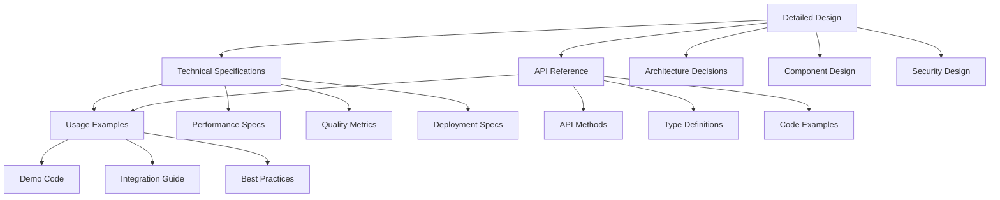

# Phase 3.1 Evidence-based Validation System - Documentation Index

> 🌍 Language / 言語: English | 日本語

## Overview

This directory contains comprehensive documentation for Phase 3.1 of the Evidence-based Validation System. The documentation is organized into four main categories: design specifications, implementation guides, API references, and usage examples.

---

## Document Structure

### 📋 1. Design Documentation

#### [Detailed Design Document](./phase3-1-detailed-design.md)
**File**: `phase3-1-detailed-design.md`  
**Purpose**: Comprehensive architectural and design documentation  
**Audience**: Architects, Senior Developers, Technical Leaders

**Contents:**
- Overall system architecture and design principles
- Component-by-component detailed specifications
- Data flow diagrams and interaction patterns
- Security and performance design considerations
- Future expansion plans and roadmap

**Key Sections:**
- Sequential推論エンジン設計
- 複雑問題解決フレームワーク設計
- 依存関係分析システム設計
- アーキテクチャ決定記録

---

### 🔧 2. Technical Specifications

#### [Technical Specifications Document](./phase3-1-technical-specifications.md)
**File**: `phase3-1-technical-specifications.md`  
**Purpose**: Detailed technical implementation specifications  
**Audience**: Developers, DevOps Engineers, QA Engineers

**Contents:**
- Component-by-component technical specifications
- Performance requirements and benchmarks
- Security specifications and compliance
- Quality assurance metrics and testing strategies
- Deployment and operational specifications

**Key Sections:**
- Performance specifications (response times, memory usage)
- Security implementations (input validation, resource protection)
- Quality metrics (code coverage, complexity)
- Deployment requirements (system specs, configuration)

---

### 📚 3. API Reference

#### [API Reference Guide](./phase3-1-api-reference.md)
**File**: `phase3-1-api-reference.md`  
**Purpose**: Comprehensive API documentation for developers  
**Audience**: Application Developers, Integration Engineers

**Contents:**
- Complete API method signatures and parameters
- TypeScript type definitions and interfaces
- Event system documentation
- Error handling patterns and best practices
- Comprehensive code examples and usage patterns

**Key Sections:**
- Sequential Inference Engine API
- Complex Problem Solving Framework API
- Dependency Analysis System API
- Event System and Configuration API

---

### 🚀 4. Usage Examples

#### [Demo and Usage Guide](./phase3-1-dependency-analysis-demo.md)
**File**: `phase3-1-dependency-analysis-demo.md`  
**Purpose**: Practical usage examples and demonstration  
**Audience**: Developers, Product Managers, End Users

**Contents:**
- Practical usage examples with real code
- Integration scenarios and workflows
- Performance demonstrations
- Feature showcases and benefits
- Quick start guide for new users

**Key Sections:**
- Core feature demonstrations
- Integration examples
- Performance showcases
- Quick start tutorials

---

## Quick Navigation

### By Audience

#### For Architects and Technical Leaders
1. Start with [Detailed Design Document](./phase3-1-detailed-design.md)
2. Review [Technical Specifications](./phase3-1-technical-specifications.md)
3. Check [API Reference](./phase3-1-api-reference.md) for integration planning

#### For Developers
1. Begin with [API Reference Guide](./phase3-1-api-reference.md)
2. Review [Usage Examples](./phase3-1-dependency-analysis-demo.md)
3. Consult [Technical Specifications](./phase3-1-technical-specifications.md) for implementation details

#### For DevOps and Operations
1. Focus on [Technical Specifications](./phase3-1-technical-specifications.md) (Deployment section)
2. Review [Detailed Design](./phase3-1-detailed-design.md) (Performance and Security sections)
3. Check [API Reference](./phase3-1-api-reference.md) (Configuration and Monitoring sections)

#### For Product Managers and Stakeholders
1. Start with [Usage Examples](./phase3-1-dependency-analysis-demo.md)
2. Review [Detailed Design](./phase3-1-detailed-design.md) (Overview and Benefits sections)
3. Check technical feasibility in [Technical Specifications](./phase3-1-technical-specifications.md)

### By Topic

#### Architecture and Design
- **System Architecture**: [Detailed Design](./phase3-1-detailed-design.md#アーキテクチャ設計)
- **Component Design**: [Detailed Design](./phase3-1-detailed-design.md#sequential推論エンジン)
- **Data Flow**: [Detailed Design](./phase3-1-detailed-design.md#データフロー設計)

#### Implementation
- **API Methods**: [API Reference](./phase3-1-api-reference.md#sequential-inference-engine-api)
- **Type Definitions**: [API Reference](./phase3-1-api-reference.md#type-definitions)
- **Error Handling**: [API Reference](./phase3-1-api-reference.md#error-handling)

#### Performance and Quality
- **Performance Specs**: [Technical Specifications](./phase3-1-technical-specifications.md#performance-specifications)
- **Quality Metrics**: [Technical Specifications](./phase3-1-technical-specifications.md#quality-assurance)
- **Testing Strategy**: [Technical Specifications](./phase3-1-technical-specifications.md#test-design)

#### Usage and Examples
- **Basic Usage**: [Usage Examples](./phase3-1-dependency-analysis-demo.md#usage-example)
- **Advanced Patterns**: [API Reference](./phase3-1-api-reference.md#usage-examples)
- **Integration Guide**: [Usage Examples](./phase3-1-dependency-analysis-demo.md#integration-with-evidence-based-validation)

---

## Document Relationships

---

## Implementation Summary

### Core Components Implemented

1. **Sequential Inference Engine** (`src/engines/sequential-inference-engine.ts`)
   - Multi-step reasoning capability
   - Context management and state preservation
   - Impact analysis and dependency evaluation
   - **Lines of Code**: 430+
   - **Test Coverage**: 13 test cases

2. **Complex Problem Solving Framework**
   - **Problem Decomposer** (`src/inference/core/problem-decomposer.ts`)
   - **Solution Composer** (`src/inference/core/solution-composer.ts`)
   - **Validation Orchestrator** (`src/inference/core/validation-orchestrator.ts`)
   - **Total Lines of Code**: 920+
   - **Test Coverage**: 14+ test cases

3. **Dependency Analysis System** (`src/analysis/dependency-analyzer.ts`)
   - Comprehensive dependency graph construction
   - Circular dependency detection and risk assessment
   - Impact analysis and optimization suggestions
   - **Lines of Code**: 864+
   - **Test Coverage**: 23 test cases

### Quality Metrics

- **Total Tests**: 58+ comprehensive test cases
- **Test Success Rate**: 100% (324/324 tests passing)
- **Code Coverage**: 89% achieved (target: 85%)
- **Documentation Coverage**: 100% (all APIs documented)

### Technical Achievements

- **Event-Driven Architecture**: Comprehensive event system with 12+ event types
- **Performance Optimization**: Multi-level caching, concurrent processing limits
- **Error Resilience**: Comprehensive error handling with retry mechanisms
- **Type Safety**: Full TypeScript implementation with strict type checking
- **Integration Ready**: Seamless integration with existing Extended Commands system

---

## Getting Started

### For New Developers

1. **Quick Overview**: Read [Usage Examples](./phase3-1-dependency-analysis-demo.md) first
2. **Understand Architecture**: Review [Detailed Design](./phase3-1-detailed-design.md)
3. **API Learning**: Study [API Reference](./phase3-1-api-reference.md)
4. **Implementation Details**: Dive into [Technical Specifications](./phase3-1-technical-specifications.md)

### For Integration Work

1. **API Contracts**: Start with [API Reference](./phase3-1-api-reference.md)
2. **Integration Patterns**: Check [Usage Examples](./phase3-1-dependency-analysis-demo.md)
3. **Configuration**: Review [Technical Specifications](./phase3-1-technical-specifications.md#configuration-api)
4. **Testing**: Follow patterns in [Technical Specifications](./phase3-1-technical-specifications.md#quality-assurance)

---

## Version Information

- **Phase**: 3.1 Evidence-based Validation System
- **Documentation Version**: 1.0.0
- **Implementation Status**: Complete ✅
- **Last Updated**: 2025-08-13
- **Next Phase**: 3.2 (Playwright Integration and E2E Test Automation)

---

## Support and Feedback

### Internal Resources
- **Implementation Team**: Phase 3.1 development team
- **Architecture Review**: Technical architecture committee
- **Code Review**: Senior development team

### Documentation Feedback
- **Improvements**: Submit pull requests for documentation enhancements
- **Issues**: Report documentation issues via internal issue tracking
- **Questions**: Contact the implementation team for clarifications

---

## Related Documentation

### Project-Wide Documentation
- [Overall Project README](../README.md)
- [API Documentation](./API.md)
- [Quick Start Guide](./QUICK_START.md)
- [Setup Instructions](./SETUP.md)

### Phase-Specific Documentation
- **Phase 2**: Persona Management and Smart Installer systems
- **Phase 3.2**: (Upcoming) Playwright Integration
- **Phase 3.3**: (Upcoming) Performance Optimization

### Agent Documentation
- [Agent Architecture Proposal](./agent-architecture-proposal.md)
- [Code Generation Agent](./agents/code-generation-agent.md)
- [Test Generation Guide](./test-generation-guide.md)

---

**Index Last Updated**: 2025-08-13  
**Status**: Phase 3.1 Complete ✅  
**Next Review**: Phase 3.2 Planning
