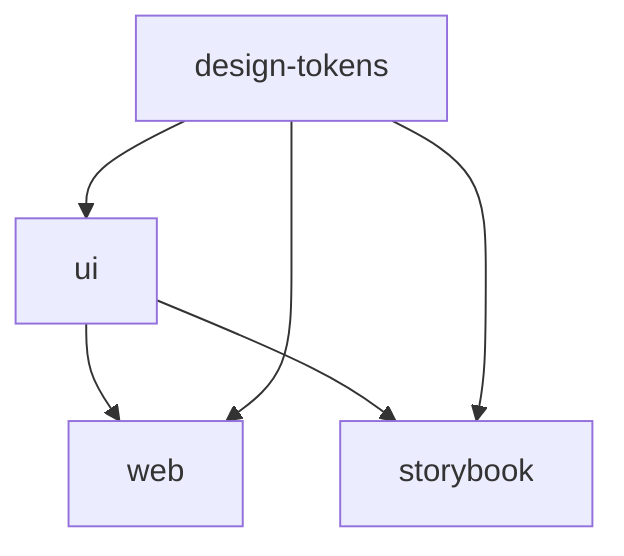

# Frontend Foundation - Technical Specifications

> Phase 6 UI/UX基盤の技術仕様とブラウザサポート行列

**Parent Issue**: [#55 feat(frontend): Phase 6 UI/UX foundation](https://github.com/itdojp/ae-framework/issues/55)  
**Related**: [#53 Phase 6 EPIC](https://github.com/itdojp/ae-framework/issues/53)

## 📋 Technology Stack

### Core Framework
- **Next.js 14**: App Router with React Server Components
- **React 18**: Modern React with Suspense and Concurrent Features
- **TypeScript 5**: Strict type checking and modern language features
- **Tailwind CSS 3**: Utility-first CSS framework with design tokens

### UI Components
- **Radix UI**: Accessible, unstyled UI primitives
- **shadcn/ui**: Beautiful UI components built on Radix
- **Lucide React**: Beautiful & consistent icon library
- **Class Variance Authority (CVA)**: Component variant management

### State Management & Forms
- **TanStack Query 5**: Powerful data synchronization for React
- **React Hook Form 7**: Performant, flexible forms with validation
- **Zod 3**: TypeScript-first schema validation

### Development Tools
- **Storybook 7**: Component development and documentation
- **ESLint**: Code linting with accessibility plugins
- **TypeScript**: Static type checking
- **PostCSS**: CSS processing and optimization

## 🌐 Browser Support Matrix

### Supported Browsers

| Browser | Version | Support Level | Notes |
|---------|---------|---------------|-------|
| **Chrome** | 90+ | ✅ Full Support | Primary development target |
| **Firefox** | 88+ | ✅ Full Support | Tested on latest stable |
| **Safari** | 14+ | ✅ Full Support | iOS Safari 14+ |
| **Edge** | 90+ | ✅ Full Support | Chromium-based Edge |
| **Opera** | 76+ | ⚠️ Best Effort | Based on Chromium |

### Mobile Support

| Platform | Browser | Version | Support Level |
|----------|---------|---------|---------------|
| **iOS** | Safari | 14+ | ✅ Full Support |
| **iOS** | Chrome | Latest | ✅ Full Support |
| **Android** | Chrome | 90+ | ✅ Full Support |
| **Android** | Firefox | 88+ | ✅ Full Support |
| **Android** | Samsung Internet | 14+ | ⚠️ Best Effort |

### Feature Requirements
- **JavaScript**: ES2020+ features required
- **CSS**: CSS Grid, Flexbox, Custom Properties
- **Web APIs**: Fetch API, IntersectionObserver, ResizeObserver
- **Performance**: Core Web Vitals optimization

## 🌍 Internationalization (i18n)

### Default Configuration
- **Primary Locale**: `ja-JP` (Japanese - Japan)
- **Secondary Locale**: `en-US` (English - United States)
- **Framework**: `next-intl` for Next.js App Router
- **Fallback Strategy**: English fallback for missing translations

### Supported Locales
```typescript
const supportedLocales = [
  'ja',    // Japanese (default)
  'en',    // English
  // Future: 'ko', 'zh-CN', 'zh-TW'
] as const;
```

### Locale Detection
1. **User Preference**: Browser language settings
2. **URL Parameter**: `/en/page` or `/ja/page`
3. **Default Fallback**: Japanese (`ja`)

### Translation Files Structure
```
messages/
├── ja.json          # Japanese translations (default)
├── en.json          # English translations
└── [locale].json    # Future locale support
```

### Sample Translation Keys
```json
{
  "HomePage": {
    "title": "ae-framework",
    "subtitle": "AI-Enhanced Development Framework with Phase 6 UI/UX Automation"
  },
  "Navigation": {
    "home": "ホーム",
    "about": "概要",
    "health": "ヘルスチェック"
  },
  "Common": {
    "loading": "読み込み中...",
    "error": "エラーが発生しました",
    "retry": "再試行"
  }
}
```

## ♿ Accessibility Standards

### WCAG 2.1 AA Compliance
- **Color Contrast**: Minimum 4.5:1 for normal text, 3:1 for large text
- **Focus Indicators**: Visible focus outline (2px minimum)
- **Keyboard Navigation**: All interactive elements keyboard accessible
- **Screen Reader**: Proper ARIA labels and semantic HTML

### Automated Testing
- **ESLint Plugin**: `eslint-plugin-jsx-a11y` for static analysis
- **Storybook Addon**: `@storybook/addon-a11y` for component testing
- **CI Integration**: Automated accessibility testing in PR workflow

### Accessibility Features
- **Touch Targets**: Minimum 44x44px for mobile (WCAG 2.1 AA)
- **Text Scaling**: Support up to 200% text zoom
- **Motion**: Respect `prefers-reduced-motion` setting
- **High Contrast**: Support high contrast mode

## 📦 Package Architecture

### Monorepo Structure
```
packages/
├── design-tokens/           # Design system tokens
│   ├── src/index.ts        # Token definitions
│   ├── src/tailwind.ts     # Tailwind integration
│   └── package.json
├── ui/                      # Reusable UI components
│   ├── src/button.tsx      # Button component
│   ├── src/input.tsx       # Input component
│   ├── src/dialog.tsx      # Dialog component
│   └── package.json
└── ...

apps/
├── web/                     # Next.js web application
│   ├── app/                 # App Router pages
│   ├── components/          # App-specific components
│   ├── messages/            # i18n translation files
│   └── package.json
├── storybook/               # Component documentation
│   ├── stories/             # Component stories
│   ├── .storybook/          # Storybook configuration
│   └── package.json
└── ...
```

### Build Dependencies


## 🚀 Development Workflow

### Local Development
```bash
# Install dependencies
pnpm install

# Start design tokens build watch
pnpm run build:tokens

# Start UI components build watch  
pnpm run build:ui

# Start web application
pnpm run dev:web

# Start Storybook (separate terminal)
pnpm run dev:storybook
```

### Production Build
```bash
# Build all packages in correct order
pnpm run build:frontend

# Build Storybook for deployment
pnpm run build:storybook
```

### Quality Assurance
```bash
# Run ESLint with accessibility checks
pnpm run lint:frontend

# Run TypeScript type checking
pnpm run type-check:frontend

# Clean build artifacts
pnpm run clean:frontend
```

## 🎯 Performance Targets

### Core Web Vitals
- **Largest Contentful Paint (LCP)**: < 2.5s
- **First Input Delay (FID)**: < 100ms
- **Cumulative Layout Shift (CLS)**: < 0.1

### Lighthouse Scores (Minimum)
- **Performance**: ≥ 75
- **Accessibility**: ≥ 95
- **Best Practices**: ≥ 90
- **SEO**: ≥ 90

### Bundle Size Targets
- **Initial JS Bundle**: < 250KB gzipped
- **CSS Bundle**: < 50KB gzipped
- **Total Page Weight**: < 1MB

## 🔧 Configuration Files

### TypeScript Configuration
- **Strict Mode**: Enabled for all packages
- **Path Mapping**: `@/*` for internal imports
- **JSX**: React JSX transform
- **Target**: ES2020

### ESLint Configuration
- **Base**: `eslint:recommended`
- **TypeScript**: `@typescript-eslint/recommended`
- **React**: `plugin:react/recommended` + `plugin:react-hooks/recommended`
- **Accessibility**: `plugin:jsx-a11y/recommended`

### Tailwind Configuration
- **Design Tokens**: Integrated from `@ae-framework/design-tokens`
- **Content Paths**: All packages and apps
- **Purging**: Automatic unused CSS removal
- **Plugins**: None (keeping it minimal)

## 📚 Component Documentation

### Storybook Integration
- **Accessibility Testing**: Built-in a11y addon
- **Component Variants**: All variants documented
- **Usage Examples**: Real-world scenarios
- **Design System**: Token usage examples

### Component API
- **Props**: Fully typed with TypeScript
- **Variants**: CVA-based variant system
- **Accessibility**: ARIA attributes and keyboard support
- **Responsive**: Mobile-first responsive design

## 🚦 Quality Gates

### Required Checks
- ✅ **TypeScript**: No compilation errors
- ✅ **ESLint**: No linting errors (including a11y)
- ✅ **Build**: All packages build successfully
- ✅ **Storybook**: All stories render without errors

### Recommended Checks
- 🔍 **Visual Testing**: Chromatic integration (future)
- 🔍 **E2E Testing**: Playwright integration (future) 
- 🔍 **Performance**: Lighthouse CI (future)

## 🔮 Future Enhancements

### Planned Features
1. **Dark Mode**: Theme switching support
2. **RTL Support**: Right-to-left language support
3. **PWA Features**: Service worker and offline support
4. **Micro-frontends**: Module federation integration
5. **Advanced Locales**: Korean, Chinese support

### Integration Roadmap
1. **Phase 6.1**: Basic foundation (current)
2. **Phase 6.2**: Quality gates and testing
3. **Phase 6.3**: Advanced features and optimization
4. **Phase 6.4**: Production deployment and monitoring

---

**Frontend Foundation** - Production-ready UI/UX 基盤 with comprehensive browser support and accessibility 🎨

*最終更新: 2025年8月*