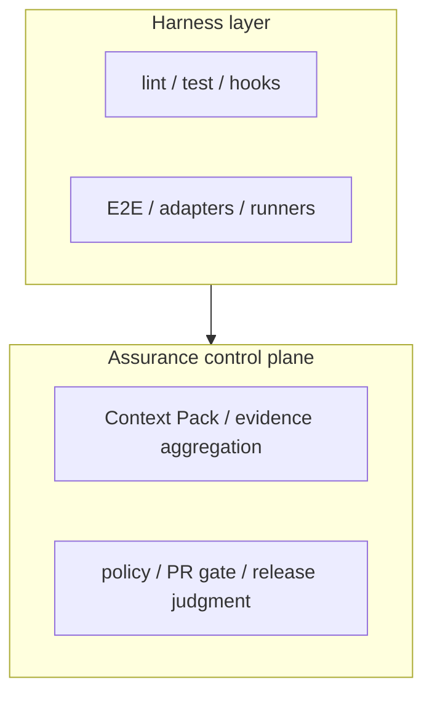

# Assurance Control Plane

> Language / 言語: English | 日本語

---

## English

Canonical policy: `docs/product/ASSURANCE-CONTROL-PLANE-POLICY.md`. This overview is derived from the policy and current architecture; use the policy for implementation decisions.

### 1. Definition
This document defines ae-framework as an agent-neutral assurance control plane that sits on top of BYO agents, human maintainers, CI jobs, and verification tools.

Here, “control plane” means the layer that keeps the following under a consistent contract:
- specification
- verification
- evidence artifacts
- policy / PR gate / merge automation
- release / post-deploy judgment

### 2. Where the value actually comes from
The center of value is not an isolated code-generation feature. In the current implementation, the practical value comes from:

1. fixing specifications and contracts through Context Pack and schemas
2. aggregating `verify-lite`, formal runners, and conformance outputs into summaries
3. detecting breakage through artifact validation and the Contract Catalog
4. operating `policy-gate`, `gate`, auto-fix, and auto-merge with explicit control
5. retaining PR / release evidence in JSON and Markdown

### 3. What ae-framework is / is not

#### 3.1 What it is
- an agent-neutral assurance control plane for agent-driven SDLC
- a control plane for specification / verification / evidence / policy gates
- an operating model that can strengthen assurance only for selected high-risk changes

#### 3.2 What it is not
- a single-model-dependent code generator
- an agent runtime or IDE plugin
- a hosted CI/CD service
- a mandatory framework that requires formal proof on every change

### 4. Producer vs. control-plane responsibilities

| Category | Examples | Primary responsibility |
| --- | --- | --- |
| Producer | Codex, Claude Code, GitHub Copilot, human maintainers, test runners, TLA/Alloy/SMT/CSP/Lean tools | generate code, specifications, review comments, and raw verification results |
| Assurance control plane | Context Pack, `verify-lite`, formal aggregate, `policy-gate`, change package | collect outputs, validate contracts, and convert results into judgment artifacts |

Because of this separation, teams can replace the underlying agents or solvers while keeping the judgment-side contracts stable.

#### 4.1 Context Pack as design SSOT
Context Pack is the design SSOT/input contract for agent-driven SDLC. It fixes the specification fragments, implementation boundaries, acceptance tests, and traceability anchors that producers should read before generating or reviewing code. It is not a vendor-specific prompt or a disposable code-generation input.

For agent work, the recommended reference order is:
1. GitHub Issue body.
2. `AGENTS.md`.
3. `docs/spec/context-pack.md` and `spec/context-pack/boundary-map.json`.
4. Relevant acceptance tests and existing verification evidence.
5. Implementation changes, followed by `pnpm -s run context-pack:validate`, `pnpm -s run context-pack:verify-boundary-map`, and risk-appropriate additional checks.

This keeps Baseline changes lightweight, adds Structured assurance when traceability is needed, and promotes only high-risk critical core claims to heavier formal/model/proof lanes.

#### 4.2 Two-layer model

```text
Harness layer
- lint / test / hooks
- E2E / adapters / runners

Assurance control plane
- Context Pack / evidence aggregation
- policy / PR gate / release judgment
```

- The Harness layer executes checks and produces raw outputs.
- The Assurance control plane converts those outputs into contract-bound artifacts that can be reviewed and judged.
- `docs/agents/evidence-adapters.md` defines how raw agent and human producer output is mapped into existing evidence and change-package artifacts.
- The differentiator of ae-framework is not the individual harness feature, but the ability to keep the judgment-side contract stable.

### 5. Rollout profiles

### Baseline
- `verify-lite`
- schema / AJV validation
- `policy-gate` and `gate`
- report-only aggregation through `quality-scorecard`
- role: stabilize the minimum Harness layer

### Structured assurance
- Context Pack
- property / MBT / conformance
- `assurance-summary`
- `hook-feedback` / `ae-handoff`
- organized change evidence
- role: connect specifications and verification evidence into the control plane

### High-assurance critical core
- formal / model / proof lanes
- stricter policy-gate operation
- proof-carrying change package
- role: strengthen the control plane only for selected high-risk changes

### 6. Mapping to the current implementation

Control-plane elements that already exist today:
- `docs/spec/context-pack.md`
- `spec/context-pack/boundary-map.json`
- `schema/*.schema.json`
- `scripts/context-pack/verify-boundary-map.mjs`
- `scripts/ci/validate-artifacts-ajv.mjs`
- `artifacts/verify-lite/verify-lite-run-summary.json`
- `artifacts/assurance/assurance-summary.json`
- `artifacts/quality/quality-scorecard.json`
- `artifacts/agents/hook-feedback.json`
- `artifacts/handoff/ae-handoff.json`
- `artifacts/formal/formal-summary-v1.json`
- `artifacts/hermetic-reports/formal/summary.json`
- `artifacts/ci/policy-gate-summary.json`
- `artifacts/ci/policy-decision-js-v1.json`, `artifacts/ci/policy-decision-opa-v1.json`
- `artifacts/ci/automation-report.json`
- `docs/ci/pr-automation.md`
- `docs/agents/evidence-adapters.md`

Conditional or preview elements:
- strict assurance enforcement (only when the `enforce-assurance` label is set)
- proof-carrying change package v2
- opt-in heavy lanes such as formal / trace / security

### 7. What matters on the judgment side
- being able to explain what is guaranteed and what remains unverified is more important than a raw green build alone
- review and release decisions should center on summary artifacts, not raw logs
- heavy verification should be required only for high-risk changes, while normal lanes stay fast

---

## 日本語

Canonical policy: `docs/product/ASSURANCE-CONTROL-PLANE-POLICY.md`。この概要は policy と current architecture から派生した文書です。実装判断には policy を優先します。

## 1. 定義

本資料では、ae-framework を **BYO-agent、人間のmaintainer、CI job、検証toolの上に載る、エージェント非依存の assurance control plane** と定義します。

ここでいう control plane とは、次を一貫した契約で束ねる層です。

- specification
- verification
- evidence artifacts
- policy / PR gate / merge automation
- release / post-deploy judgment

## 2. 何が価値の中心か

価値の中心は、個別の codegen 機能ではありません。現在の実装で価値が出ているのは次です。

1. Context Pack や schema による spec/contracts の固定
2. `pnpm run verify:lite`、formal runners、conformance の summary 化
3. artifact validation と Contract Catalog による破壊検知
4. `policy-gate` / `gate` / auto-fix / auto-merge の運用制御
5. PR / release に必要な証跡を JSON/Markdown で残すこと

## 3. What ae-framework is / is not

### 3.1 What it is
- エージェント協調型SDLCのための agent-neutral assurance control plane
- spec / verification / evidence / policy gate の control plane
- high-risk 変更だけ assurance を強化できる運用基盤

### 3.2 What it is not
- 単一モデル依存のコード生成器
- agent runtime や IDE plugin
- ホスト型CI/CDサービス
- すべての変更に formal proof を要求する強制フレームワーク

## 4. producer と control plane の役割分担

| 区分 | 例 | 主責務 |
| --- | --- | --- |
| Producer | Codex、Claude Code、GitHub Copilot、人間のmaintainer、test runner、TLA/Alloy/SMT/CSP/Lean ツール | コード、仕様、review comment、検証結果を生成する |
| Assurance control plane | Context Pack, verify-lite, formal aggregate, policy gate, change package | 結果を収集し、契約検証し、判断用 artifact に変換する |

この分離により、基礎となる agent や solver が変わっても、判断面の契約を継続利用できます。

### 4.1 design SSOTとしてのContext Pack
Context Pack は agent-driven SDLC の design SSOT / input contract です。producer がコード生成やreviewを行う前に参照すべき仕様断片、実装境界、acceptance tests、traceability anchor を固定します。vendor固有のpromptや一時的なcode generation inputではありません。

agent作業時の推奨参照順は次です。
1. GitHub Issue本文。
2. `AGENTS.md`。
3. `docs/spec/context-pack.md` と `spec/context-pack/boundary-map.json`。
4. 関連する acceptance tests と既存の検証証跡。
5. 実装変更後に `pnpm -s run context-pack:validate`、`pnpm -s run context-pack:verify-boundary-map`、riskに応じた追加検証を実行する。

これにより、Baseline変更は軽量に保ち、traceabilityが必要な場合だけStructured assuranceを追加し、高リスクのcritical core claimだけをformal/model/proof laneへ昇格できます。

### 4.2 二層モデル



- Harness layer は「実行して結果を出す層」です。
- Assurance control plane は「結果を契約化し、判断可能な artifact に変換する層」です。
- `docs/agents/evidence-adapters.md` は、agent / human の raw producer output を既存 evidence / change-package artifact へ接続する方針を定義します。
- ae-framework の差別化は前者の個別機能ではなく、後者の判断面契約を固定できる点にあります。

## 5. 導入プロファイル

### Baseline
- `verify-lite`
- schema/AJV validation
- `policy-gate` と `gate`
- `quality-scorecard` の report-only 集約
- 役割: harness layer の最小安定化

### Structured assurance
- Context Pack
- property / MBT / conformance
- `assurance-summary`
- `hook-feedback` / `ae-handoff`
- change evidence の整理
- 役割: control plane に仕様と検証の対応を供給

### High-assurance critical core
- formal/model/proof lane
- strict policy gate
- proof-carrying change package
- 役割: selected high-risk change に限定して control plane を強化

## 6. 現行実装との対応

現時点で既に存在する control plane 要素:
- `docs/spec/context-pack.md`
- `spec/context-pack/boundary-map.json`
- `schema/*.schema.json`
- `scripts/context-pack/verify-boundary-map.mjs`
- `scripts/ci/validate-artifacts-ajv.mjs`
- `artifacts/verify-lite/verify-lite-run-summary.json`
- `artifacts/assurance/assurance-summary.json`
- `artifacts/quality/quality-scorecard.json`
- `artifacts/agents/hook-feedback.json`
- `artifacts/handoff/ae-handoff.json`
- `artifacts/formal/formal-summary-v1.json`
- `artifacts/hermetic-reports/formal/summary.json`（formal aggregate）
- `artifacts/ci/policy-gate-summary.json`
- `artifacts/ci/policy-decision-js-v1.json`, `artifacts/ci/policy-decision-opa-v1.json`
- `artifacts/ci/automation-report.json`
- `docs/ci/pr-automation.md`
- `docs/agents/evidence-adapters.md`

条件付きまたは preview 扱いの要素:
- strict assurance enforcement（`enforce-assurance` ラベル時のみ）
- proof-carrying change package v2
- formal / trace / security などの opt-in heavy lane

## 7. 判断面で重視すること

- green build であることより、何が保証され何が未保証かを説明できること
- raw log ではなく summary artifact を review/release 判断の中心に置くこと
- high-risk change にだけ重い検証を要求し、通常 lane の速度を維持すること
