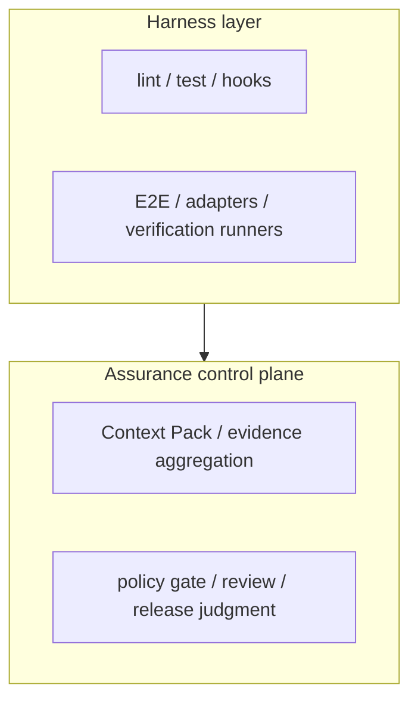

# Assurance Control Plane

> Language / 言語: English | 日本語

---

## English (Summary)

`ae-framework` should be understood as an assurance control plane over BYO coding agents and verification tools.

Core value:
- standardize specifications
- run and aggregate verification lanes
- validate artifacts/contracts
- turn results into policy/review/release decisions

---

## 日本語

## 1. 定義

本資料では、ae-framework を **BYO-agent の上に載る assurance control plane** と定義します。

ここでいう control plane とは、次を一貫した契約で束ねる層です。

- specification
- verification
- evidence artifacts
- policy / review / merge gate
- release / post-deploy judgment

## 2. 何が価値の中心か

価値の中心は、個別の codegen 機能ではありません。現在の実装で価値が出ているのは次です。

1. Context Pack や schema による spec/contracts の固定
2. `verify:lite`、formal runners、conformance の summary 化
3. artifact validation と Contract Catalog による破壊検知
4. policy gate / review gate / auto-fix / auto-merge の運用制御
5. PR / release に必要な証跡を JSON/Markdown で残すこと

## 3. What ae-framework is / is not

### 3.1 What it is
- agentic SDLC orchestrator
- spec / verification / evidence / policy gate の control plane
- high-risk 変更だけ assurance を強化できる運用基盤

### 3.2 What it is not
- 単一モデル依存のコード生成器
- agent runtime や IDE plugin
- すべての変更に formal proof を要求する強制フレームワーク

## 4. producer と control plane の役割分担

| 区分 | 例 | 主責務 |
| --- | --- | --- |
| Producer | coding agent, test runner, TLA/Alloy/SMT/CSP/Lean ツール | コード、仕様、検証結果を生成する |
| Assurance control plane | Context Pack, verify-lite, formal aggregate, policy gate, change package | 結果を収集し、契約検証し、判断用 artifact に変換する |

この分離により、基礎となる agent や solver が変わっても、判断面の契約を継続利用できます。

### 4.1 二層モデル

- Harness layer は「実行して結果を出す層」です。
- Assurance control plane は「結果を契約化し、判断可能な artifact に変換する層」です。
- ae-framework の差別化は前者の個別機能ではなく、後者の判断面契約を固定できる点にあります。

## 5. 導入プロファイル

### Baseline
- `verify:lite`
- schema/AJV validation
- PR gate
- 役割: harness layer の最小安定化

### Structured assurance
- Context Pack
- property / MBT / conformance
- change evidence の整理
- 役割: control plane に仕様と検証の対応を供給

### High-assurance critical core
- formal/model/proof lane
- strict policy gate
- proof-carrying change package
- 役割: selected high-risk change に限定して decision plane を強化

## 6. 現行実装との対応

現時点で既に存在する control plane 要素:
- `docs/spec/context-pack.md`
- `schema/*.schema.json`
- `scripts/ci/validate-artifacts-ajv.mjs`
- `artifacts/verify-lite/verify-lite-run-summary.json`
- `artifacts/formal/formal-summary-v1.json`
- `artifacts/hermetic-reports/formal/summary.json`（formal aggregate）
- `artifacts/ci/policy-gate-summary.json`
- `docs/ci/pr-automation.md`

段階導入中の要素:
- assurance profile / level
- proof-carrying change package v2
- independent validation lanes

## 7. 判断面で重視すること

- green build であることより、何が保証され何が未保証かを説明できること
- raw log ではなく summary artifact を review/release 判断の中心に置くこと
- high-risk change にだけ重い検証を要求し、通常 lane の速度を維持すること
