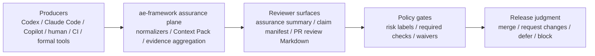

# Launch Kit: Agent-Neutral Assurance Control Plane Preview

> Language / 言語: English | 日本語

---

## English

### 1. One-line positioning

**Bring your own agent. Keep your assurance plane.** ae-framework is not an
agent runtime; it is the stable assurance control plane around agent-driven SDLC.

### 2. Three-value proposition

1. **Agent-neutral evidence routing** — Codex, Claude Code, GitHub Copilot,
   human maintainers, CI jobs, and formal tools are producers. Their raw output
   is routed into reviewable artifacts instead of becoming approval by itself.
2. **Reviewer-first assurance surface** — producers feed
   `producer-normalization-summary/v1`, `assurance-summary/v1`,
   `claim-evidence-manifest/v1`, `policy-gate-summary/v1`, and reviewer
   Markdown so maintainers can inspect missing evidence, scope drift, waivers,
   and policy decisions before raw logs.
3. **Risk-based escalation** — routine changes stay on the fast lane, while
   selected high-risk / critical claims can trigger stricter evidence without
   forcing formal proof or heavyweight gates on every PR.

### 3. Architecture flow



### 4. Demo ladder

| Timebox | Demo | Command / surface | Goal |
| --- | --- | --- | --- |
| 5 minutes | Launch preview walkthrough | `docs/product/DEMO-SCRIPT.md` | Explain the assurance plane and open a prebuilt review surface. |
| 15 minutes | Offline BYO-agent assurance demo | `pnpm run demo:agent-assurance` | Generate fixture-backed producer, assurance, policy, and reviewer artifacts. |
| Metrics route | Agent PR assurance metrics collector | `pnpm run metrics:agent-pr-assurance` | Collect report-only trust-calibration metrics without adding a blocking gate. |
| PR surface | Review-surface posting helper | `pnpm run assurance:post-review-surface -- --repo itdojp/ae-framework --pr 123 --body-file artifacts/review/agent-assurance-demo/assurance-review.md` | Dry-run or manually post reviewer Markdown; the helper does not approve, merge, or update comments by default. |
| CI smoke | Demo smoke lane | `pnpm run demo:smoke` and `.github/workflows/demo-smoke.yml` | Re-run the representative demo sequence and artifact/schema checker. |
| Pilot setup | External pilot onboarding | `docs/guides/external-pilot-onboarding.md` | Run a one-repository, about-five-PR pilot with report-only metrics, consent, and redaction boundaries. |
| Pilot report | ACP-097 dry-run status | `docs/product/PILOT-REPORT-2026Q3-01.md` | Explain that the current pilot report is `dry-run only` and does not contain live external PR evidence. |
| Live pilot entry | Live-pilot entry criteria | `docs/product/LIVE-PILOT-ENTRY-CRITERIA.md` | Define consent, data handling, retention, required evidence, measurement fields, and claim boundaries before collecting live external data. |
| Future benchmark | Controlled comparison protocol | `docs/product/CONTROLLED-COMPARISON-PROTOCOL.md` | Explain how future claims must compare review workflows, not agent vendors, after controlled baseline data exists. |
| Optional | Scope-drift scenario | `node scripts/demo/run-scope-drift-demo.mjs` | Show report-only drift in a normal lane and blocking drift in a strict lane. |
| Optional | High-risk escalation sample | `node scripts/demo/run-high-risk-escalation-demo.mjs` | Show selected critical/high claims and strict-lane evidence requirements. |
| Optional | Cross-agent fixtures | `fixtures/agents/evidence-adapters/` | Show producer-neutral routing for Codex, Claude Code, Copilot, human, CI, and formal output. |

Recommended first-time evidence route: `docs/guides/byo-agent-assurance-quickstart.md` -> `docs/product/PILOT-REPORT-2026Q3-01.md` -> this launch kit's limitations -> `docs/product/CONTROLLED-COMPARISON-PROTOCOL.md`. This route separates local fixture evidence, internal dogfooding observations, the current dry-run pilot report, and future controlled-comparison criteria.

### 5. Before / after PR reviewer story

**Before:** a reviewer reads an agent summary, raw logs, CI checks, and scattered
review comments, then manually decides which claims are supported, which drifted
outside scope, and which risks remain unresolved.

**After:** the producer output is normalized into report-only evidence, scope
and missing-evidence findings are surfaced in a reviewer Markdown file, and the
policy gate states whether the PR can remain on the fast lane or needs stricter
assurance. The reviewer still decides, but the decision inputs are explicit.

### 6. Evidence status after pilot metrics

Internal dogfooding on ae-framework PR #3516 through PR #3521 showed the current
preview can support review traceability, but it is only one evidence source:

- 6 adoption/effectiveness PRs reached merge with 22 review threads resolved and
  0 unresolved review threads at final review-completeness checks.
- The scope-drift scenario exposes 2 Boundary Map findings and shows the
  difference between report-only normal-lane evidence and strict-lane blocking.
- The high-risk escalation sample selects 2 claims, 1 critical and 1 high, and
  keeps missing evidence / waiver metadata gaps visible.
- The cross-agent fixture set covers Codex CLI, Claude Code, GitHub Copilot,
  human maintainer, CI/test runner, and formal/model-checker outputs as evidence
  producers, not approval authorities.

| Evidence source | Current status | What can be claimed | What must not be claimed |
| --- | --- | --- | --- |
| Offline quickstart / demos | Fixture-backed and locally repeatable. | Evidence routing, reviewer-surface shape, report-only policy interpretation. | Real-world speed, safety, or adoption impact. |
| Internal dogfooding | ae-framework PR #3516 through PR #3521. | Review traceability and final unresolved-thread closure within this repository. | Controlled benchmark, external pilot outcome, or agent-vendor ranking. |
| ACP-097 pilot report | `dry-run only`; 0 live external PRs collected. | Pilot readiness, consent/redaction boundary, and report-only metric vocabulary. | Live external effectiveness, safety, or review-speed improvement. |
| Live-pilot entry criteria | Criteria documented; not yet satisfied by live data. | What must be recorded before live external collection or publication. | Any live outcome claim until criteria reach `claim_ready`. |
| Controlled comparison protocol | Protocol-ready; not executed. | Future measurement design for `without ae-framework` vs `with ae-framework` review workflows. | Any benchmark or review-speed claim before comparable baseline data exists. |

Use `docs/product/DOGFOODING-REPORT-2026Q3.md` for dogfooding limitations,
`docs/product/PILOT-REPORT-2026Q3-01.md` for the dry-run pilot state,
`docs/ci/agent-pr-assurance-metrics.md` for collector semantics, and
`docs/product/CONTROLLED-COMPARISON-PROTOCOL.md` for future benchmark criteria.

### 7. Non-goals for the preview

- No hosted agent service or IDE plugin is launched by this preview.
- No claim that ae-framework generates better code than any coding agent.
- No claim that review is faster without a controlled baseline.
- No review-workflow benchmark claim until the controlled-comparison protocol is
  executed with comparable baseline data.
- No agent-vendor ranking.
- No auto-merge guarantee.
- No formal proof requirement for every PR.
- No replacement for human maintainer judgment.
- No external-pilot publication without maintainer-approved consent and redaction boundaries.

### 8. Release note template

```markdown
## Agent-neutral assurance control plane preview

Bring your own agent. Keep your assurance plane.

ae-framework now includes a preview launch kit for routing Codex, Claude Code,
GitHub Copilot, human, CI, and formal-tool output into reviewer-facing assurance
artifacts. Start with the 15-minute offline demo, then inspect the dry-run
pilot report, dogfooding observations, and controlled-comparison limitations.

- Launch kit: docs/product/LAUNCH-KIT.md
- One-page pitch: docs/product/ONE-PAGE-PITCH.md
- Demo script: docs/product/DEMO-SCRIPT.md
- Quickstart: docs/guides/byo-agent-assurance-quickstart.md
- Dogfooding report: docs/product/DOGFOODING-REPORT-2026Q3.md
- Pilot report: docs/product/PILOT-REPORT-2026Q3-01.md
- Metrics collector: docs/ci/agent-pr-assurance-metrics.md
- Controlled comparison protocol: docs/product/CONTROLLED-COMPARISON-PROTOCOL.md

Non-goals: this is not a hosted agent runtime, vendor benchmark, auto-merge
guarantee, or universal formal-proof mandate.
```

### 9. GitHub topics and release naming candidates

| Surface | Candidates |
| --- | --- |
| GitHub topics | `agentic-sdlc`, `assurance`, `policy-gates`, `ai-code-review`, `codex`, `copilot`, `claude-code`, `formal-methods`, `devex`, `github-actions` |
| Preview release names | `agent-neutral-assurance-preview`, `bring-your-own-agent-preview`, `assurance-plane-preview` |
| Tagline | `Bring your own agent. Keep your assurance plane.` |
| Repository short description | `Agent-neutral assurance control plane for agent-driven SDLC.` |

### 10. Short post drafts

#### GitHub Discussions

Title: `Preview: Bring your own agent. Keep your assurance plane.`

Body:

```markdown
ae-framework now has a public preview launch kit for an agent-neutral assurance
control plane. The preview focuses on reviewer traceability: producer output from
Codex, Claude Code, Copilot, humans, CI, and formal tools is routed into
assurance summaries, claim evidence, policy-gate summaries, and PR review
Markdown.

Start with the 15-minute offline demo, then read the dry-run pilot report and
dogfooding report for what is observed, what is only prepared, and what remains
unmeasured.

- Launch kit: docs/product/LAUNCH-KIT.md
- Demo script: docs/product/DEMO-SCRIPT.md
- Dogfooding report: docs/product/DOGFOODING-REPORT-2026Q3.md
- Pilot report: docs/product/PILOT-REPORT-2026Q3-01.md
- Controlled comparison protocol: docs/product/CONTROLLED-COMPARISON-PROTOCOL.md
```

#### X

```text
Bring your own agent. Keep your assurance plane.

ae-framework now has a preview launch kit for agent-neutral PR assurance: route
Codex / Claude Code / Copilot / human / CI / formal output into reviewable
evidence, policy gates, and release judgment.

Start: docs/product/LAUNCH-KIT.md
Demo: docs/guides/byo-agent-assurance-quickstart.md
Evidence: docs/product/DOGFOODING-REPORT-2026Q3.md
Pilot: docs/product/PILOT-REPORT-2026Q3-01.md
Limitations: docs/product/CONTROLLED-COMPARISON-PROTOCOL.md
```

#### LinkedIn

```text
We prepared a public preview launch kit for ae-framework's agent-neutral
assurance control plane.

The message is simple: Bring your own agent. Keep your assurance plane.

The preview is not a coding-agent runtime and not an agent-vendor benchmark. It
focuses on the review side: producer output from Codex, Claude Code, GitHub
Copilot, human maintainers, CI, and formal tools is normalized into evidence
artifacts, reviewer Markdown, policy-gate summaries, and release judgment.

The kit includes a one-page pitch, a 5-minute demo script, a 15-minute offline
quickstart, a dry-run pilot report, an internal dogfooding report, and a
controlled-comparison protocol that keeps benchmark claims out of scope until
comparable baseline data exists.
```

#### Zenn / Qiita

```markdown
# Bring your own agent. Keep your assurance plane.

ae-framework の agent-neutral assurance control plane preview を公開準備しました。

coding agent を置き換えるのではなく、Codex / Claude Code / Copilot / human / CI /
formal tool の output を reviewer-facing evidence と policy gate に変換する層です。

読む順番:
1. `docs/product/ONE-PAGE-PITCH.md`
2. `docs/product/DEMO-SCRIPT.md`
3. `docs/guides/byo-agent-assurance-quickstart.md`
4. `docs/product/PILOT-REPORT-2026Q3-01.md`
5. `docs/product/DOGFOODING-REPORT-2026Q3.md`
6. `docs/product/CONTROLLED-COMPARISON-PROTOCOL.md`

pilot report は dry-run only です。未測定の性能改善や agent vendor 比較は主張しません。
まずは review traceability と evidence routing の preview として扱います。
```

---

## 日本語

### 1. 位置付け

**Bring your own agent. Keep your assurance plane.** ae-framework は agent runtime
ではなく、agent-driven SDLC の周囲に置く安定した assurance control plane である。

### 2. 価値提案

1. **Agent-neutral evidence routing** — Codex、Claude Code、GitHub Copilot、human
   maintainer、CI job、formal tool を producer として扱い、raw output を approval ではなく
   reviewable artifact へ route する。
2. **Reviewer-first assurance surface** — missing evidence、scope drift、waiver、policy
   decision を raw log より先に reviewer Markdown と summary artifact で確認できる。
3. **Risk-based escalation** — 通常変更は fast lane に留め、selected high-risk / critical
   claim だけ stricter evidence を要求できる。

### 3. Launch kit の構成

- `docs/product/ONE-PAGE-PITCH.md` — 初見向け one-page pitch。
- `docs/product/DEMO-SCRIPT.md` — 5分 demo と 15分拡張 demo。
- `docs/guides/byo-agent-assurance-quickstart.md` — offline BYO-agent assurance demo。
- `docs/guides/external-pilot-onboarding.md` — report-only external pilot、consent、redaction / publication boundary。
- `docs/product/PILOT-REPORT-2026Q3-01.md` — ACP-097 の `dry-run only` pilot report と limitations。
- `docs/product/CONTROLLED-COMPARISON-PROTOCOL.md` — future benchmark を agent vendor ranking ではなく review workflow comparison として設計する protocol。
- `docs/product/DOGFOODING-REPORT-2026Q3.md` — dogfooding evidence と limitations。
- `docs/ci/agent-pr-assurance-metrics.md` — report-only metrics collector の語彙と出力。
- `docs/quality/assurance-operations-runbook.md` — PR review surface の dry-run / manual posting helper。
- `.github/workflows/demo-smoke.yml` — representative demo smoke lane。

初見導線は `docs/guides/byo-agent-assurance-quickstart.md` → `docs/product/PILOT-REPORT-2026Q3-01.md` → 本 launch kit の limitations → `docs/product/CONTROLLED-COMPARISON-PROTOCOL.md`。この順序で、local fixture、internal dogfooding、dry-run pilot、未実施の controlled comparison を分離して説明する。

### 4. Evidence status

| Evidence source | 現在の状態 | 主張できること | 主張しないこと |
| --- | --- | --- | --- |
| Offline quickstart / demos | fixture-backed で local repeatable。 | evidence routing と reviewer surface。 | 実運用の speed / safety / adoption 効果。 |
| Internal dogfooding | ae-framework PR #3516〜#3521。 | このrepository内での review traceability と unresolved thread closure。 | controlled benchmark、external pilot outcome、agent vendor ranking。 |
| ACP-097 pilot report | `dry-run only`、live external PR 0件。 | pilot readiness、consent/redaction boundary、report-only metrics vocabulary。 | live external effectiveness、safety、review-speed improvement。 |
| Controlled comparison protocol | protocol-ready、未実施。 | `without ae-framework` / `with ae-framework` review workflow のfuture measurement design。 | comparable baseline data なしのbenchmark claim。 |

### 5. 主張しないこと

- hosted agent service、IDE plugin、auto-merge guarantee は提供しない。
- agent vendor 比較や未測定の review-speed 改善は主張しない。
- controlled-comparison protocol を comparable baseline data で実行するまで、review-workflow benchmark claim は主張しない。
- すべての PR に formal proof を要求しない。
- human maintainer judgment を置き換えない。
- maintainer が承認した consent / redaction boundary なしに external-pilot data を公開しない。

### 6. Demo message

まず `pnpm run demo:agent-assurance` を実行し、`artifacts/review/agent-assurance-demo/assurance-review.md`
を開く。次に scope drift / high-risk escalation の optional demo を見せる。外部 repository で試す場合は
`docs/guides/external-pilot-onboarding.md` に沿って report-only / consent / redaction boundary を先に固定し、`docs/product/PILOT-REPORT-2026Q3-01.md` で現在は `dry-run only` であることを示す。最後に dogfooding
report の summary を使い、preview の実測範囲と限界を説明する。
Future benchmark の説明が必要な場合は `docs/product/CONTROLLED-COMPARISON-PROTOCOL.md`
を使い、比較対象は agent vendor ではなく `without ae-framework` / `with ae-framework`
の review workflow であると明示する。
