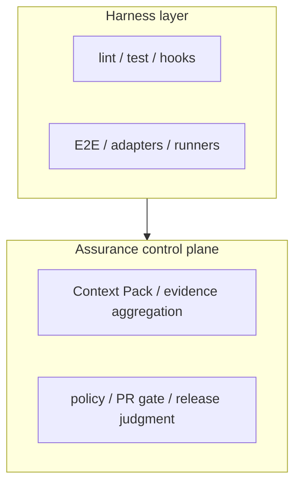

# ae-framework 適用ガイド: プロダクト別の入力・出力・ツール適性

> Language / 言語: English | 日本語

---

## English (Summary)

This guide helps teams decide where ae-framework fits best by mapping:
- product archetypes
- required input artifacts
- expected outputs
- recommended toolchains per problem type

---

## 日本語

## 1. 目的

ae-framework を導入する際に、次を一目で判断できるようにするためのガイドです。

- どの種類のプロダクトに適しているか
- どの入力を最初に準備すべきか
- どの成果物が得られるか
- 問題領域ごとに、どのツールを使うべきか

本資料での前提は、ae-framework を「コード生成ツール」ではなく、**spec / verification / evidence / policy gate を束ねる assurance control plane** として捉えることです。codegen は producer の一つであり、判断面の中心は contract と artifact にあります。

前提（根拠）:
- Node.js `>=20.11 <23`（`package.json` `engines.node`）
- pnpm `10.0.0`（`package.json` `packageManager`）
- CI 実行基盤として GitHub Actions

## 1.1 実装言語・実行基盤の制約（現行実装）

| 区分 | 制約 | 根拠 |
| --- | --- | --- |
| フレームワーク本体 | Node.js 上の TypeScript/JavaScript 実装 | `package.json` の `type: module`, `bin`, `scripts`（`"ae-framework": "tsx src/cli/index.ts"`） |
| 必須実行環境 | Node.js + pnpm + GitHub Actions 前提。`verify:lite` は bash 実行が必要 | `package.json` `engines`/`packageManager`, `.github/workflows/*`, `scripts/verify/run.mjs`, `scripts/ci/run-verify-lite-local.sh` |
| フルセット導入 | `verify:lite` をそのまま使う場合は JS/TS ツールチェーン前提 | `scripts/ci/run-verify-lite-local.sh` が `pnpm types:check`, `pnpm lint`, `pnpm run build` を実行 |
| 他言語プロダクト | 仕様/形式検証系は導入可能。ただし lint/test/build ゲートは対象言語向けに別実装が必要 | `verify:formal`/`verify:conformance` は仕様入力中心、`verify:lite` は JS/TS 前提 |

## 1.2 分野適合の制約（費用対効果）

| 分類 | 向いている度合い | 補足 |
| --- | --- | --- |
| 仕様・監査要求が強い分野（API、イベント駆動、並行制御、高信頼系） | 高い | 仕様→検証→成果物集約の効果が出やすい |
| 一般的な業務アプリ（CRUD中心） | 中程度 | 最小導入（`verify:lite` + spec validate）で十分な場合が多い |
| 単発PoC・短命スクリプト | 低い | 設定/CIコストが成果を上回りやすい |
| CIを使えない運用、成果物保全が不要な運用 | 非推奨 | ae-framework の主要価値（再現性/監査性）を活かせない |

## 1.3 導入プロファイル（Baseline / Structured / High-assurance）

| プロファイル | 想定対象 | 中核機能 | 成果物の重心 |
| --- | --- | --- | --- |
| Baseline | 一般的な業務アプリ、通常PRゲート | `verify-lite`, schema/AJV, `policy-gate`, `gate` | verify-lite summary, report envelope, quality-scorecard |
| Structured assurance | 仕様起点の整合性が必要なサービス | Context Pack, property/MBT/conformance, change evidence | boundary-map report, conformance summary, assurance summary, change package, hook-feedback |
| High-assurance critical core | 並行制御、金融、信頼性要求の高い中核 | formal/model/proof lanes, strict policy gate, proof-carrying package | formal summary, assurance/change artifacts, quality-scorecard, policy decision |

判断の基準:
- Baseline は「日常開発の品質下限を安定化したい」ケースに向く
- Structured assurance は「どの仕様断片がどの検証で支えられているか」を残したいケースに向く
- High-assurance は「critical claim を反例探索や proof obligation まで含めて扱う」ケースに限定する

## 1.4 二層モデル（Harness layer / Assurance control plane）

読み方:
- Baseline は Harness layer の安定化を主目的とする
- Structured assurance は Harness layer の結果を control plane に接続する
- High-assurance critical core は control plane 側の judgment strictness を selected high-risk change に対して高める

## 2. プロダクト適用マップ（何に向いているか）

| プロダクト類型 | 典型課題 | 最小入力 | 推奨開始コマンド | 主な出力 |
| --- | --- | --- | --- | --- |
| Web API / BFF | 仕様と実装の乖離、PR品質のばらつき | 要件Markdown、API仕様、最小テスト | `pnpm run verify:lite` | `artifacts/verify-lite/verify-lite-run-summary.json`, `artifacts/report-envelope.json` |
| イベント駆動（在庫/注文/決済） | 不変条件違反、イベント順序不整合 | サンプルイベント、ルール定義、トレース | `pnpm run conformance:verify:sample` | `artifacts/hermetic-reports/conformance/summary.json` |
| 仕様主導開発（契約重視） | 要件の曖昧さ、変更影響追跡不足 | AE-Spec(Markdown) | `pnpm run ae-framework -- spec validate -i spec/example-spec.md --output .ae/ae-ir.json` | `.ae/ae-ir.json`, export成果物 |
| 並行・プロトコル系 | deadlock/livelock、到達不能状態 | CSPM/Promela/TLA+ モデル | `pnpm run verify:csp -- --file spec/csp/cspx-smoke.cspm --mode typecheck` | `artifacts/hermetic-reports/formal/csp-summary.json`, `artifacts/hermetic-reports/formal/cspx-result.json` |
| 高信頼/検証強化が必要 | 境界条件の抜け、反例の見落とし | 形式仕様（TLA+/Alloy/SMT/Lean） | `pnpm run verify:formal` | `artifacts/hermetic-reports/formal/summary.json` と各種 summary |
| 既存プロダクト改善 | 重い検証の再実行コスト、退行検知遅延 | 既存テスト結果、比較対象スナップショット | `node scripts/pipelines/compare-test-trends.mjs --json-output reports/heavy-test-trends.json` | `reports/heavy-test-trends.json` |

## 3. 入力として準備すべきもの（最小セット）

## 3.1 必須入力（どの類型でも共通）

| 入力 | 推奨配置 | 用途 |
| --- | --- | --- |
| 要件ドキュメント（Markdown） | `spec/*.md` | AE-Spec から AE-IR へ変換し、仕様運用の起点にする |
| テスト実行可能なコードベース | `src/`, `tests/` | `verify-lite` / `test:fast` の基盤 |
| CI 設定 | `.github/workflows/*` | PRゲート、成果物収集、再現運用 |

## 3.2 類型別に追加する入力

| 対象 | 追加入力 | 例 |
| --- | --- | --- |
| Conformance を使う場合 | 入力イベントJSON + ルールJSON | `configs/samples/sample-data.json`, `configs/samples/sample-rules.json` |
| CSP を使う場合 | CSPM ファイル | `spec/csp/cspx-smoke.cspm`, `spec/csp/sample.cspm` |
| TLA+/Alloy/SMT/Lean を使う場合 | 各形式仕様ファイル | `spec/tla/`, `spec/alloy/`, `spec/smt/`, `spec/lean/` |
| 重いテスト比較を使う場合 | 過去スナップショット | `reports/heavy-test-trends*.json` |

## 4. 得られるアウトプット（何が残るか）

| レイヤ | 主要アウトプット | 解釈ポイント |
| --- | --- | --- |
| 軽量PRゲート | `artifacts/verify-lite/verify-lite-run-summary.json` | PRの最小合否判断 |
| report-only 健全性集約 | `artifacts/quality/quality-scorecard.json` | verify-lite / policy / optional assurance・formal を横断して overall status を把握 |
| 仕様変換 | `.ae/ae-ir.json` | 仕様の機械可読SSOT |
| Context Pack 境界検証（任意実行） | `artifacts/context-pack/context-pack-boundary-map-report.json` | `pnpm run context-pack:verify-boundary-map` 実行時の slice 依存、consume edge、循環の確認 |
| Conformance | `artifacts/hermetic-reports/conformance/summary.json` | `schemaErrors` / `invariantViolations` |
| assurance 集約 | `artifacts/assurance/assurance-summary.json` | lane coverage / warning claim / missing evidence kinds を確認 |
| 形式検証集約 | `artifacts/hermetic-reports/formal/summary.json` | 各ツールの `status` を横断確認 |
| CSP詳細 | `artifacts/hermetic-reports/formal/csp-summary.json`, `artifacts/hermetic-reports/formal/cspx-result.json` | `backend/status/resultStatus/exitCode` と詳細 |
| CI向け要約 | `artifacts/formal/formal-aggregate.json`, `artifacts/formal/formal-aggregate.md` | PRコメントと同じ情報源 |
| continuation / handoff | `artifacts/agents/hook-feedback.json`, `artifacts/handoff/ae-handoff.json` | 継続作業に必要な blocker / next action / evidence を標準化 |
| 退行比較 | `reports/heavy-test-trends.json` | heavy test の劣化/改善トレンド |

補足:
- assurance control plane として重要なのは、個々のコマンドよりも **どの artifact を review / release 判断に使うか** を固定できることです。
- 現行実装では `verify-lite` / `policy-gate` / `gate` が Required checks の基準であり、`assurance-summary` と `quality-scorecard` は report-only judgment artifact として PR / release summary に接続されています。
- `change-package/v2` は preview ですが、`assurance-summary` / `hook-feedback` / `ae-handoff` / `context-pack-boundary-map` は current-state capability として利用できます。

## 5. ツール適性マトリクス（どの分野に強いか）

| ツール/コマンド | 適している分野 | 入力 | 主出力 | 注意点 |
| --- | --- | --- | --- | --- |
| `pnpm run verify:lite` | 日常PRゲート、品質の下限担保 | 通常のソースとテスト | verify-lite summary | 必須ゲート運用向き |
| `pnpm run ae-framework -- spec validate ...` / `pnpm run ae-framework -- spec lint ...` | 仕様主導開発、契約整合 | AE-Spec Markdown / AE-IR JSON | `.ae/ae-ir.json` | 仕様品質の起点を作る |
| `pnpm run verify:formal` | 形式検証の全体スモーク | 形式仕様一式 | formal summary 一式 | non-blocking 前提 |
| `pnpm run verify:tla -- --engine=tlc` | 小さな状態空間の高速検査 | TLA+ + cfg/jar | `tla-summary.json` | `TLA_TOOLS_JAR` が必要 |
| `node scripts/formal/verify-apalache.mjs` | BMC/大きめ制約の TLA+ 検査 | TLA+ | `apalache-summary.json` | CLI導入が必要 |
| `pnpm run verify:smt -- --file spec/smt/sample.smt2 --solver=z3|cvc5` | 数式制約・境界条件の検証 | SMT-LIB2 | `smt-summary.json` | solver導入が必要。ファイル未指定時は `status: no_file` で検証未実行 |
| `pnpm run verify:alloy` | 構造/関係モデル検証 | Alloy model | `alloy-summary.json` | `ALLOY_JAR` 等の準備 |
| `pnpm run verify:csp` | 並行プロトコル、deadlock系 | CSPM | `csp-summary.json`, `cspx-result.json` | `cspx` 推奨、`metrics` は optional |
| `pnpm run verify:spin` | Promelaモデル検査 | `.pml` + LTL | `spin-summary.json` | `spin` と `gcc` が必要 |
| `pnpm run verify:lean` | 証明/型検査ベースの厳密性 | Lean project | `lean-summary.json` | `elan`/`lake` が必要 |

## 6. 導入時の実行順（推奨）

1. 最小ゲート確立:
   - `pnpm run lint`
   - `pnpm run test:fast`
   - `pnpm run verify:lite`
2. 仕様運用開始:
   - `pnpm run ae-framework -- spec validate -i spec/example-spec.md --output .ae/ae-ir.json`
   - `pnpm run ae-framework -- spec lint -i .ae/ae-ir.json`
3. 形式検証を追加（必要時）:
   - `pnpm run tools:formal:check`
   - `pnpm run verify:formal`
4. 領域特化を追加:
   - CSP: `pnpm run verify:csp -- --file spec/csp/cspx-smoke.cspm --mode typecheck`
   - Conformance: `pnpm run conformance:verify:sample`
5. 運用最適化:
   - `node scripts/pipelines/sync-test-results.mjs --store`
   - `node scripts/pipelines/compare-test-trends.mjs --json-output reports/heavy-test-trends.json`

## 7. 判断の目安（簡易）

- まず PR 品質を安定させたい: `verify-lite` を先に固定
- 仕様のブレを減らしたい: AE-Spec/AE-IR を先に導入
- 並行性や deadlock が主要リスク: CSP/SPIN を優先
- 数学的制約や境界条件が主要リスク: SMT/TLA/Apalache を優先
- 厳密証明や型保証を段階導入したい: Lean を追加

## 8. 関連ドキュメント

- `docs/product/ASSURANCE-CONTROL-PLANE.md`
- `docs/product/OVERVIEW.md`
- `docs/product/DETAIL.md`
- `docs/product/USER-MANUAL.md`
- `docs/product/USE-CASES.md`
- `docs/quality/ASSURANCE-MODEL.md`
- `docs/quality/formal-runbook.md`
- `docs/quality/formal-csp.md`
- `docs/architecture/CURRENT-SYSTEM-OVERVIEW.md`
