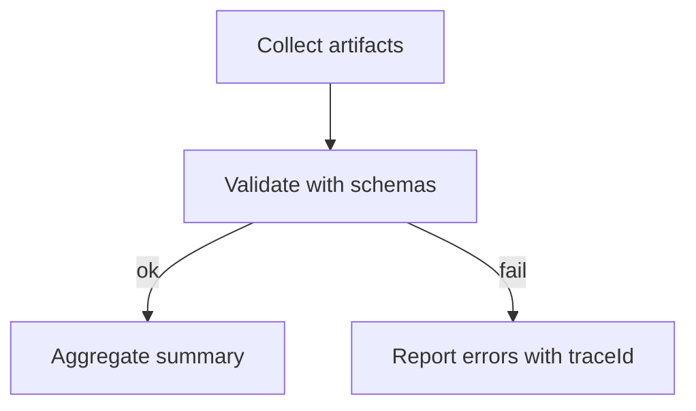

# PR Summary Aggregation (One Page)

Goal
- Provide a concise, machine-and-human friendly one-page PR summary.

Sections
- Coverage: overall %, threshold, delta
- Failing GWT: short counterexamples with `traceId` (see `docs/quality/counterexample-gwt.md`)
- Adapters: one-line summaries from `artifacts/*/summary.json`
- Formal: link to `formal/summary.json` with result and violated invariants
- Trace IDs: quick links to filterable runs/tests

Format (example)
```
## Quality Summary
- Coverage: 82% (>= 80%) ✅  [+1%]
- Failing GWT (1): inv-001 — allocated <= onHand
- Adapters:
  - lighthouse: Perf 78, A11y 96, PWA 55 (warn)
  - playwright: 12/12 passed (ok)
- Formal: fail — see formal/summary.json
- Trace IDs: inv-001, inv-002
```

Artifacts
- Read from normalized JSON artifacts:
  - `artifacts/*/summary.json` (adapters)
  - `formal/summary.json`
  - `artifacts/properties/summary.json`

Implementation Notes
- Keep core thin; aggregation can be implemented in CI or release scripts.
- Output single comment body suitable for PR description or bot comment.

## Failure Case Example
- Coverage: 78% (< 80%) ❌  [-2%]
- Failing GWT (2): inv-001 — allocated <= onHand; inv-007 — nonNegative(onHand)
- Adapters:
  - lighthouse: Perf 72, A11y 93, PWA 50 (warn)
  - playwright: 10/12 passed (error)
- Formal: fail — see formal/summary.json
- Trace IDs: inv-001, inv-007

### Aggregator Pseudo
```ts
type Summary = { coverage:number; failingGwt:string[]; adapters: {name:string; status:string; summary:string}[]; formal:string; traceIds:string[] };
function aggregate(a:Artifacts): Summary { /* read artifacts/*/summary.json, formal/summary.json, properties/summary.json */ return {} as any }
```
## Validation Flow
- Validate JSON artifacts against schemas in `docs/schemas/`.
- Aggregate only validated data for PR summary to avoid noise.
- Prefer fail-fast with clear error messages and `traceId` context.


## Summary Output Variants
### Short Digest
```
Quality: 82% (>=80) ✅  [+1%] | Formal: pass | Adapters: lighthouse(warn), playwright(ok) | GWT: 0 | Trace: inv-001, inv-002
```

### Detailed
```
## Quality Summary
- Coverage: 82% (>= 80%) ✅  [+1%]
- Failing GWT: none
- Adapters:
  - lighthouse: Perf 78, A11y 96, PWA 55 (warn)
  - playwright: 12/12 passed (ok)
- Formal: pass
- Trace IDs: inv-001, inv-002
```
<<<<<<< HEAD

## Replay Line (optional)
- Example: `Replay: 12 events (ItemReceived:7, ItemAllocated:5), 0 violations`
=======
<<<<<<< HEAD

## Replay Line (optional)
- Example: `Replay: 12 events (ItemReceived:7, ItemAllocated:5), 0 violations`
=======
>>>>>>> upstream/main
>>>>>>> upstream/main
