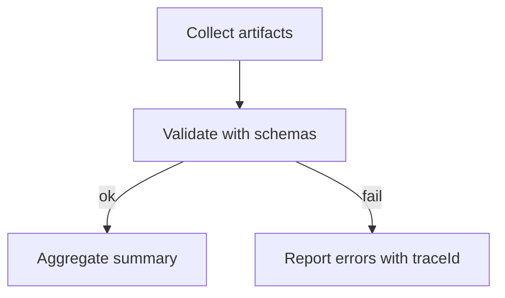

# PR Summary Aggregation (One Page)

> 🌍 Language / 言語: English | 日本語

---

## 日本語（概要）

PR に 1 ページの品質サマリを集約して表示するための方針です。
- セクション: カバレッジ、失敗 GWT、アダプター要約、フォーマル結果、トレース ID
- 入力: `artifacts/*/summary.json`, `formal/summary.json`, `artifacts/properties/summary.json`
- 実装: コアは薄く、CI/リリーススクリプトで集約し、単一のコメント本文に出力

例やフォーマットは以下の英語セクションを参照してください。

最小1行サマリ（例）
```
• CI: ✅ tests 124/124, coverage 84% (≥80), typecov 66% (baseline 65); a11y 96 (≥95), perf 78 (≥75)
```

Goal
- Provide a concise, machine-and-human friendly one-page PR summary.

Sections
- Coverage: overall %, threshold, delta
- Failing GWT: short counterexamples with `traceId` (see `docs/quality/counterexample-gwt.md`)
- Adapters: one-line summaries from `artifacts/*/summary.json`
- Formal: link to `formal/summary.json` with result and violated invariants
- Trace IDs: quick links to filterable runs/tests

Format (example)
```
## Quality Summary
- Coverage: 82% (>= 80%) ✅  [+1%]
- Failing GWT (1): inv-001 — allocated <= onHand
- Adapters:
  - lighthouse: Perf 78, A11y 96, PWA 55 (warn)
  - playwright: 12/12 passed (ok)
- Formal: fail — see formal/summary.json
- Trace IDs: inv-001, inv-002
```

Artifacts
- Read from normalized JSON artifacts:
  - `artifacts/*/summary.json` (adapters)
  - `formal/summary.json`
  - `artifacts/properties/summary.json`

Implementation Notes
- Keep core thin; aggregation can be implemented in CI or release scripts.
- Output single comment body suitable for PR description or bot comment.

## Failure Case Example
- Coverage: 78% (< 80%) ❌  [-2%]
- Failing GWT (2): inv-001 — allocated <= onHand; inv-007 — nonNegative(onHand)
- Adapters:
  - lighthouse: Perf 72, A11y 93, PWA 50 (warn)
  - playwright: 10/12 passed (error)
- Formal: fail — see formal/summary.json
- Trace IDs: inv-001, inv-007

### Aggregator Pseudo
```ts
type Summary = { coverage:number; failingGwt:string[]; adapters: {name:string; status:string; summary:string}[]; formal:string; traceIds:string[] };
function aggregate(a:Artifacts): Summary { /* read artifacts/*/summary.json, formal/summary.json, properties/summary.json */ return {} as any }
```
## Validation Flow
- Validate JSON artifacts against schemas in `docs/schemas/`.
- Aggregate only validated data for PR summary to avoid noise.
- Prefer fail-fast with clear error messages and `traceId` context.


## Summary Output Variants
### Short Digest
```
Quality: 82% (>=80) ✅  [+1%] | Formal: pass | Adapters: lighthouse(warn), playwright(ok) | GWT: 0 | Trace: inv-001, inv-002
```

### Detailed
```
## Quality Summary
- Coverage: 82% (>= 80%) ✅  [+1%]
- Failing GWT: none
- Adapters:
  - lighthouse: Perf 78, A11y 96, PWA 55 (warn)
  - playwright: 12/12 passed (ok)
- Formal: pass
- Trace IDs: inv-001, inv-002
```

## Replay Line (optional)
- Example: `Replay: 12 events (ItemReceived:7, ItemAllocated:5), 0 violations`

---

## 日本語（詳細）

### 目的
PR に 1 ページの品質サマリを生成し、機械/人間双方が読みやすい形で可視化します。

### 入力（正規化アーティファクト）
- `artifacts/*/summary.json`（アダプター要約）
- `formal/summary.json`（フォーマル検査要約）
- `artifacts/properties/summary.json`（プロパティテスト、配列の場合は要素ごと検証）

### 出力（例）
短いダイジェスト:
```
Quality: 82% (>=80) ✅ [+1%] | Formal: pass | Adapters: lighthouse(warn), playwright(ok) | GWT: 0 | Trace: inv-001, inv-002
```

詳細:
```
## 品質サマリ
- カバレッジ: 82% (>= 80%) ✅ [+1%]
- 失敗 GWT: なし
- アダプター:
  - lighthouse: Perf 78, A11y 96, PWA 55 (warn)
  - playwright: 12/12 passed (ok)
- フォーマル: pass
- Trace IDs: inv-001, inv-002
```

### 実装ノート
- 中核は薄く保ち、CI もしくはリリーススクリプト側で集約。
- スキーマ検証（`docs/schemas/`）で不正データを早期に除外。

### 検証とエラー方針
- 入力アーティファクトは必ずスキーマ検証（ajv など）を通す
- エラーは「ファイル/キー/traceId」を含めて短く出力（過剰ログ回避）
- 不正データは要約に含めない（fail-fast）
- 代表コマンド:
  ```bash
  npx ajv -s docs/schemas/artifacts-adapter-summary.schema.json \
    -d artifacts/*/summary.json --strict=false
  ```

### PR コメント構成（推奨）
- 1行ダイジェスト（Coverage/Formal/Adapters/GWT/Trace）
- 詳細ブロック（見出し `## Quality Summary`、各セクションの箇条書き）
- 追記（ある場合）: Replay 行、エラー明細（短く・リンク付き）

#### エラー出力テンプレ（短文）
```
❌ adapter: invalid data at artifacts/lighthouse/summary.json (key=status, traceId=inv-001)
```

### 出力整形ルール（推奨）
- パーセントは整数に丸め（四捨五入）
- しきい値比較は `>=` を明記（記号と色分けは最小限）
- アイコンは ✅/❌/⚠️ のみに限定（読みやすさ優先）
- 数値は固定小数点 1 桁以内に制限（騒がしさ低減）

#### サンプル（整形適用後）
```
Quality: 83% (>=80) ✅ [+1%] | Formal: pass | Adapters: lighthouse(warn), playwright(ok) | GWT: 0 | Trace: inv-001, inv-002
```

#### 整形 Before/After
```
# Before（冗長・小数多用）
Coverage: 82.374% (>= 80.000%) | Perf: 78.443 | A11y: 96.221

# After（丸め・最小記号）
Coverage: 82% (>=80) | Perf: 78 | A11y: 96
```

#### Formal/Adapters の短文化（例）
```
Formal: pass | Adapters: lighthouse(warn: Perf 78, A11y 96), playwright(ok)
```

#### 表示ポリシー（Formal/Adapters）
- 閾値比較は `>=` のみ明示し、色・アイコンは最小（✅/❌/⚠️）
- 長文は避け、`name(status: short)` 形式で簡潔に（必要ならリンクを併記）

#### リンク方針（簡潔）
- 必要に応じて artifacts への相対パスを 1〜2 件だけ添付（多過ぎる列挙は避ける）
- 例: `formal/summary.json` / `artifacts/integration/summary.json`

#### リンク例（Short）
```
Formal: pass — formal/summary.json
Integration: see artifacts/integration/summary.json
```

#### 閾値表示の例
```
Coverage: 83% (>=80) ✅ | Perf: 78 (>=75) ✅ | A11y: 94 (>=95) ❌
```

#### Formal/Adapters の例（1行）
```
Formal: pass | Adapters: lighthouse(warn: Perf 78, A11y 96), playwright(ok)
```
