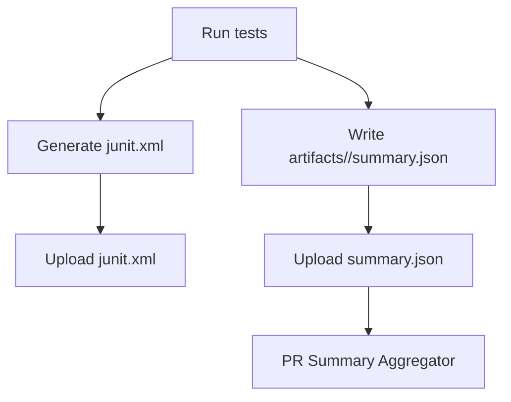

# JUnit + Summary Collection Flow (#408)

> 🌍 Language / 言語: English | 日本語

---

## 日本語（概要）

JUnit XML（生）と正規化 JSON の双方を生成し、JSON を PR 集約の唯一の入力として使用します。XML の解析はコア外（アダプター/CI）に留めます。

- Produce both raw JUnit XML and normalized JSON summary.
- Upload both as CI artifacts; aggregate PR summary from JSON only.

Notes
- Keep XML parsing out of core; use JSON summaries for aggregation.
- Include `traceId` in JSON where applicable.
