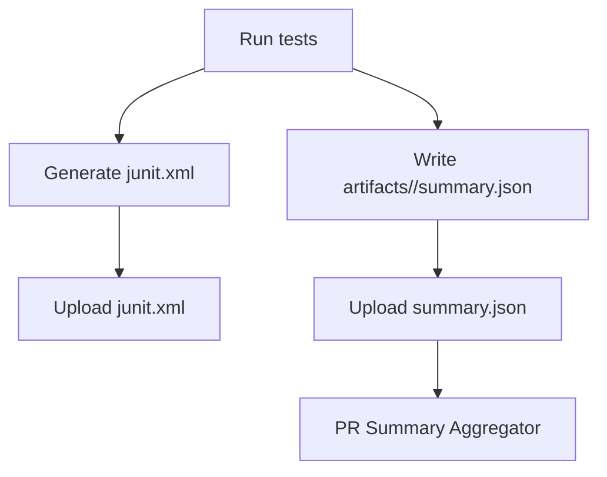

# JUnit + Summary Collection Flow (#408)

- Produce both raw JUnit XML and normalized JSON summary.
- Upload both as CI artifacts; aggregate PR summary from JSON only.

Notes
- Keep XML parsing out of core; use JSON summaries for aggregation.
- Include `traceId` in JSON where applicable.
