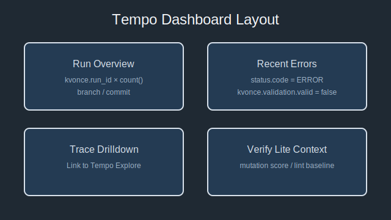

# Grafana Tempo Dashboard PoC

Issue refs: #1036 / #1011 / #1038

## Overview
This document sketches a minimal Grafana dashboard that surfaces KvOnce traces stored in Tempo. It assumes the `docker/otlp-tempo` stack is running and KvOnce spans contain `kvonce_run_id`, `kvonce_branch`, and `kvonce_payload_sha` attributes (see `scripts/trace/run-kvonce-conformance.sh`).

## Tempo datasource configuration
1. In Grafana, add a data source of type **Tempo** with the URL pointing to the Tempo instance (default `http://localhost:3200`).
2. Enable TraceQL support.

## Dashboard JSON snippet
```json
{
  "title": "KvOnce Trace Overview",
  "panels": [
    {
      "title": "Trace counts by branch",
      "type": "timeseries",
      "targets": [
        {
          "datasource": { "type": "tempo", "uid": "tempo" },
          "queryType": "traceql",
          "query": "{ kvonce_run_id != '' } | stats count() by kvonce_branch"
        }
      ]
    },
    {
      "title": "Recent errors",
      "type": "table",
      "targets": [
        {
          "datasource": { "type": "tempo", "uid": "tempo" },
          "queryType": "traceql",
          "query": "{ status.code = 'STATUS_CODE_ERROR' } | fields service.name, status_message, kvonce_run_id"
        }
      ]
    }
  ]
}
```



## クエリとパネルの詳細
| パネル | TraceQL / データソース | Envelope 連携 |
|--------|-------------------------|----------------|
| Run Overview | `{ kvonce_run_id != '' } \| stats count() by kvonce_branch, kvonce_run_id` | Envelope の `correlation.runId` を `kvonce.run_id` 属性にコピーすることで、ブランチ・Run ID 単位の集計が可能。 |
| Recent errors | `{ status.code = 'STATUS_CODE_ERROR' } \| fields service.name, status_message, kvonce.validation.valid` | `summary.validation.valid` を `kvonce.validation.valid` としてコピーし、再発する不整合をフィルタ。 |
| Trace Drilldown | `trace_id = $traceId` (テンプレート変数) | Envelope の `correlation.traceIds[]` を変数に注入し、Explore へのリンクを生成。 |
| Verify Lite Context | JSON datasource (`artifacts/verify-lite/verify-lite-run-summary.json`) | Mutation score や lint backlog を Envelope summary から抽出してテーブル表示。 |

テンプレート変数例:
```yaml
- name: kvonceRunId
  label: Run ID
  datasource: tempo
  query: "{ kvonce_run_id != '' } | stats latest(kvonce_run_id) by kvonce_run_id"
```

## データ更新フロー
1. `pipelines:trace` 実行時に `hermetic-reports/trace/kvonce-projection.json` と Envelope (`artifacts/verify-lite/report-envelope.json`) を生成する。
2. Collector (S3/MinIO) にアップロードした Envelope を Grafana JSON datasource で参照できるようにする。
3. Tempo 側では `kvonce.*` 属性を TraceQL で検索し、Grafana ダッシュボードの変数として expose する。
4. CI 完了後に `scripts/trace/export-dashboard.mjs`（次期タスク）でダッシュボード JSON をエクスポートし、`docs/trace/grafana/tempo-dashboard.json` としてバージョン管理する。

> ℹ️ **TraceQL フィールド名の補足**: Tempo では OTLP の span status が `status.code` にマッピングされ、値は `STATUS_CODE_OK` / `STATUS_CODE_ERROR` などの列挙になります。環境により表記が異なる場合は Grafana の Explore 画面で実際の span を Inspect し、必要に応じて `status_code` などに読み替えてください。

### Span 属性の確認手順

KvOnce の収集スクリプト (`scripts/trace/run-kvonce-conformance.sh`) は、投影結果に `kvonce_run_id` / `kvonce_branch` / `kvonce_payload_sha` を付与することを前提にしています。Tempo に投入したデータでこれらが付与されているかを次の手順で確認できます。

1. `pnpm tsx scripts/trace/run-kvonce-conformance.sh --output-dir hermetic-reports/trace` を実行し、`hermetic-reports/trace/kvonce-projection.json` を生成する。
2. 生成された JSON で `kvonce_*` 属性が存在することを確認する。Grafana 側でも Explore で span を開き、Attributes タブに同じキーがあることをチェックする。
3. 属性が欠落している場合は、`scripts/trace/prepare-otlp-trace.mjs` や `run-kvonce-conformance.sh` が参照する入力（S3 / GCS / ローカルファイル）が最新かを確認し、再収集する。

## Next steps
- [ ] Surface verify-lite envelope metrics alongside Tempo stats.
- [ ] Add panels that highlight mutation survivors per run.
- [ ] Provide `scripts/trace/export-dashboard.sh` to sync dashboards through CI.
