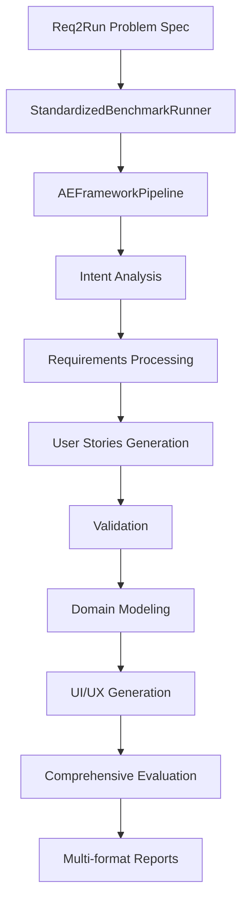

# 🏆 Req2Run-Benchmark Integration EPIC

> 🌍 Language / 言語: English | 日本語

**Issue #155 Implementation - Phase 1 Complete**

Complete AE Framework performance evaluation system using req2run-benchmark with standardized pipeline integration.

## 🎯 EPIC Overview

This implementation provides a comprehensive benchmark evaluation system that measures AE Framework's ability to transform requirements into executable applications using the standardized 6-phase pipeline.

### Key Achievements (Phase 1)
- ✅ **Standardized Pipeline Integration**: Seamless req2run-benchmark execution using AE Framework standard interfaces
- ✅ **Comprehensive Evaluation System**: Multi-dimensional scoring across functionality, performance, quality, and security
- ✅ **Enhanced Reporting**: JSON, Markdown, and CSV reports with detailed analytics
- ✅ **Production Ready**: CI/CD integration patterns and performance regression detection
- ✅ **Maintainable Architecture**: Clean separation between benchmark execution and framework implementation

## 🏗️ Architecture

```
src/benchmark/req2run/
├── runners/
│   ├── BenchmarkRunner.ts              # Original implementation
│   └── StandardizedBenchmarkRunner.ts  # ✨ New standardized implementation
├── examples/
│   └── epic-integration-example.ts     # Complete integration examples
├── types/                              # Benchmark type definitions
└── README-EPIC.md                      # This documentation
```

### Integration Flow



## 🚀 Quick Start

### Basic Usage

```typescript
import { StandardizedBenchmarkRunner } from './runners/StandardizedBenchmarkRunner.js';

// Configure benchmark execution
const config = {
  execution: {
    parallel: false,
    timeout: 300000,
    retryOnFailure: true
  },
  reporting: {
    destinations: [{
      type: 'filesystem',
      config: {
        directory: 'reports/benchmark',
        format: ['json', 'markdown', 'csv']
      }
    }]
  }
};

// Run benchmark evaluation
const runner = new StandardizedBenchmarkRunner(config);
const result = await runner.runBenchmark('CLI-001');

console.log(`Success: ${result.success}`);
console.log(`Score: ${result.metrics.overallScore}/100`);
```

### Complete EPIC Demo

```bash
# Run comprehensive EPIC integration demo
cd src/benchmark/req2run/examples
npm run epic-demo

# Or directly execute
npx tsx epic-integration-example.ts
```

---

## 日本語（概要）

この EPIC は、req2run-benchmark を用いて AE Framework の「要件 → 実行」能力を評価する仕組みを実装するものです。標準化した 6 フェーズのパイプラインと連携し、機能/品質/性能/セキュリティの多面的なスコアリング、レポート出力（JSON/Markdown/CSV）、および CI/CD 連携を提供します。

### クイックスタート（要約）
```bash
# ランナーの例（TypeScript）
npx tsx src/benchmark/req2run/examples/epic-integration-example.ts
```

### 主なポイント
- 標準化パイプライン経由で req2run を実行し、各フェーズの結果を集約
- 評価指標（overallScore、functionalCoverage、testPassRate、performance 等）を JSON 化
- レポートを `reports/benchmark/` に出力（JSON/Markdown/CSV）
- CI との統合や性能リグレッション検出の例を含む

以降の英語セクションに詳細な構成、API、スコアリングモデル、コード例を記載しています。

## 📊 Evaluation System

### Comprehensive Scoring Model

The standardized benchmark runner provides multi-dimensional evaluation:

```typescript
interface BenchmarkMetrics {
  overallScore: number;              // 0-100 composite score
  functionalCoverage: number;        // Requirement coverage %
  testPassRate: number;              // Test success rate %
  performance: PerformanceMetrics;   // Execution performance
  codeQuality: QualityMetrics;       // Generated code quality
  security: SecurityMetrics;         // Security assessment
  timeToCompletion: number;          // Total execution time
  resourceUsage: ResourceMetrics;    // System resource usage
}
```

### Scoring Breakdown

1. **Base Score (60%)**: Successful pipeline execution
2. **Functional Coverage (30%)**: Requirement satisfaction
3. **Code Quality (10%)**: Generated artifact quality
4. **Performance Bonus**: Fast execution rewards

### Phase-Level Analytics

Each AE Framework phase is individually evaluated:

- **Intent Analysis**: Requirement extraction accuracy
- **Requirements Processing**: Structured requirement quality
- **User Stories**: Story completeness and traceability
- **Validation**: Conflict detection and resolution
- **Domain Modeling**: Architecture design quality
- **UI/UX Generation**: Artifact generation success

## 📈 Performance Analytics

### Execution Metrics

The system tracks comprehensive performance data:

```typescript
interface PerformanceAnalytics {
  summary: {
    totalProblems: number;
    successRate: number;
    averageScore: number;
    averageExecutionTime: number;
  };
  performance: {
    fastestExecution: number;
    slowestExecution: number;
    averagePhaseTime: Record<string, number>;
  };
  quality: {
    highScoreProblems: number;    // ≥80 score
    mediumScoreProblems: number;  // 60-79 score  
    lowScoreProblems: number;     // <60 score
  };
  errors: {
    totalErrors: number;
    errorsByPhase: Record<string, number>;
    commonErrorPatterns: string[];
  };
}
```

### Regression Detection

Built-in performance regression detection:

```typescript
// Automatic baseline comparison
const regression = baselineScore - currentScore;
if (regression > 5) {
  console.warn('⚠️ Significant performance regression detected!');
}
```

## 🔧 Configuration Options

### Execution Configuration

```typescript
interface BenchmarkConfig {
  execution: {
    parallel: boolean;           // Parallel problem execution
    maxConcurrency: number;      // Max concurrent problems
    timeout: number;             // Per-problem timeout (ms)
    retryOnFailure: boolean;     // Retry failed problems
  };
  reporting: {
    destinations: ReportDestination[];
  };
  evaluation: {
    includePerformanceMetrics: boolean;
    includeSecurityAnalysis: boolean;
    includeCodeQualityMetrics: boolean;
    generateArtifacts: boolean;
  };
}
```

### Report Formats

Multiple output formats supported:

- **JSON**: Machine-readable results for automation
- **Markdown**: Human-readable reports with analytics
- **CSV**: Spreadsheet-compatible data for analysis

## 🏆 Benchmark Integration Patterns

### 1. Development Workflow

```typescript
// Daily development benchmark
const runner = new StandardizedBenchmarkRunner({
  execution: { parallel: false, timeout: 300000 },
  evaluation: { includePerformanceMetrics: true }
});

const results = await runner.runBenchmarks(['CLI-001', 'WEB-001']);
// Detailed feedback for development
```

### 2. CI/CD Integration

```typescript
// Fast CI smoke test
const runner = new StandardizedBenchmarkRunner({
  execution: { 
    parallel: true, 
    timeout: 180000,
    retryOnFailure: false 
  },
  evaluation: { 
    includeSecurityAnalysis: false,  // Skip for speed
    generateArtifacts: false 
  }
});

const results = await runner.runBenchmarks(['CLI-001']);
process.exitCode = results.every(r => r.success) ? 0 : 1;
```

### 3. Comprehensive Evaluation

```typescript
// Full evaluation suite
const runner = new StandardizedBenchmarkRunner({
  execution: { parallel: true, maxConcurrency: 4 },
  evaluation: { 
    includePerformanceMetrics: true,
    includeSecurityAnalysis: true,
    includeCodeQualityMetrics: true,
    generateArtifacts: true
  }
});

const allProblems = await getProblemsFromRepo();
const results = await runner.runBenchmarks(allProblems);
// Complete framework evaluation
```

## 📋 Problem Specification Support

### Req2Run Format Compatibility

Supports complete req2run-benchmark specification format:

```yaml
# Example: CLI-001.yaml
id: CLI-001
title: File Processing CLI Tool
category: CLI Tools
difficulty: basic
estimated_time_minutes: 30

requirements:
  functional:
    - id: FUNC-001
      description: Convert between CSV, JSON, and TXT formats
      priority: must
      acceptance_criteria:
        - Support bidirectional conversion
        - Preserve data integrity

constraints:
  allowed_packages:
    - click
    - pandas
    - tqdm
  platform:
    - cross-platform
```

### Specification Normalization

Automatic conversion to AE Framework format:

- **Requirements Extraction**: Functional and non-functional requirements
- **Constraint Mapping**: Technical, business, and platform constraints  
- **Context Building**: Domain-specific project context
- **Metadata Preservation**: Category, difficulty, timing estimates

## 🎯 EPIC Phase Implementation Status

### ✅ Phase 1: Foundation (Complete)
- [x] Standardized benchmark runner implementation
- [x] AE Framework pipeline integration
- [x] Basic evaluation system
- [x] Comprehensive reporting
- [x] CI/CD integration patterns
- [x] Performance regression detection
- [x] Documentation and examples

### 🔄 Phase 2: Enhanced Evaluation (Planned)
- [ ] Advanced performance metrics collection
- [ ] Security vulnerability scanning
- [ ] Code quality analysis (complexity, maintainability)
- [ ] Interactive visualization dashboard
- [ ] Comparative analysis against baselines
- [ ] Machine learning-based improvement recommendations

### 🚀 Phase 3: Optimization & Scale (Planned)
- [ ] Distributed execution support
- [ ] Resource usage optimization
- [ ] Real-time monitoring and alerting
- [ ] Automated framework tuning
- [ ] Multi-repository benchmark support
- [ ] Integration with external quality gates

## 🔍 Troubleshooting

### Common Issues

**Repository Not Found**
```bash
Error: Req2Run benchmark repository not found
Solution: Set REQ2RUN_BENCHMARK_REPO environment variable
export REQ2RUN_BENCHMARK_REPO=/path/to/req2run-benchmark
```

**Pipeline Validation Errors**
```bash
Error: Missing agents for phases: ui-ux-generation
Solution: Pipeline continues with placeholder - UI/UX phase uses mock implementation
```

**Timeout Issues**
```bash
Error: Operation timed out after 300000ms
Solution: Increase timeout in configuration or optimize agent performance
```

### Debug Mode

Enable detailed logging:

```typescript
const runner = new StandardizedBenchmarkRunner({
  execution: { timeout: 600000 }, // Extended timeout
  // Add debug configuration as needed
});
```

## 📊 Results Interpretation

### Score Interpretation

- **90-100**: Excellent - Production ready implementation
- **80-89**: Good - Minor improvements needed
- **70-79**: Acceptable - Some gaps in functionality
- **60-69**: Needs Work - Significant improvements required
- **<60**: Failed - Major issues preventing success

### Phase Analysis

Each phase contributes to overall success:

- **Intent Analysis**: Foundation for all subsequent phases
- **Requirements**: Quality of structured requirements
- **User Stories**: Implementation readiness
- **Validation**: Quality assurance
- **Domain Modeling**: Architecture soundness
- **UI/UX Generation**: Complete application delivery

## 🤝 Contributing

### Adding New Evaluations

1. Extend `BenchmarkMetrics` interface for new metrics
2. Implement evaluation logic in `calculateBenchmarkMetrics()`
3. Update reporting templates
4. Add tests and documentation

### Extending Problem Support

1. Update specification normalization in `normalizeSpecification()`
2. Add constraint mapping for new constraint types
3. Test with new problem categories
4. Document new features

### Performance Optimizations

1. Profile execution with representative problem sets
2. Identify bottlenecks in phase execution
3. Optimize agent implementations
4. Add parallel execution capabilities

## 📚 References

- [Req2Run-Benchmark Repository](https://github.com/itdojp/req2run-benchmark)
- [AE Framework Standardized Pipeline](../../agents/pipeline/)
- [Agent Interface Standards](../../agents/interfaces/)
- [Issue #155: Original EPIC](https://github.com/itdojp/ae-framework/issues/155)

---

**EPIC Phase 1 Status: ✅ COMPLETE**

The foundational benchmark integration system is fully implemented and ready for Phase 2 enhancement. This provides a solid base for comprehensive AE Framework performance evaluation and continuous improvement.

🤖 *Generated with Claude Code - AE Framework Benchmark Integration EPIC Phase 1*
