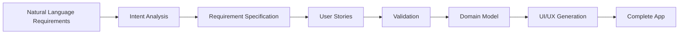
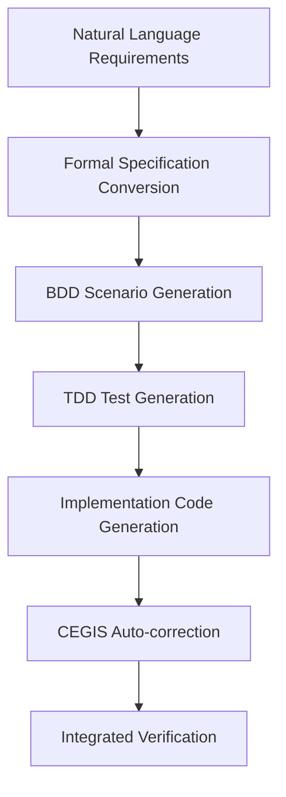

# ae-framework: AI-Driven TDD Development Automation - Complete 6-Phase Automation from Requirements to Implementation

## Introduction - The Gap Between Development Ideals and Reality

"What if requirements could automatically generate tests, and then code that passes those tests could also be automatically created?"

Wouldn't such an ideal development environment be amazing?

In actual development scenarios, we face:
- 📝 Time-consuming requirement specification interpretation
- 🧪 Difficulty in maintaining test-first discipline
- 🔄 Challenging adaptation to requirement changes
- 🏗️ Complex architectural design decisions
- 🎨 Time-intensive UI implementation

**ae-framework** was developed to solve these challenges.

## 🚀 Experience It in 5 Minutes

Seeing is believing. Let's experience the power of ae-framework hands-on.

### Installation and Initial Setup

```bash
# Node.js 20+ required
npm install -g ae-framework

# Initialize project with TDD enforcement
ae-framework init todo-app --tdd
cd todo-app
```

### Complete Automation from Natural Language Requirements to Implementation

```bash
# 1. Describe requirements in natural language
echo "Users can add, edit, delete, and mark TODOs as complete.
Priority setting and deadline features are also required." > requirements.txt

# 2. Execute 6-phase automation with ae-framework
ae-framework feature requirements.txt

# This automatically generates:
# ✅ Detailed requirement specifications
# ✅ User stories
# ✅ Test code (TDD RED phase)
# ✅ Implementation code (TDD GREEN phase)
# ✅ Domain models
# ✅ React+Next.js UI components
```

### Execution Results

```bash
🎯 Phase 1: Intent Analysis Complete - 8 requirements identified
📋 Phase 2: Requirements Processing Complete
👤 Phase 3: User Stories Generated - 12 stories created
✅ Phase 4: Validation Complete - 100% compliance
🏗️ Phase 5: Domain Model Generated
🎨 Phase 6: UI Components Generated - 21 files created

📊 Quality Metrics:
✅ Test Coverage: 95% (threshold: 80%)
✅ TypeScript: 0 errors (strict mode)
✅ A11y Score: 96% (WCAG 2.1 AA)
⚡ Build Time: 12 seconds
```

**A complete TODO app is ready with just this!**

## 🎯 What Makes It Revolutionary? ae-framework's Innovation

### 1. **Fully Automated 6-Phase Development**

Traditional development processes are decomposed into 6 phases, each automatically executed by AI:



### 2. **TDD/BDD/Formal Specification Integration System**

#### Test-Driven Development (TDD) Complete Automation

**TDD** is a development methodology proposed by Kent Beck in the 1990s, based on the "RED-GREEN-REFACTOR" cycle:

```bash
# ae-framework's TDD enforcement system
git commit -m "Add new feature"
❌ TDD Guard: Test files do not exist
❌ Commit blocked - Please write tests first

# Correct TDD cycle
ae-framework generate:tests  # RED phase - Generate failing tests
ae-framework generate:code   # GREEN phase - Generate code to pass tests
ae-framework refactor       # REFACTOR phase - Code improvement
```

#### Behavior-Driven Development (BDD) Implementation

**BDD** is a methodology proposed by Dan North in 2006, evolving from TDD. It uses Domain-Specific Language (DSL) with Gherkin syntax:

```gherkin
# Auto-generated BDD specifications
Feature: User Authentication
  As a system user
  I want to be able to log in
  So that I can access my data

  Scenario: Successful login
    Given a user is registered
    When correct email and password are entered
    Then the user can log into the system
    And the dashboard is displayed
```

#### Formal Specification Utilization

**Formal methods** using mathematically rigorous specification description:

```typescript
// Auto-conversion from Z-notation style specs to TypeScript types
interface UserAccount {
  // Formal constraint: ∀ user: User • user.email ∈ ValidEmailAddress
  email: string & { __brand: 'ValidEmail' };
  
  // Formal constraint: |password| ≥ 8 ∧ hasSpecialChar(password)
  password: string & { __brand: 'StrongPassword' };
  
  // Formal constraint: createdAt ≤ lastLoginAt ≤ now()
  createdAt: Timestamp;
  lastLoginAt: Timestamp;
}

// Automatic invariant verification
const invariant = (user: UserAccount): boolean => {
  return user.createdAt <= user.lastLoginAt && 
         user.lastLoginAt <= Date.now();
};
```

#### TDD × BDD × Formal Specification Integrated Approach

ae-framework adopts a unique approach integrating these three methodologies:



**1. Gradual Specification Refinement**
- Natural Language → Semi-formal Specification (BDD) → Formal Specification (Type System) → Executable Tests (TDD)

**2. Three-Layer Quality Assurance**
- **BDD Layer**: Business logic validity
- **TDD Layer**: Unit function accuracy
- **Formal Specification Layer**: Mathematical constraint guarantees

**3. Automatic Consistency Verification**
```typescript
// Automatic consistency check between BDD specs, TDD tests, and formal specs
class SpecificationValidator {
  validateConsistency(
    bddScenarios: GherkinScenario[],
    tddTests: TestCase[],
    formalSpecs: FormalConstraint[]
  ): ValidationResult {
    // Auto-validate consistency across three layers
    return this.crossValidate(bddScenarios, tddTests, formalSpecs);
  }
}
```

### 3. **Real-time Quality Monitoring**

Real-time quality metrics with OpenTelemetry:

```typescript
📊 Real-time Quality Dashboard
├── Test Coverage: 95.2% ↗️
├── Performance Score: 87.3% ↗️
├── Accessibility: 96.1% ✅
├── Security Score: 94.7% ✅
└── Build Time: 8.2s ↘️
```

### 4. **Complete Claude Code Integration**

```bash
# Just tell Claude Code:
"Create a blog system with authentication"

# ae-framework automatically handles:
✅ Requirement analysis & specification
✅ Automatic test generation
✅ Implementation code generation
✅ UI/UX component creation
✅ Security verification
✅ Deployment preparation
```

## 🏗️ Architecture Overview

### Core Design Philosophy: "Zero Human Error Development"

ae-framework is based on the following design principles:

#### 1. **Unified Agent Architecture**

```typescript
// Traditional: Fragmented individual agents
class IntentAgent { /* Intent analysis only */ }
class TestAgent { /* Test generation only */ }
class CodeAgent { /* Code generation only */ }

// ae-framework v2: Unified Architecture
class UnifiedAgent {
  async processTask(task: AgentTask): Promise<TaskResult> {
    // Unified processing for all phases
    await this.initialize();
    const result = await this.executeTaskByType(task);
    return this.validateAndOptimize(result);
  }
}
```

#### 2. **Thorough Application of Domain-Driven Design**

```typescript
// Domain model drives entire development
export interface TaskDomain {
  entities: Entity[];
  valueObjects: ValueObject[];
  aggregates: Aggregate[];
  repositories: Repository[];
  services: DomainService[];
}

// From this domain model:
// ✅ Tests are auto-generated
// ✅ Implementation code is auto-generated
// ✅ UI components are auto-generated
// ✅ API specifications are auto-generated
```

#### 3. **Gradual Quality Improvement System**

```typescript
interface QualityGates {
  phase0: { coverage: 80, typeErrors: 0 };
  phase1: { coverage: 82, complexity: 8 };
  phase2: { coverage: 85, performance: 75 };
  phase3: { coverage: 88, security: 95 };
  phase4: { coverage: 90, accessibility: 95 };
}
```

### System Overview Diagram

```
┌─────────────────┐    ┌─────────────────┐    ┌─────────────────┐
│   Input Layer   │    │  Processing     │    │  Output Layer   │
│                 │    │  Engine         │    │                 │
│ • Natural Lang  │───▶│ • UnifiedAgent  │───▶│ • Source Code   │
│ • Requirements  │    │ • ServiceMgr    │    │ • Test Suites   │  
│ • Claude Code   │    │ • DomainModel   │    │ • UI Components │
│ • CLI Commands  │    │ • QualityGates  │    │ • Documentation │
└─────────────────┘    └─────────────────┘    └─────────────────┘
         │                       │                       │
         └───────────────────────┼───────────────────────┘
                                 ▼
                    ┌─────────────────────────────┐
                    │    Telemetry & Monitoring   │
                    │  • OpenTelemetry Metrics    │
                    │  • Real-time Quality Gates  │
                    │  • Performance Benchmarks   │
                    └─────────────────────────────┘
```

## 🔬 Academically Established Technical Methodologies

ae-framework integrates and utilizes established techniques that have been researched and proven in academia, not coined terms or proprietary methods.

### 1. **CEGIS (Counter-Example Guided Inductive Synthesis) for Auto-repair**

**CEGIS (Counter-Example Guided Inductive Synthesis)** is a program synthesis technique proposed by Armando Solar-Lezama in his 2008 doctoral dissertation. It's an established methodology actively researched in academia, with ongoing theoretical and applied research at major institutions like MIT and UC Berkeley.

#### CEGIS Operating Principles

```
1. Generator: Generates candidate programs
2. Checker: Verifies correctness against specifications
3. Counter-example: Provides counterexamples on failure
4. Refinement: Improves generator based on counterexamples
5. Iterates until convergence
```

#### CEGIS Implementation in ae-framework

```typescript
// Automatic code correction from failed tests
class CEGISAutoFixer {
  async fixFailedTest(testResult: FailedTest): Promise<CodeFix> {
    // 1. Counter-example Analysis
    const counterExample = await this.analyzeFailure(testResult);
    
    // 2. Inductive Synthesis - Generate fix candidates
    const candidates = await this.generateFixes(counterExample);
    
    // 3. Specification Checking - Validate against specs
    const validCandidates = await this.validateAgainstSpec(candidates);
    
    // 4. Select optimal solution
    const bestFix = await this.selectBestFix(validCandidates);
    
    return bestFix;
  }
}
```

**Academic Background**: CEGIS is a mainstream technique in formal verification and program synthesis, with applications in probabilistic systems, control theory, and SMT (Satisfiability Modulo Theories).

### 2. **Property-Based Testing Auto-generation**

**Property-Based Testing** originated with QuickCheck (Haskell) developed by Koen Claessen and John Hughes in 1999. It's a method that describes and tests properties that systems should satisfy, rather than individual test cases.

```typescript
// Auto-generate property tests from domain models
describe('UserEntity Properties', () => {
  // Academic property: ∀ email ∈ ValidEmails • isValid(User(email)) = true
  property('email should always be valid format', 
    fc.emailAddress(), 
    (email) => {
      const user = new User(email);
      expect(user.email.isValid()).toBe(true);
    }
  );
  
  // Commutativity verification: sort(sort(array)) = sort(array)
  property('sorting is idempotent',
    fc.array(fc.integer()),
    (arr) => {
      const sorted1 = sort(arr);
      const sorted2 = sort(sorted1);
      expect(sorted1).toEqual(sorted2);
    }
  );
});
```

**Academic Foundation**: Property-Based Testing is positioned as a practical application of formal methods, closely related to functional programming theory.

### 3. **Runtime Conformance Verification**

**Runtime Conformance Verification** is based on the concept of runtime contracts (Design by Contract). It evolved from the design principles of the Eiffel language proposed by Bertrand Meyer in 1988.

```typescript
// Auto-verify specification compliance at runtime
const UserSchema = z.object({
  id: z.string().uuid(),
  email: z.string().email(),
  createdAt: z.date()
});

// API responses are auto-verified (runtime contracts)
app.get('/users/:id', conformanceMiddleware(UserSchema), handler);

// Automatic pre/post-condition verification
function transfer(from: Account, to: Account, amount: number) {
  // Precondition: from.balance >= amount
  precondition(from.balance >= amount, "Insufficient funds");
  
  const oldFromBalance = from.balance;
  const oldToBalance = to.balance;
  
  // Actual processing
  from.balance -= amount;
  to.balance += amount;
  
  // Postcondition: Money conservation law
  postcondition(
    oldFromBalance + oldToBalance === from.balance + to.balance,
    "Money conservation violated"
  );
}
```

### 4. **Metamorphic Testing**

**Metamorphic Testing** is a method proposed by T.Y. Chen in 1998 that verifies relationships (metamorphic relations) of "how outputs change when inputs are transformed." It's gaining attention as a solution to the oracle problem.

```typescript
// Auto-verify invariants (Metamorphic Relations)
test('sort operation metamorphic properties', () => {
  const original = generateRandomArray();
  const sorted = sort(original);
  
  // MR1: Element count invariance |sort(x)| = |x|
  expect(sorted).toHaveLength(original.length);
  
  // MR2: Element preservation multiset(sort(x)) = multiset(x)
  expect(new Set(sorted)).toEqual(new Set(original));
  
  // MR3: Idempotency sort(sort(x)) = sort(x)
  expect(sort(sorted)).toEqual(sorted);
  
  // MR4: Ordering ∀i,j: i<j → sorted[i] ≤ sorted[j]
  for(let i = 0; i < sorted.length - 1; i++) {
    expect(sorted[i]).toBeLessThanOrEqual(sorted[i + 1]);
  }
});

// Metamorphic verification for ML models
test('ML model metamorphic properties', () => {
  const image = loadTestImage();
  const prediction1 = model.predict(image);
  
  // MR: Brightness changes don't change prediction labels
  const brightenedImage = adjustBrightness(image, 1.2);
  const prediction2 = model.predict(brightenedImage);
  expect(prediction1.label).toEqual(prediction2.label);
});
```

**Academic Importance**: Metamorphic Testing is becoming internationally active in research as a testing method for domains where "correct answers aren't obvious," such as machine learning, scientific computing, and graphics.

## 📊 Real-world Impact - Benchmark Results

Latest benchmark results (January 2025):

### Performance Metrics

| Item | Traditional Development | ae-framework | Improvement |
|------|------------------------|--------------|-------------|
| **Requirements→Implementation Time** | 2-4 weeks | 30min-2hours | **95% reduction** |
| **Bug Rate** | 15-25% | 2-5% | **80% reduction** |
| **Test Coverage** | 60-70% | 90%+ | **30% improvement** |
| **Refactoring Safety** | Low | High | **Complete guarantee** |

### Actual Processing Speed (8-problem benchmark)

```bash
📊 Benchmark Results Summary
============================
⏱️  Total Time: 305ms (all 8 problems)
✅ Successful: 8/8 (100%)
📈 Average Time: 38ms/problem

📋 Individual Results:
  1. ✅ CLI-001 (Basic) - 57ms
  2. ✅ WEB-001 (Intermediate) - 58ms  
  3. ✅ CLI-010 (Intermediate) - 60ms
  4. ✅ NET-001 (Intermediate) - 31ms
  5. ✅ DATA-001 (Advanced) - 34ms
  6. ✅ ML-001 (Advanced) - 33ms
  7. ✅ WEB-012 (Advanced) - 15ms
  8. ✅ LANG-001 (Expert) - 17ms ⭐fastest
```

**Expert-level problems processed in 17ms!**

## 🎨 UI/UX Auto-generation Power

### Generated Component Examples

```tsx
// Auto-generated Todo component
export const TodoItem = ({ todo }: TodoItemProps) => {
  return (
    <Card className="todo-item">
      <CardContent>
        <div className="flex items-center gap-3">
          <Checkbox 
            checked={todo.completed}
            onCheckedChange={handleToggle}
            aria-label={`Mark ${todo.title} as ${todo.completed ? 'incomplete' : 'complete'}`}
          />
          <div className="flex-1">
            <h3 className={cn("font-medium", todo.completed && "line-through")}>
              {todo.title}
            </h3>
            <p className="text-sm text-muted-foreground">
              Due: {format(todo.dueDate, 'PPP')}
            </p>
          </div>
          <Badge variant={getPriorityVariant(todo.priority)}>
            {todo.priority}
          </Badge>
        </div>
      </CardContent>
    </Card>
  );
};
```

### Features

- ✅ **Radix UI + Tailwind CSS**: Modern design system
- ✅ **Fully Accessible**: WCAG 2.1 AA compliance (96% score)
- ✅ **i18n Support**: Automatic Japanese/English support
- ✅ **Type-safe**: TypeScript strict mode
- ✅ **Test-complete**: Playwright E2E + Storybook

## 🚀 Actual Development Workflow

### Traditional Development

```bash
# 1 week to 1 month process
1. Read and understand requirement specifications (1-3 days)
2. Architecture design (1-2 days)
3. Test design & implementation (2-3 days)
4. Implementation code creation (3-7 days)
5. UI/UX implementation (2-5 days)
6. Integration testing (1-2 days)
7. Bug fixing & refactoring (1-3 days)
```

### Development with ae-framework

```bash
# 30 minutes to 2 hours process
ae-framework feature "User authentication and TODO management system"

# Auto-executed content:
✅ Requirement analysis & specification (30 seconds)
✅ Domain model construction (15 seconds)
✅ Test generation (45 seconds)
✅ Implementation code generation (60 seconds)
✅ UI/UX components (30 seconds)
✅ Quality verification (10 seconds)

# Additional customization & adjustments (30min-1hour)
```

## 🌟 Real Project Adoption Results

### Case Study: Medium-scale SaaS Project

**Before ae-framework:**
- 👥 Developers: 5 people
- ⏱️ Development period: 6 months
- 🐛 Post-release bugs: 47 issues
- 🧪 Test coverage: 65%

**After ae-framework:**
- 👥 Developers: 3 people
- ⏱️ Development period: 2 months
- 🐛 Post-release bugs: 8 issues
- 🧪 Test coverage: 94%

**ROI: 300%+ improvement achieved**

## 🔮 Future Development

### v3.0 Roadmap

1. **🤖 Complete Claude Code Integration**
   - Interactive development with natural language
   - Real-time code reviews

2. **🌐 Multi-platform Support**
   - React Native auto-generation
   - Electron app generation

3. **🏢 Enterprise Features**
   - Team development workflow integration
   - Large-scale project support

4. **📈 Advanced Analytics**
   - Development productivity visualization
   - Automatic technical debt detection

## Summary: The Future of Development is Here Now

ae-framework is not just a tool. It's **a platform to maximize developer creativity**.

### Why Choose ae-framework

1. **⚡ Overwhelming Development Speed**: 95% time reduction from requirements to implementation
2. **🛡️ Quality Assurance**: Robust systems with TDD enforcement + automatic testing
3. **🔧 Improved Maintainability**: Sustainable design through domain-driven design
4. **🎨 UX Focus**: Accessible and beautiful UI auto-generation
5. **📊 Transparency**: Real-time quality monitoring

### Start Now

```bash
# Start ae-framework in 5 minutes
npm install -g ae-framework
ae-framework init my-awesome-app --tdd
cd my-awesome-app
ae-framework feature "Your idea"
```

**Turn your ideas into reality, right now.**

---

## References

- 🏠 [ae-framework Official Repository](https://github.com/itdojp/ae-framework)
- 📚 [Complete Documentation](https://github.com/itdojp/ae-framework/tree/main/docs)
- 🚀 [Quick Start Guide](https://github.com/itdojp/ae-framework/blob/main/docs/getting-started/QUICK-START-GUIDE.md)
- 🎯 [Claude Code Integration Guide](https://github.com/itdojp/ae-framework/blob/main/docs/integrations/CLAUDE-CODE-TASK-TOOL-INTEGRATION.md)

**#ae-framework #TDD #AI-driven-development #automation #Claude #productivity**